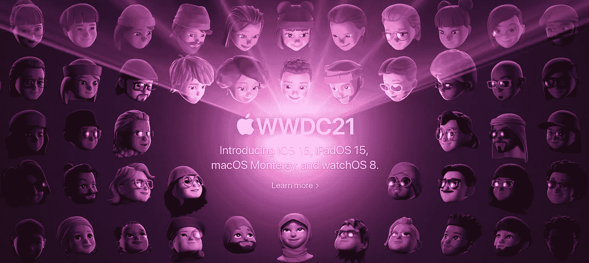

# WWDC 21 岁——这是苹果宣布的一切

> 原文：<https://blog.devgenius.io/wwdc21-here-is-everything-apple-annoucned-23ae1d499111?source=collection_archive---------4----------------------->

资料来源:Apple.com

又到了一年的这个时候了！

今天早上，苹果公司开始了一年一度的 WWDC:主题演讲挤满了各种设备的新东西。

没时间收听直播吗？别担心。我已将所有重大新闻浓缩成以下要点。所以请你有空的时候看一眼吧！

与之前的活动不同，今年，苹果以独特和更具创意的方式开启了这次活动。

活动前:有一些普通的钢琴音乐，一群 memo Ji 用不同的语言打招呼，附近的 memo Ji 盯着他们的文本气泡。

资料来源:Apple.com

开球:苹果没有像每年一样从一个有创意的动画视频开始，而是从开发者的证词开始，他们认为 WWDC 应该如何开始，相信我，这甚至更好。这是来自开发人员的许多有趣的想法和动画，加上一些像样的制作价值——绝对必须观看！

资料来源:Apple.com

> 我必须承认，我开始做这个主题演讲时，以为苹果会一如既往地从讲述自己的故事开始，但是——哇，我错了！这是一个关于热爱为苹果平台开发应用的开发者的故事。

请系好安全带，我们将在此发布一些现有公告。

苹果今年的 WWDC 2021 主题演讲专门关注软件，当你认为这是一次开发者大会时，这是有意义的。

# **首先，IOs 15——face time 和 Focus**

资料来源:Apple.com

iOS15 为 FaceTime、iMessage、通知、地图、钱包、Siri 等带来改进！

【iOS15 关注了什么-

*   保持联系
*   寻找焦点
*   使用智能
*   探索世界

**FaceTime -**

苹果知道“数字化”是前进的方向，他们一定意识到他们错过了一个关键的平台，即视频会议工具。相比之下，其他巨头如谷歌、微软和其他公司已经有了做得很好的平台。因此，今年，苹果将 FaceTime 变成了一个视频会议平台。它不止于此。它还推出了额外的功能，使 FaceTime 既适用于商业用途，也适用于个人用途。主要功能包括-

1.  空间音频
2.  声音隔离
3.  网格视图—突出显示正在发言的人
4.  share play——还记得网飞派对吗？嗯，差不多一样，但是你也可以听音频
5.  通过不同的应用程序安排通话、会议和共享链接
6.  屏幕共享
7.  SharePlay API 将对开发者开放
8.  FaceTime 现在支持 Android 和 Windows 设备(仅限浏览器)

iMessage 也有所改进，增加了“照片堆叠、与你分享、点击一下就能找到剩余的对话，等等”。天气应用和聚光灯也进行了设计革新。

**对焦模式-**

*   使用设备智能创建摘要
*   你可以将手机切换到不同的可定制模式，比如“工作”模式，只显示与工作相关的应用程序，或者“个人”模式，可以将所有工作应用程序和小工具隐藏在后台。

**直播文字-**

这是迄今为止最期待的特性之一；该相机现在可以识别照片、手写笔记或打印文本中的文本，并使其可选择、可搜索、可复制/可粘贴等。它还能识别文本以外的东西，包括动物品种、地标等。

> 你会喜欢细节，我总是告诉每个人，尽管苹果推出一个功能有点晚，但它做得非常完美。

**苹果钱包——轻松使用**

在上一届 WWDC 上，我们看到了苹果钱包的进步。它展示了一个功能，只需使用你的 iPhone 就可以解锁一辆宝马。今年，引擎盖上增加了更多功能——苹果将家庭、办公室和酒店的钥匙整合到苹果钱包中，允许你用手机打开这些地方的兼容门。举例来说，你可以登记入住指定的酒店，一旦你的房间准备好了，你的房间钥匙就会显示在你的手机上。

不仅如此，苹果还与美国运输安全管理局合作，将你的州驾照的加密副本放在钱包中，在安检时可以接受。所以不用再拿出你们的护照了。

**苹果地图——3D 立面地图和 AR 导航**

虽然谷歌地图在 AR 导航等功能方面很先进，但我一直很喜欢苹果地图的细节。随着 iOS15 的推出，苹果地图又上了一个台阶。地图应用正在进行注重细节的彻底改革，增加了 3D 立面地图、3D 渲染地标、人行横道、自行车道等。最重要的是，苹果正在将 AR 导航引入其地图。

目前支持—美国、英国、加拿大、西班牙、葡萄牙。今年晚些时候，意大利和澳大利亚。

**苹果 ai rpods——对话启动并找到我的**

AirPods 也获得了更新，推出了:

对话模式:当您在嘈杂的环境中进行面对面的对话时，这将允许您提高周围人的音量(并控制环境噪音的音量)。

“查找我的”: AirPods 现在可以与“查找我的”应用程序一起使用，即使它们在箱子里，如果你把它们留在箱子里，它也可以向你发送提醒，并能够通知你——类似于 AirTags。

# **iPadOS15 —小工具、多任务处理和翻译**

资料来源:Apple.com

iPadOS 拥有我们在 iOS 上看到的一切和 macOS 的一些功能

*   小部件——由于房地产空间，只是更大了
*   应用程序库
*   多任务处理
*   Notes 应用程序，允许您@提及某人，他们会收到通知(仅限共享的笔记)
*   快速笔记是最好的功能之一，可以让你在任何地方通过从屏幕右下角向上滑动来创建笔记
*   翻译: iPadOS 将获得一个全系统的文本翻译选项，以及一个用于实时翻译面对面对话的应用程序

# 隐私—音频永远不会离开设备

资料来源:Apple.com

*   Siri 的语音识别现在将在设备上进行，将录音从苹果的服务器上移除，并允许在没有互联网连接的情况下使用 Siri 命令。

> 音频永远不会离开设备

*   您可以将恢复联系人添加到您的 iCloud 帐户，允许您选择朋友，如果您被锁定，他们可以帮助您重新进入 iCloud 帐户。你还可以选择“遗留”联系人，如果你去世了，他们可以请求访问你的 iCloud 数据——**另一个深思熟虑的功能！**
*   Apple Mail 会用邮件隐私保护屏蔽追踪像素，Safari 会隐藏 IPs。苹果还在设置中引入了一个名为“应用隐私报告”的新部分。

# 健康更新-

资料来源:Apple.com

*   新的“健康共享”选项将让您安全地与您关心的人共享健康数据
*   你的 iPhone 现在可以测量你的步态、步伐计时等。分析你的“行走稳定性”,如果你跌倒的风险随着时间的推移而增加，希望能提醒你

# WatchOS——保持健康

资料来源:Apple.com

苹果正在为 Apple Watch 的核心操作系统引入一系列新功能和更新。

*   睡眠应用——watch OS 现在可以帮助跟踪你的呼吸频率(你每分钟呼吸多少次),并记录你一天中呼吸的不同(比如你睡觉时)。
*   一个新的“肖像”表盘将使用你的肖像模式照片来创建一个整洁，层次分明的时钟布局。

# MAC OS——它叫蒙特雷——快捷方式、Safari 和 AirPlay

资料来源:Apple.com

*   新款 macOS 被称为**蒙特利**。
*   一个重要的新功能是在 Mac 和 iPad 上使用相同的鼠标和键盘。苹果的快捷方式应用程序也将登陆 Mac。Monterey 对 FaceTime、SharePlay 和苹果的新“焦点”状态进行了改进，这些都将出现在苹果的其他软件平台上。
*   Mac 正在获得 AirPlay 支持，允许用户将 AirPlay 内容发送到 Mac 的显示器上。
*   Safari 正在进行用户界面改造。标签被做得越来越小，他们引入了一个“标签组”系统来保持事物的有序。

# 几个开发者亮点:

*   开发者现在可以为同一个应用建立多个应用商店产品页面——用不同的图标、截图等。—看哪一个最能引起共鸣。
*   新的 API 可以与 SharePlay、Focus 等挂钩
*   iOS 获得了一个内置的 3D 物体扫描系统，开发者可以将它绑定到他们的应用程序中，允许他们集成 3D 扫描风格的功能

我很惊讶，尽管现在一切都是数字/虚拟的，但苹果不知何故继续让全球开发者保持同样的兴奋水平。

那是一个包裹。