# xc framework+SwiftPackageManager

> 原文：<https://blog.devgenius.io/xcframework-swiftpackagemanager-c03f4b1903d9?source=collection_archive---------1----------------------->

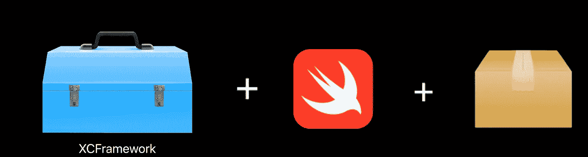

出版背景

你将读到一篇关于如何制作框架、XCFramework、如何制作 Swift 包管理器以及如何将 XCFramework 与 Swift 包管理器一起使用的文章。我将涵盖从初级水平开始的所有主题。我假设您对 SwiftPackageManager 和 XCFrameworks 有基本的了解。

首先，我推荐你看两个视频，分别来自

*第一个视频[Swift 中的二进制框架](https://developer.apple.com/videos/play/wwdc2019/416/)第二个是[以 Swift 包的形式分发二进制框架](https://developer.apple.com/videos/play/wwdc2020/10147/)，我想你会喜欢这些视频的，它们很好吃🍎*

*是的，让我们开始，当你阅读一些关于 XCFramework 的文章时，你必须在其中一篇文章中看到预编译的单词，预编译描述 XCFramework，它基本上是苹果世界的二进制包。通过在 Xcode 项目导航器中查看它们，您可以看到它们之间的主要区别。*

*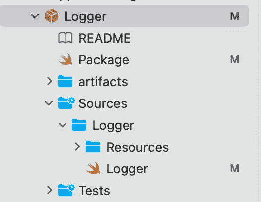**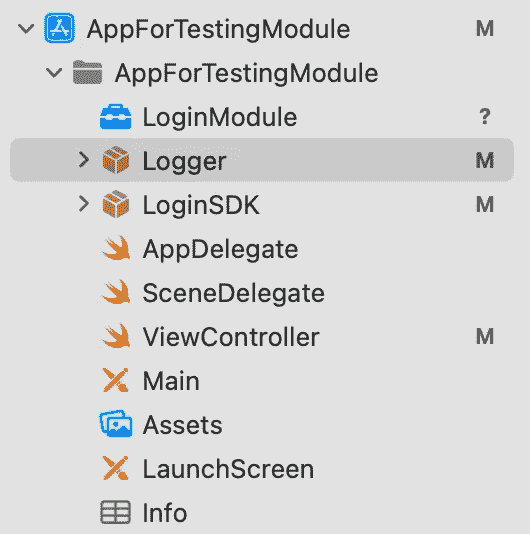*

*简单项目的项目导航器*

*请在左侧图像上聚焦 Logger，在右侧图像上聚焦 LoginModule。Logger 是一个简单的 Swift 包，右边的 LoginModule 是一个简单的 xc framework——二进制包。您可以查看 SwiftPackage 的所有 includes、sources 和 resources，但是您是否看到 LoginModule 有点像一个锁着的盒子？这是一个新命名为 XCFramework 的二进制包，你可以以二进制形式共享你的代码，没有人能看到你的代码。SwiftPackageManager 真的很酷很好用，现在我们可以用它来 XCFrameworks，那我们为什么不用它呢？*

# *我们需要一个场景来建造一些东西*

*我制作了一个场景来构建类似这样的东西，X 公司付钱给我们来构建一个 ToDo SDK，我们必须将我们的 SDK 交付给 X 公司，这个 ToDo SDK 获取 ToDo，并为我们的 ToDo 集成提供第三方登录模块，但要小心，这只是一个小模块，获取和登录的东西。*

# *创建 XCFramework*

*像为 iOS 创建应用程序的类似步骤一样，您需要首先为 iOS 创建一个框架，然后我们将创建我们的 XCFramework！*

*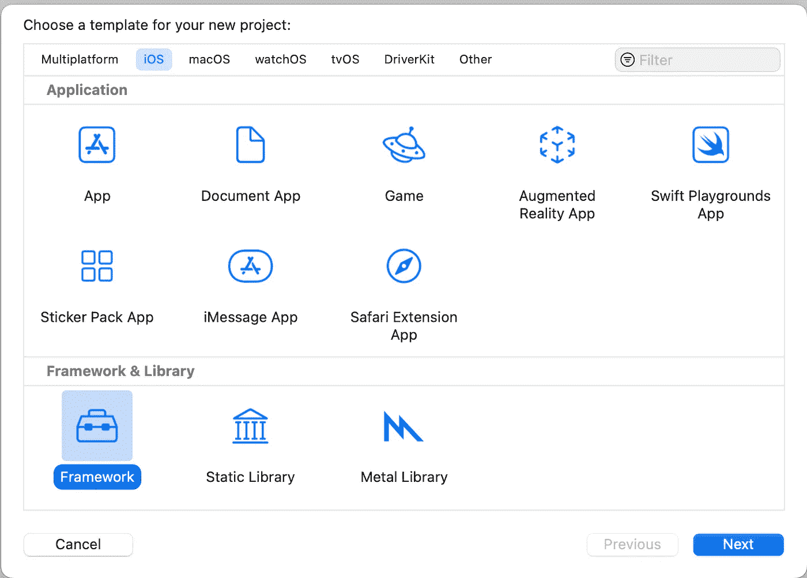**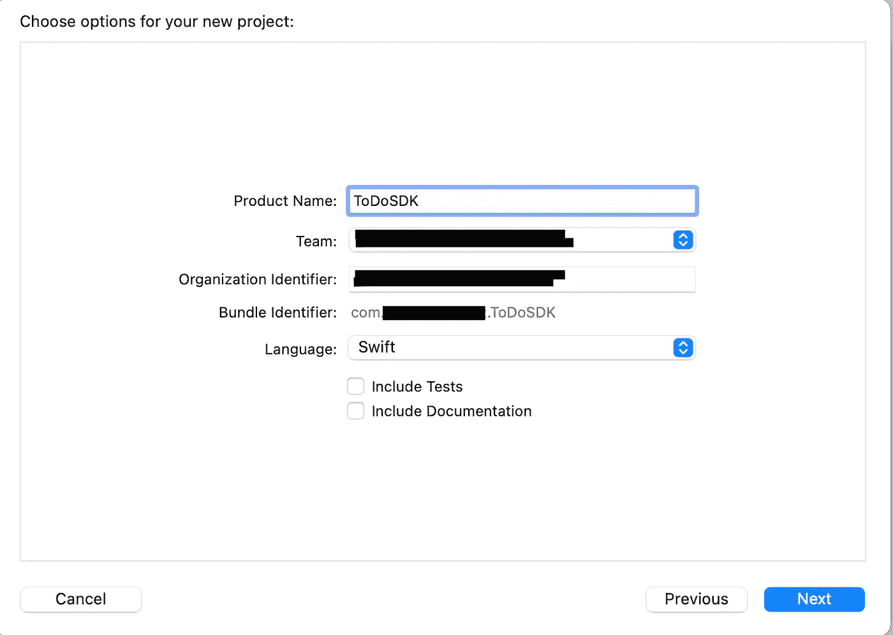*

*不要忘记记住你的 XCFramework 的包标识符，我们稍后会用到它:)现在我们成功地创建了我们的二进制框架，但是我们必须做一些事情*

*我创建了一个名为 Sources 的文件夹，然后在 Sources 文件夹中，也创建了 Network 和 Login 文件夹，在 Network 文件夹中创建了一个新的 Swift 文件并将其命名为 LoginNetwork，然后创建了一个 Cocoa Touch 类并命名为 LoginViewController，并选择了**还创建了 XIB 文件**，然后创建了最后一个名为 LoginViewModel 的文件。你可以在下面看到项目结构的样子。*

*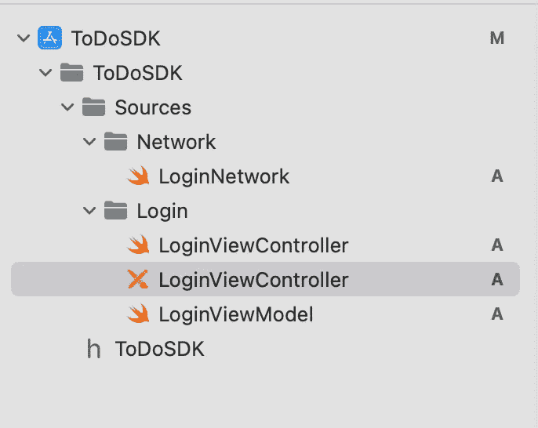*

*让我们看看我们的项目文件，看看 LoginViewController XIB*

*登录网络*

*LoginViewModel*

*LoginViewController*

*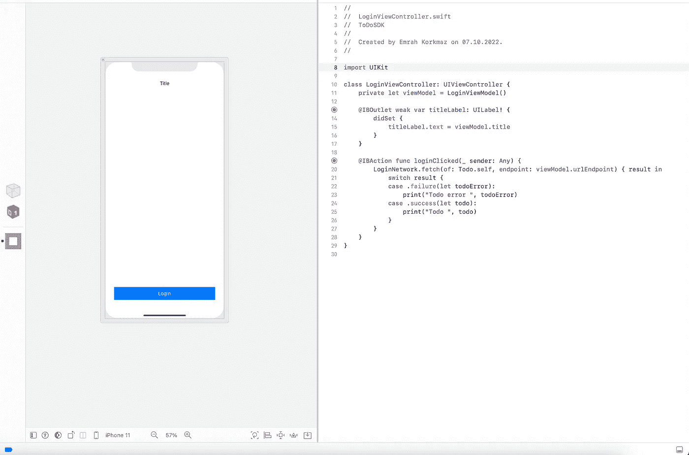*

*LoginViewController 在底部包含一个 UIButton，在顶部包含一个 UILabel，所以这是一个非常基本和没有意义的页面，但是当您查看按钮的 IBAction 功能时，您会看到有一个从 Todo API 获取 Todo 的网络调用。*

> *正如我之前写的，我只需要一个场景，所以不要把这个场景当回事，它只是本文的一个有趣的框架*

# *让我们把手弄脏，🧑🏻‍💻*

*因此，我们的第一项工作是转到目标并选择*构建设置，*然后找到**构建分发库**，将其设置为**是**，然后构建它。*

*我们现在需要为 iPhone 模拟器和 iPhone 操作系统存档 TodoSDK，这很有必要，因为我们将创建这些存档，以便在创建 xcframe 时结合使用，然后我们可以将 ToDoSDK 与模拟器和真实设备一起使用。*

*使用您的终端并转到**文件夹至**文件夹*

*这段代码将把 ToDoSDK 作为. xcarchive 文件夹存档到桌面上，正如你所看到的，目标是 iPhone 模拟器，现在我们必须把它用于真正的 iPhone。*

*这个存档命令将把我们的苹果操作系统框架存档。现在，我们必须将这个 iPhone 模拟器+ iPhone 操作系统档案合并到一个 xcframe 中，我们可以将它作为一个二进制包与单一的 xcframe 一起使用。*

*现在这个命令将把两个框架合并成一个 XCFramework。现在我们在桌面上有了我们的 XCFrameworks，命名为 ToDoSDK*

# *XCFramework 的用法*

*对于一个应用程序，XCFramework 有多种用法，第一种用法是您可以将它拖放到您的应用程序中，然后将其导入到项目中，让我们看看下面的截图。*

*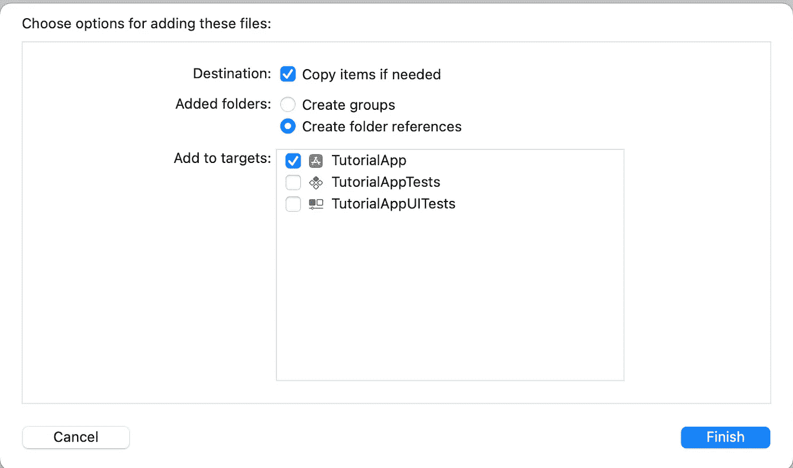*

*如果需要的话，让我们选择复制项目并完成，你可以导入到 oSDK 并愉快地使用它，就像我在教程项目中所做的那样，你可以在下面的截图中看到*

*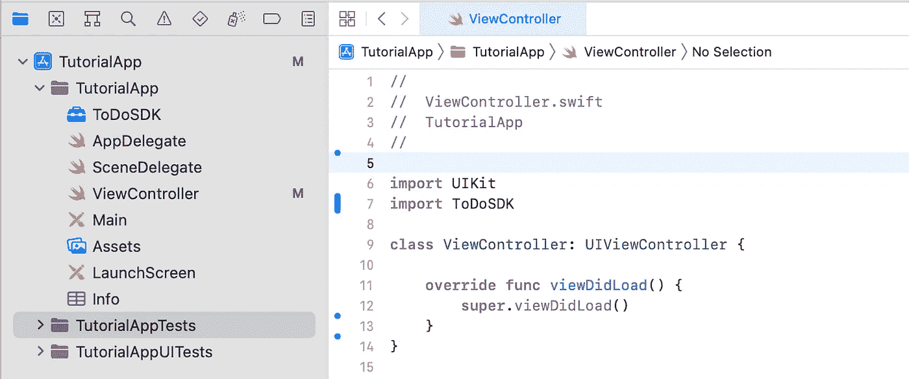*

*快乐编码:)*

# *使用 Swift 包裹管理器的好处*

*伙计们，你们有没有看到我把我的 XCFramework 拖放到项目中，这是一种很酷的方式，但是也有很酷的方式来使用和分发，因为这些包必须主要在项目中分发，我指的是打包，当我谈到分发时，例如，Swift Package Manager 或 CocoaPods，但是我们将在本文中介绍 Swift Package Manager，有了 SPM，我们将对它进行更多的封装， 我们将添加一些包装类来实现 ToDoSDK 的功能，一些组织使用电子邮件来发送这个二进制包，使用二进制包会很酷*

## *创建 Swift 套餐*

*选择 Xcode 图标后，选择文件->新建->包。将其命名为包装。创建一个名为**工件**的文件夹，并将我们珍贵的 xcframe 拖放到这个文件夹中。*

*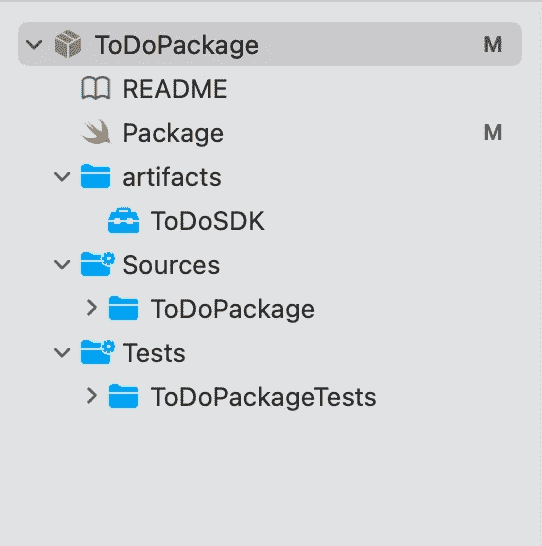*

*应该是这样的*

*然后在包中，您必须将 ToDoSDK 添加为**二进制目标**并将该二进制依赖项添加到我们的库中，该库名为 **ToDoPackage***

*如您所见，在 binaryTarget 中，有 ToDoSDK 的确切名称及其路径，您最终将二进制 XCFramework 添加到 Swift 包中，但我们需要将该二进制包添加为我们库的目标，如第 13 行所示。*

## *实现包装功能*

*当你打开底部的 ToDoPackage 文件夹时，你会看到有一个名为 ToDoPackage 的 swift 文件，删除它并粘贴下面的代码。*

*在照片中，你可以看到一个名为 **getLoginViewController** 的类和静态函数，它返回 **LoginViewController***

*如果你点击返回端的 ToDoSDK 查看信息，你只会看到它的所有结构的接口，如下图，实现和细节是看不到的。*

*所以我们在正确的道路上，继续前进…*

*你还记得我在文章开头说过不要忘记框架的包标识符吗？*

*在这里，为了获得 LoginViewController 的实例，需要一个 Bundle，而在 SwiftPackage 和 XCFramework 中，Bundle 是不同的，所以为了访问 LoginViewController，您必须输入框架的确切标识符，不要忘记这一点。*

*现在，我们终于可以平静地尝试我们的 SwiftPackage 了。试用我们的 SwiftPackage 的方式不止一种。首先，您可以将 SwiftPackage 推入 Github，然后使用 Add Package 选项从 Xcode 获取包，或者您可以拖放，对于本文，我选择了简单的路径并使用拖放。*

*我创建了一个名为 TutorialApp 的空应用程序，并将我的 ToDoPackage 拖放到该应用程序中。*

*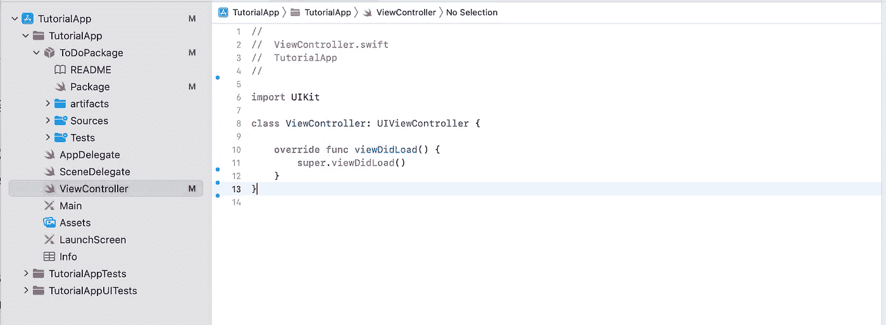*

*在项目导航器上应该是这样的，然后在项目目标中，你必须点击 **+** 按钮进入 ***框架、库和嵌入内容*** 来添加我们的包到我们的目标中，你可以看到下图*

*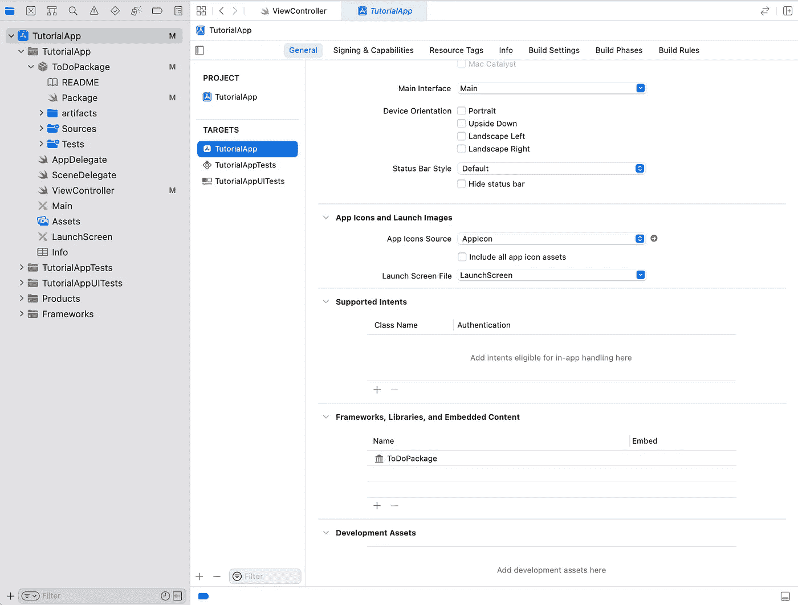*

*内容*

*然后在 ViewController 的 viewDidAppear 中，从 TodoPackage 功能中获取 LoginViewController 并呈现它*

*并从模拟器或真实设备运行它。*

*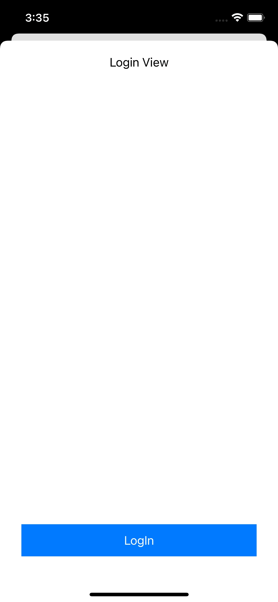*

*结果很完美。*

*单击登录按钮并查找日志，我这样做了，这是我的输出*

> ***Todo(id:1，userId: 1，title: "delectus aut autem "，completed: false)***

*所以我们可以很容易地说，在这一点上，我们创建了框架，然后创建了名为 XCFramework 的二进制框架，并将其与 SwiftPackageManager 一起使用。您可以通过 Swift Package Manager 以一种简单的方式分发和使用 XCFramework。*

# *下一步我们应该做什么？*

*我们可以将 Github 用于 SwiftPackage 存储库，通过这种方式，我们可以通过远程方式而不是通过本地方式拖放来要求我们的 SwiftPackage，对于本文，我没有涉及它，但像通常一样以这种方式使用该包会很有趣。*

*感谢您阅读文章！我希望你喜欢我的文章，它是有帮助和有用的。请随时评论你的想法，我们可以讨论它，注意安全🤘🏻*