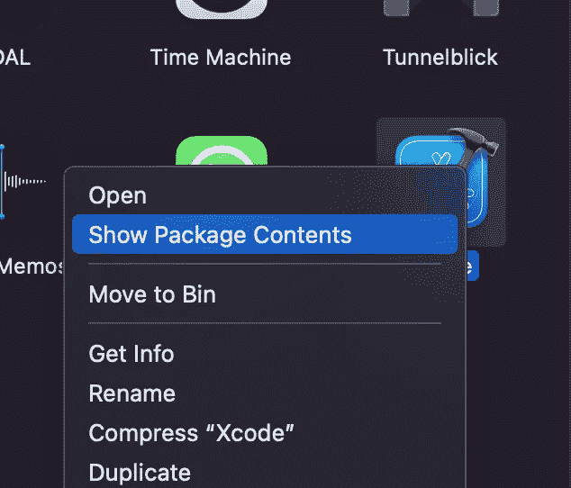
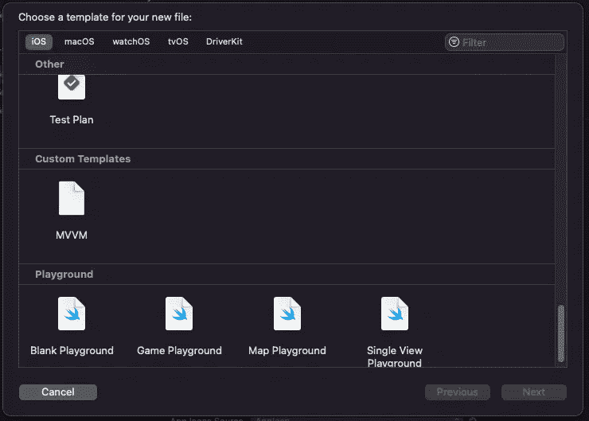
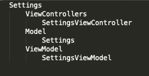
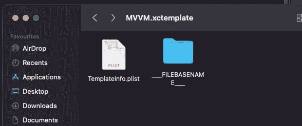
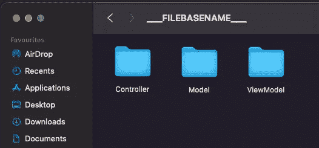
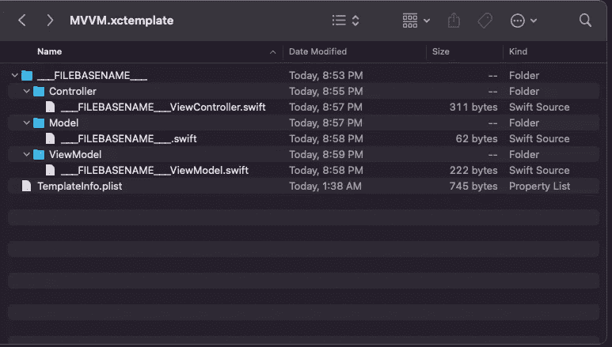
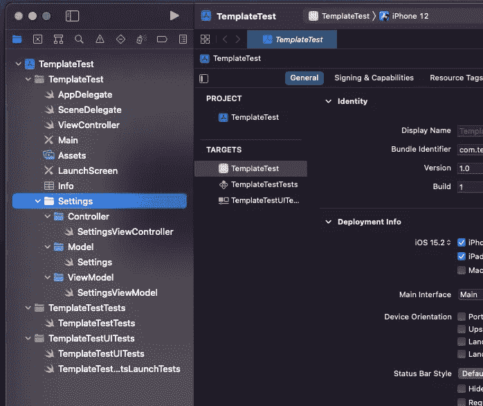

# iOS 版 Xcode 模板教程

> 原文：<https://blog.devgenius.io/xcode-templates-tutorial-for-ios-44951449ee8b?source=collection_archive---------5----------------------->

## 不再需要手动创建您的文件和最佳方式遵循一个模式

照片由[像素](https://www.pexels.com/photo/apple-laptop-notebook-office-39284/?utm_content=attributionCopyText&utm_medium=referral&utm_source=pexels)的[皮克斯拜](https://www.pexels.com/@pixabay?utm_content=attributionCopyText&utm_medium=referral&utm_source=pexels)拍摄

在本教程中，我们将看到如何为 Xcode 创建一个自定义模板，以便一键创建多个文件。出于教学目的，我们将为 **MVVM** 模式创建一个模板。

对于 MVVM 模式，我们需要一个模型一个视图(控制器)和一个视图模型，所以我们将创建一个模板，创建所有的文件和文件夹，以便更好地组织我们的代码，但也节省时间。

# 创建自定义模板

首先，我们需要找到模板在 Xcode 中的位置。你需要进入应用程序文件夹，右击 Xcode。选择**显示包装内容。**

现在，沿着文件夹中的路径找到您的自定义模板:

**内容- >开发者- >库- > Xcode - >模板- >文件模板**

内部文件模板创建您自己的文件夹。对于本教程，我们将其命名为“**自定义模板**”(你可以随意命名)

如果您注意到其他模板，它们有一个扩展名**。xctemplate** ，所以我们需要类似的东西。在您的自定义模板文件夹中导航，并创建一个新文件夹。我们将称之为 **MVVM.xctemplate**

现在导航到你的 MVVM.xctemplate 文件夹，这里我们需要创建一个 **TemplateInfo.plist** 文件，以便 Xcode 识别我们的模板。您可以将此文件复制/粘贴到任何其他模板，然后我们需要替换文本。现在打开 TemplateInfo.plist 文件，将文本替换为以下内容:

在这个 XML plist 文件中，您需要注意两个值。一个是 **Xcode。IDEKit . text substitution filetemplatekind**which**我们声明模板的**种类**和**名称**对我们来说就是“模块名称”，当你在创建文件之前要给它起一个名字的时候就会显示出来。注意，模板名是我们给文件夹起的名字，扩展名为**xctemplate**“MVVM”。**

**在继续下一步之前，让我们检查 Xcode 是否能识别您的自定义模板。创建一个新项目或打开一个现有的项目，进入**文件- >新建- >文件**和向下滚动，找到带有您的 MVVM 模板的**自定义模板**部分。**

****

**到目前为止一切顺利！不要选择 MVVM 模板，我们需要在此之前修复一些东西(不要担心，这不是一个漫长的过程)。让我们继续为不同类型的文件(模型、视图、视图模型)创建模板**

# **创建模板的结构**

**在这一步，想一想你想如何组织你的应用程序。假设我们需要创建一个名为“Settings”的新特性。在我的项目中，我通常创建一个名为“Settings”的文件夹，我们可以在其中创建一个包含 ViewControllers、Model 和 ViewModel 的文件夹(有些人喜欢将视图与 ViewController 分开，在这种情况下，您需要为视图创建一个额外的文件)。**

**在我们的例子中，我们在 3 个不同的文件夹中有 3 个文件。所以我们需要这样的东西:**

****

**好了，现在让我们创建模板的结构。**

**导航到您的 MVVM.xctemplate，其中也有 TemplateInfo.plist 文件，并创建一个名为**_ _ _ file basename _ _**的新文件夹**

**我们确实需要这个文件夹名称，因为它是一个文本宏，Xcode 从产品名称中导出文件夹的名称，当我们从 Xcode 中选择模板时，我们将键入该名称(不要担心，它是动态的，每次我们放置一个新名称时都会发生变化，我们将在后面看到)。**

****

**在**_ _ _ file basename _ _**文件夹和中导航，创建您需要的文件夹。在我们的例子中是控制器、模型和视图模型，但是你可以选择你自己的结构。**

****

**我们完成了文件夹的结构。现在我们需要为每个将被自动创建的文件创建一个模板。**

# **ViewController 模板**

**导航到您的控制器文件夹并创建一个名为**_ _ _ file basename _ _ _ view Controller . swift**的. swift 文件**

**这样，当您创建名为“Settings”的模块时，该文件将自动转换为 SettingsViewController.swift，因为 __FILEBASENAME__ 将被替换为实际名称。**

**打开刚刚创建的文件，插入以下代码:**

**如果您愿意，可以在这里使用自己的代码。在我们的教程中，我们声明了一个扩展 UIViewController 的类(名称会自动填充),我们只需在 viewDidLoad 方法中初始化 viewModel。如果您的 viewController 中有更多的标准项目，请随意添加您想要的任何内容。**

**现在让我们对模型文件做同样的事情**

# **模型模板**

**导航到您的模型文件夹，并创建一个名为 **___FILEBASENAME___ 的文件。swift****

**这样，模型(在我们的例子中)将被称为 Settings.swift。复制/粘贴该文件的以下代码:**

# **视图模型模板**

**导航到您的 ViewModel 文件夹并创建一个名为**_ _ _ file basename _ _ _ ViewModel . swift**的文件**

**在我们的例子中，当宏被自动替换时，该字段将被命名为 SettingsViewModel.swift。为该文件复制/粘贴以下代码:**

**我们完成了结构。它应该是这样的:**

****

**是时候测试我们的模板了。我们为本教程创建了一个新项目(您也可以使用现有的项目)。现在再次进入文件->新建->文件，向下滚动到自定义模板。**选择 MVVM** ，点击 Next，现在该插入**模块名了。**我们将输入设置，点击下一步，然后创建。**

**让我们看看结果:**

****

**只需点击一下，我们就拥有了所有的结构！**

# **结论**

**自定义模板是为项目保持标准结构的好方法，而且可以节省创建所有这些文件的时间，只需在其中编写相同的代码。只要有一点想象力，你就可以用你自己的模板做任何事情！**

**感谢阅读，**

**如果你喜欢我的故事，你想从我和 medium 的其他作家那里读到更多，你可以通过以下链接加入 medium 来支持我(不需要额外费用)**

** [## 用我的推荐链接加入媒体

### 阅读 Pavlos Simas(以及媒体上成千上万的其他作家)的每一个故事。您的会员费直接支持…

simaspavlos.medium.com](https://simaspavlos.medium.com/membership)**