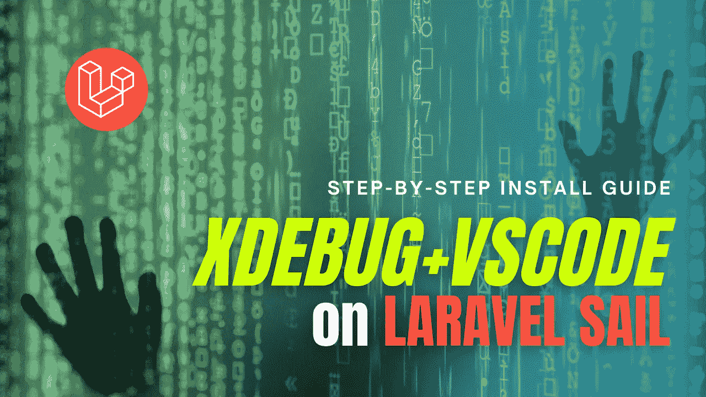
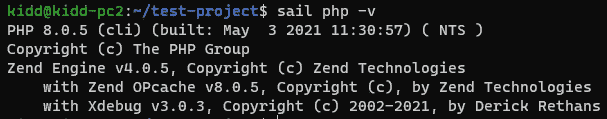
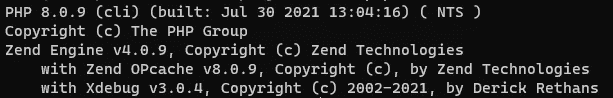
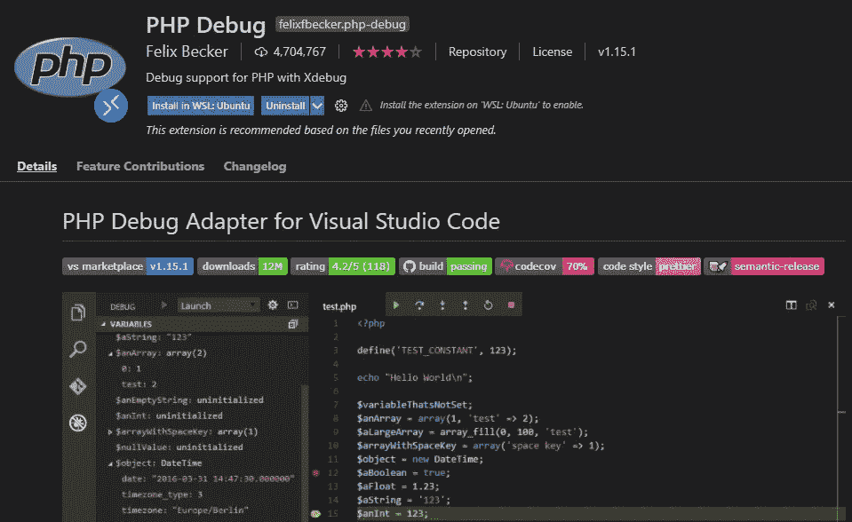
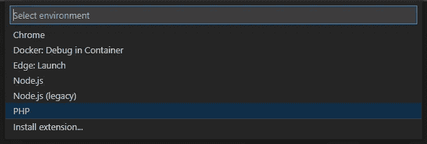
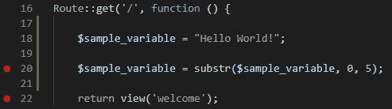
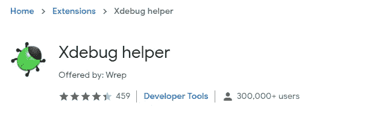
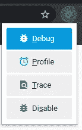
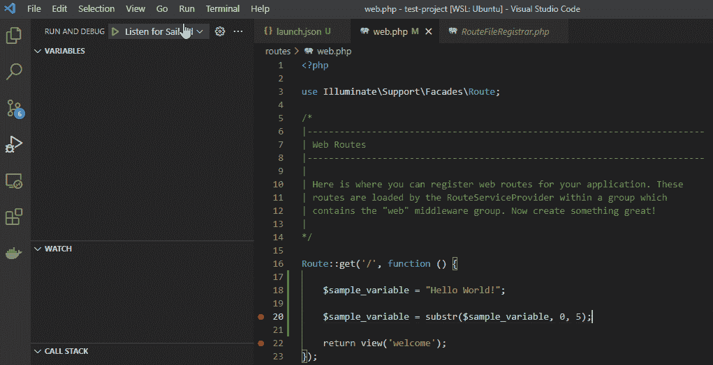

# VS 代码中的 Xdebug Laravel Sail 项目

> 原文：<https://blog.devgenius.io/xdebug-laravel-sail-project-in-vs-code-b7b73e3dedf7?source=collection_archive---------0----------------------->

如果您不是 PHP 新手，您可能听说过 Xdebug——一个 PHP 扩展，它为您提供了强大的调试和分析功能。

也许…你是`dd()`、`var_dump()`或`print_r()`的粉丝，但是 Xdebug 为你提供了更强大的 IDE 工具来捕获讨厌的 bug！(也许还能让你从不眠之夜中解脱出来)

我想你已经开始了你的项目。如果没有，你可以阅读 [Kickstart 你的 Laravel Web App 使用 Laravel Sail](https://dogcomp.medium.com/kickstart-your-laravel-web-app-using-laravel-sail-30276265e588) 。

遗憾的是，你不能选择直接添加 Xdebug 包，就像你在官方文档[中看到的那样。在](https://laravel.com/docs/8.x/installation#choosing-your-sail-services) [laravel/sail](https://github.com/laravel/sail/pull/48) repo 中有一个关于 Xdebug 支持的争论；有兴趣的可以看看。

> **更新:**Larave Sail 的新版本(> v1.9.0)包含了 Xdebug 3.0。不过，如果你想定制你的`Dockerfile`，还是可以按照教程来做。或者，你可以使用 xDebug 而不用定制你的 docker 镜像。

但是，它不能阻止你定制你的 Docker 容器！让我们一步步地将 Xdebug 添加到我们的项目中。

# 🐳编辑 Docker 配置

**1。在我们开始之前确定你是 T4。**

**2。**执行`sail artisan sail:publish`发布配置文件。
你会看到`docker`文件夹和`docker-compose.yml`文件。

**3。现在，当我们正在编辑 docker 配置文件时，您可以。**

**4。**增加`docker-compose.yml`中 Xdebug on/off 开关(`XDEBUG`)和端口号(`XDEBUG_PORT`)的**行 10** & **行 11** 。您的`.env`文件也应该将`APP_DEBUG`设置为`true`。

如果。env 不包含变量，它们将回到右边的默认值。

**5。**接下来，我们编辑由`docker-compose.yml`文件指向的`Dockerfile`(**行 6**)——`<project root>/docker/8.0/Dockerfile`
在**行 44** 下面添加这些行，就在`RUN pecl channel-update`之前

6。使用`sail up --build -d`重新组装&你的容器

> 可以用`sail build --no-cache`重建，重建后用`sail up -d`。

7.使用`sail php -v`成功安装测试 Xdebug

Xdebug 3 已安装

# 🌟使用 Laravel Sail 提供的现成 Xdebug

**1。使用`sail php -v`确保包含 Xdebug**

Xdebug 3 附带 Laravel Sail ( > v1.9.0)

**2。**在`.env`文件中添加`SAIL_XDEBUG_MODE=develop,debug`

**3。** `sail down`然后`sail up -d`应用配置

📖 ***参考资料:Laravel 官方文档:*** [***调试用 Xdebug***](https://laravel.com/docs/8.x/sail#debugging-with-xdebug)

# 💾配置 VS 代码

**1。**在终端用命令`code .`启动 VS 代码。
确保你的 VS 代码安装了 [PHP 调试](https://marketplace.visualstudio.com/items?itemName=felixfbecker.php-debug)扩展。

点击“安装在 WSL: Ubuntu 中”

> *💡*对于有用的扩展，请看一下[这里是我的 VS 代码为 Laravel【2021】](https://dogcomp.medium.com/here-is-my-vs-code-for-laravel-2021-6e816d997607)

**2。**点击**运行** > **添加配置**

> 或者， **Ctrl + Shift + D** > **创建一个 launch.json 文件**

**3。**选择 **PHP**

**4** 。你可以看到两个默认的`configurations`，就像下面这样替换它们

# 🐛开始调试！

**1。**点击行号左侧设置断点

**2。**点击 **F5** ( **运行** > **开始调试**)

**3。**输入触发控制器的路线

**4。**安装 [Xdebug 助手扩展](https://chrome.google.com/webstore/detail/xdebug-helper/eadndfjplgieldjbigjakmdgkmoaaaoc) (Chrome)

**5。**想抓虫子的时候就启用吧！

**6。**您现在可以调试了！

如果您遇到任何问题，请随时在下面留下评论！