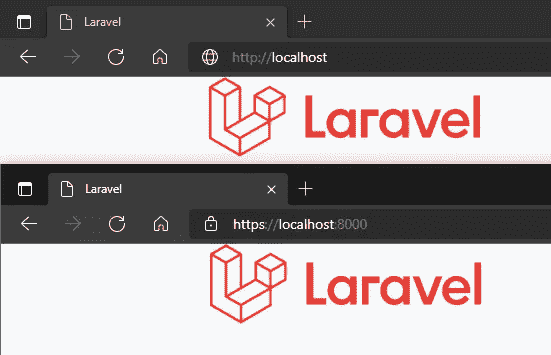
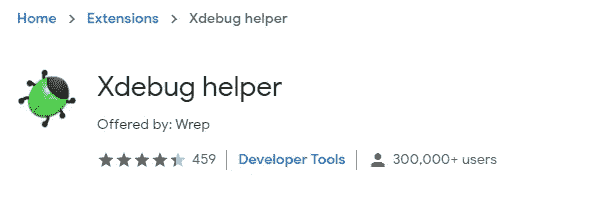
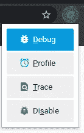
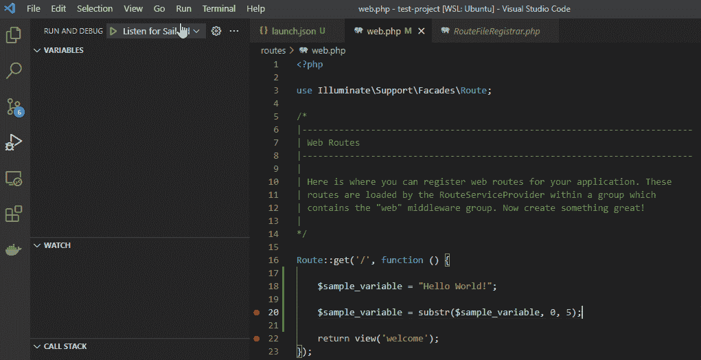

# Swoole 运行时 Laravel Octane 上的 Xdebug

> 原文：<https://blog.devgenius.io/xdebug-on-laravel-octane-with-swoole-running-14238abc0d08?source=collection_archive---------0----------------------->

S woole 为 PHP 开发人员打开了一个全新的世界，而传统工具(如 Xdebug)由于架构差异不支持 Swoole。

在 [Swoole 文档](https://www.swoole.co.uk/tools)中， [YASD(另一个 Swoole 调试器)](https://github.com/swoole/yasd)被开发为 Xdebug 的替代品。直到撰写本文时，它仍然是阿尔法和实验阶段。

这是保持 Laravel Octane 在 Swoole 上运行的技巧，而 Xdebug 可以无中断地使用。

我将跳过基本步骤，您可以随时参考:

1.  [使用 Laravel Sail (WSL2)启动 Laravel 网络应用](https://medium.com/p/30276265e588)
2.  [拉勒维尔帆带 HTTPS 旋风](https://medium.com/p/ddab7f5303ec)
3.  [VS 代码中的 Xdebug Laravel Sail 项目](https://medium.com/p/b7b73e3dedf7)

如果你按照我的教程[设置 HTTPS Swoole](https://medium.com/p/ddab7f5303ec) ，你应该已经发布并编辑了`docker/8.0/supervisord.conf`文件。现在，我让 PHP 内置服务器和 Swoole 同时运行。

> HTTPS —端口 8080 —用于 Swoole
> HTTP —端口 80 —用于 Xdebug

这是`supervisord.conf`的样品

确保实例的命名不同

记者:你的`docker-compose.yml`也需要适当的暴露端口。

一旦你完成编辑并遵循 VS 代码中 [Xdebug Laravel Sail 项目的指导，你需要`sail down`并重建你的 docker 映像](https://medium.com/p/b7b73e3dedf7)

```
sail build --no-cache
```

然后

```
sail up
```

你应该可以在两个[http://localhost](http://localhost)&[https://localhost:8000](https://localhost:8000)上运行



确保你安装了 [Xdebug 助手扩展](https://chrome.google.com/webstore/detail/xdebug-helper/eadndfjplgieldjbigjakmdgkmoaaaoc) (Chrome)



然后当你想在 [http://localhost](http://localhost) 上调试时启用它



Laravel 辛烷仍然可以不受干扰地使用。如果您遇到任何问题，请随时在下面留下评论！

# 视频演示: