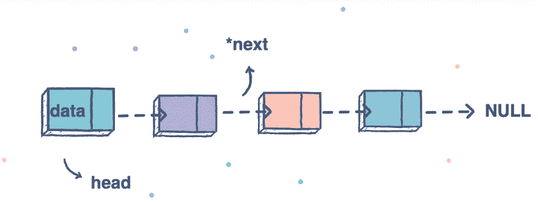

# 异或双向链表

> 原文：<https://blog.devgenius.io/xor-doubly-linked-list-3b6123af0137?source=collection_archive---------2----------------------->



**问题**:一个**异或链表**是一个内存效率更高的**双向链表**。不是每个节点保存下一个和前一个字段，而是保存一个名为 both 的字段(在我们的例子中是 **addr** )，它是下一个节点和前一个节点的 XOR。实现异或链表；它有一个 **insert** (element)将元素添加到末尾，还有一个 **get** (index)返回索引处的节点。

**解** :
点了解以下解之前先知道。

1.  每个对象都存储在内存地址，任何指针(引用)都是访问该对象的一种方式。
2.  在 C++中，你可以把任何地址转换成整数，只要把它转换成合适的数据类型。
3.  将地址转换成整数后，现在你可以对这些地址进行数学和逻辑运算。像异或、加法、减法等。
4.  若 R= A xor B，则 A= R xor B，也 B= R xor A。

```
Note: To XOR two addresses or take sum we need to convert these memory address to integers which not possible in Java. And in C++ we can cast any pointer i.e (void)*, (Node *), (int *) to any 4/8 byte **dataType** depending on your machine (**4 for 32bit and 8 for 64bit**). **uintptr_t** is available in C++ to handle pointers but we can also use **long**.
```

下面是双向链表的 3 个实现。

1.  第一个是简单的双指针双向链表。
2.  第二个，正如问题中提到的，是异或双向链表。
3.  第三种是基于内存地址值的加减。

**解决方案**:

问题来自:

[](https://www.dailycodingproblem.com/) [## 日常编码问题

### 有 N 级台阶的楼梯，一次可以爬 1、2 级。给定 N，写一个函数返回…

www.dailycodingproblem.com](https://www.dailycodingproblem.com/) 

要贡献的活动存储库:

[](https://github.com/muditsen/DailyCodingProblemKotlin) [## 穆迪森/DailyCodingProblemKotlin

### 来自 daily coding problem:https://www.dailycodingproblem.com/第一天:给定一个数字列表和一个数字 k，返回…

github.com](https://github.com/muditsen/DailyCodingProblemKotlin) 

喜欢这个解决方案:

[](https://www.buymeacoffee.com/Brobojack)