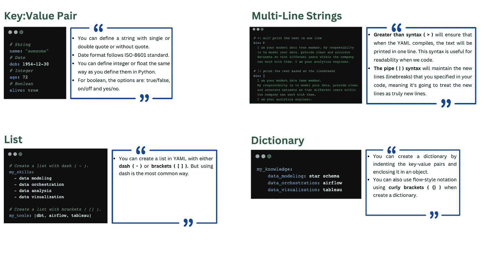

# dbt 中的 YAML 文件—第 1/2 部分

> 原文：<https://blog.devgenius.io/yaml-files-in-dbt-part-1-2-1d6ade6a2bd1?source=collection_archive---------4----------------------->

## YAML 结构和语法基础


图片来自 Unsplash，作者 Ferenc Almasi

当您开始进入分析工程并使用 dbt 作为数据转换工具时，我相信您中的一些人可能会被 dbt 内部使用的技术所淹没。例如，YAML。这可能是真的，如果你来自非技术背景，如数据分析师。

几年前，当我还是一名数据分析师时，我和整个数据和工程团队开了一次技术会议。当他们提到 YAML 时，我陷入了讨论。但那时我并不孤单，我的其他数据分析师同事也觉得这很陌生。

YAML 是使 dbt 强大的 4 种编程语言(Python、SQL 和 Jinja)之一。在 dbt 中，YAML 有多种用途，比如配置、记录和测试数据转换。因此，当你作为一名分析工程师开始进入 dbt 时，你会与 YAML 有很多交流。

本文旨在帮助数据分析师和其他不熟悉 YAML 的人理解其基础知识和他们在 dbt 中必须使用的配置文件(YAML)。本文假设您在过去从事过 dbt 项目，无论是通过教程还是项目相关，并且熟悉 dbt 项目目录。

在本系列的第一部分中，我将介绍 YAML 的基础知识，在下一部分中，我将深入研究 dbt 中的 YAML 配置文件。

# YAML 结构和句法


图片来自 Ricardo Gomez Angle 的 Unsplash

YAML (YAML 不是标记语言 **)** 是一种[数据序列化语言](https://en.wikipedia.org/wiki/Serialization)，它被设计成人类可读并且计算能力强大。YAML 通常用于编写配置文件，通常被视为比 JSON 和 XML 等其他传统选项更简洁的替代方案。许多流行的工具，如 Docker，Airflow 和 dbt 都非常依赖 YAML。

YAML 依赖于`key:value`对的基本概念。该结构通过**分隔线和带缩进的空格**来定义。这种展示给 YAML 一种更清晰的感觉，并且与文件的设计保持一致。YAML 支持 2 种不同的方式来引用它的文件类型；`.yaml`和`.yml`。

在我们开始探索 YAML 的结构和语法之前，这里有一些你在使用 YAML 时需要记住的**规则**:

*   建议使用两个空格缩进(不要使用 tab)，但实际上 YAML 将遵循任何单个文件使用的缩进系统。
*   层次结构中同一级别的项目必须有相同的缩进**。**例如在阻止列表中，列表中的每一项都应该有相同的缩进。
*   作为另一个项的子项的项必须比它们的父项缩进更多。

下图概述了 YAML 结构和语法的基础，以及如何编写一个。它有键:值对、列表、字典、多行字符串和标量(字符串、整数等)。



作者图片:基本 YAML 结构和语法

要编写注释或注释掉代码的一部分，可以在代码/代码行的开头使用`**#**` 。

我们甚至可以将其中一些概念结合起来，在 YAML 中创建更复杂的数据类型。下面是一个对象(`my_skills`)的例子，其中包含列表和键:值对。

```
my_skills:
  - data modeling: 
      name: star schema
      proficiency: 7
  - data orchestration:
      name: airflow
      proficiency: 7
  - data analysis:
      name: statistics
      proficiency: 7
  - data vizualization:
      name: tableau
      proficiency: 7
```

如果我可以用通俗的语言来描述 YAML，我会说 YAML 类似于我们在玩游戏之前所做的事情，也就是配置游戏设置。在我们开始一个游戏之前，我们通常想要配置游戏设置，例如设置显示分辨率、语言、难度等。我们这样做是为了让游戏可以流畅运行，给我们一个很棒的体验。这实际上和 YAML 能做的一样。它帮助我们在开始使用 dbt 和 Airflow 等工具之前对它们进行配置。

在下一篇文章中，我将介绍我们通常在 dbt 中使用的配置文件。如果你有任何反馈，请随时写在评论区。感谢您花时间阅读本文，并关注本系列的第二篇文章。[我们在这里连线](https://www.linkedin.com/in/baluramachandra/)。谢谢你。

**其他资源:**

*   [完成 YAML 课程；初学者-进阶。](https://www.youtube.com/watch?v=IA90BTozdow)
*   [YAML 教程:带示例的完整语言指南。](https://spacelift.io/blog/yaml)