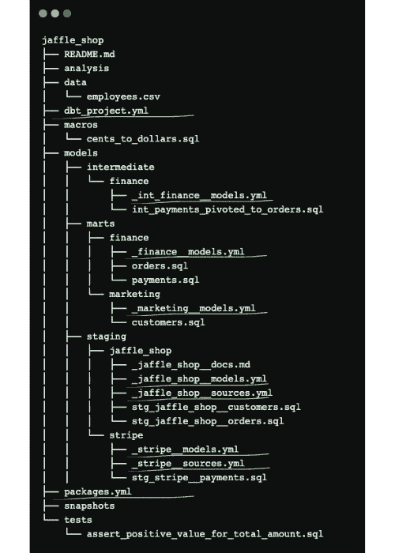
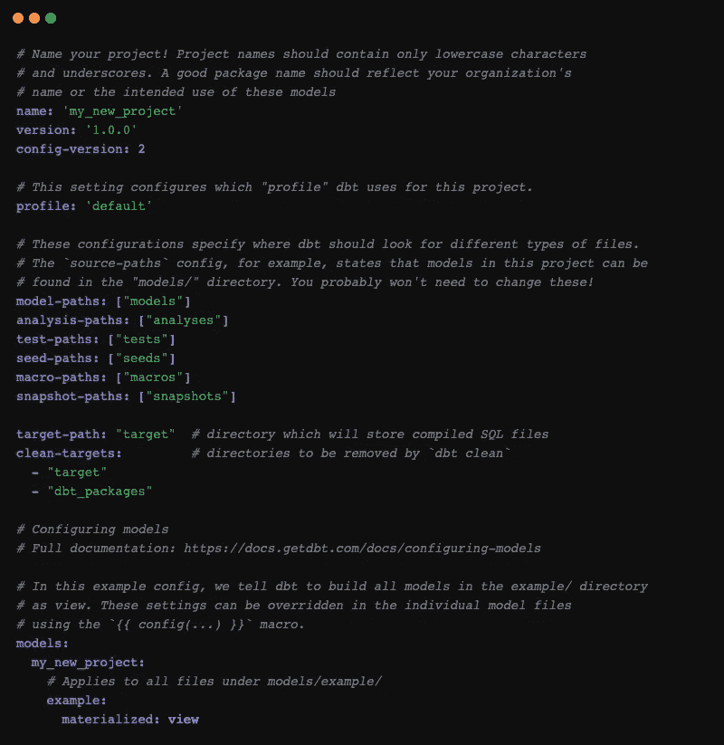
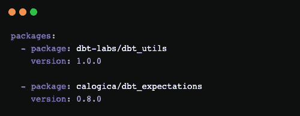
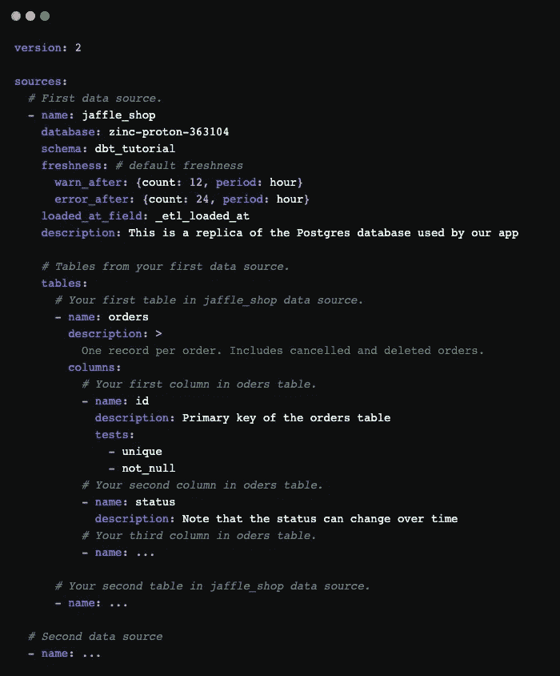
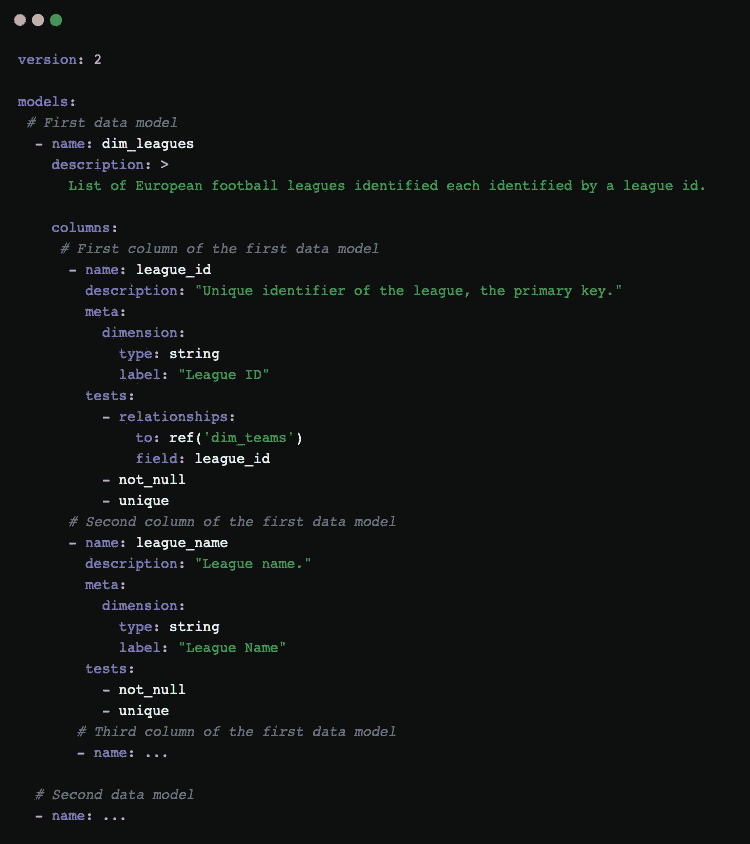
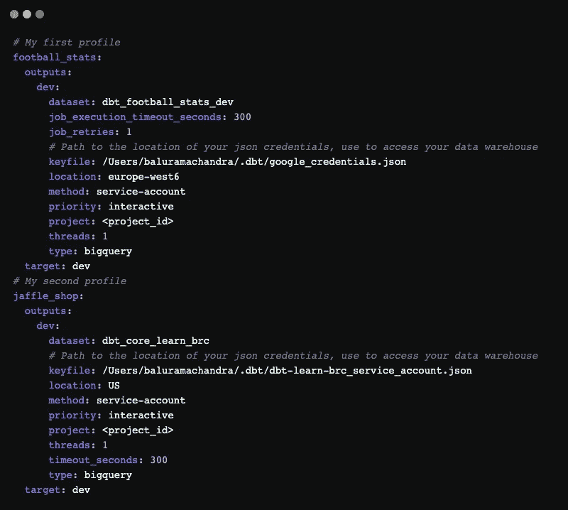
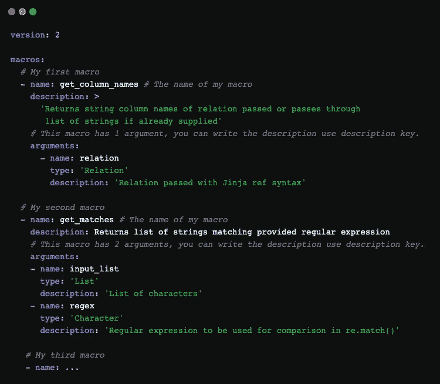

# dbt 中的 YAML 文件—第二部分

> 原文：<https://blog.devgenius.io/yaml-files-in-dbt-part-2-2-fc157764c219?source=collection_archive---------4----------------------->

## dbt 中的配置文件

图片来自 Unsplash，作者 Ferenc Almasi

正如在[上一篇文章](https://medium.com/@baluramachandra90/yaml-files-in-dbt-part-1-2-1d6ade6a2bd1)中提到的，YAML 是让 dbt 变得强大的编程语言之一。它用于各种目的，例如配置、记录和测试我们的数据转换。那么 YAML 可以在 dbt 中配置哪些东西呢？

要回答这个问题，让我先给你看一下[推荐的结构 a dbt 项目](https://docs.getdbt.com/guides/best-practices/how-we-structure/1-guide-overview)。从下面的结构中，您可以看到一些 YAML 文件，它们或者位于根目录中，或者位于 models 目录中。

通过 dbt 缩短项目结构

## 根目录

从项目结构(上面)可以看到，根目录下有 2 个 YAML 文件，`dbt_project.yml`和`packages.yml`。

***dbt _ project . yml***

> 一个`[dbt_project.yml](https://docs.getdbt.com/reference/dbt_project.yml)` [文件](https://docs.getdbt.com/reference/dbt_project.yml)就是 dbt 如何知道一个目录是一个 dbt 项目。它还包含告诉 dbt 如何操作您的项目的重要信息。— dbt

当您初始化一个 dbt 项目时，一个`dbt_project.yml`文件会在您的项目的根目录下自动创建。`dbt_project.yml`是一个配置文件，您可以在其中指定您的项目级细节，比如您的项目的各种组件的路径和模型具体化(视图、表格等)。

下面的模板显示了默认配置的`dbt_project.yml`文件的基本组件。您可以在这个文件中进行修改，例如，如果您希望您的`models`文件夹被命名为`transform`，那么您可以简单地将您的`models`文件夹重命名为`transforms`，并且在您的`dbt_project.yml`中，您需要将现在的`model-paths`(在一个列表中)指定为`transforms`而不是`models`。注意:您也可以配置您的模型将如何在这里具体化(视图、表等)，但是这些设置也可以在单独的模型文件中被覆盖。你可以在这里查看`dbt_project.yml`的其他组件。

您可能还想查看您的项目的名称以及您将要使用的概要文件配置。我们将在后面的章节中讨论更多关于`profile`的内容

dbt_project.yml 文件的基本组件

***packages.yml***

`packages.yml`文件应该与`dbt_project.yml`文件在同一级别/位置。该文件包含 dbt 安装包或库的说明。包是 dbt 项目，可以安装并添加到您的 dbt 项目中。您可以在`packages`键下指定您想要安装的软件包。您可以查看可以安装在 [dbt hub](https://hub.getdbt.com/) 上的可用软件包

> [作为 dbt 用户](https://docs.getdbt.com/docs/build/packages)，通过向您的项目添加一个包，包中的模型和宏将成为您自己项目的一部分。— dbt

安装 dbt-utils 和 dbt-expectations 包的示例，在 packages.yml 中定义。

## 模型目录

在 dbt 中，我们所有的 SQL 转换文件都位于`models`文件夹中。`models`文件夹可能包含几个子文件夹。我们这样做是为了更好地构建我们的项目、逻辑和数据转换过程。举个例子，在`models`目录里面我们可以有；一个`staging`文件夹用于从数据源清理数据，一个`marts`文件夹用于报告层。

dbt 建议每个`models`目录有一个单独的配置(YAML)文件。每个子文件夹都应该有一个支持每个数据转换(SQL 文件)过程的专用 YAML 文件，例如在过程中添加测试和文档。一般来说，模型目录下有两种类型的 YAML 文件；每个都以源(`__sources.yml`)和模型(`__models.yml` ) — **结尾，这些约定是 dbt** 推荐的。

***_ _ sources . yml***

在 dbt 中，[源](https://docs.getdbt.com/docs/build/sources)被定义为数据仓库中尚未清理/编辑/转换的原始数据的副本。我们使用`__sources.yml`不仅将原始数据(来自 BigQuery、Postgres 等底层数据仓库)引入 dbt，还对其进行命名、描述和测试。由于`__sources.yml`配置和处理原始数据本身，这个 YAML 文件应该放在`staging`文件夹中。

您可以在`sources`块下指定您的源，以及您在`__sources.yml`文件中的`database`、`schema`和`table`名称。您也可以使用`name`键给数据源一个别名。这将允许您使用`{{ source() }}`函数轻松调用 SQL 转换文件中的数据源。

简而言之，`__sources.yml`可以做 4 件事:

*   将原始数据导入到`sources`块下的 dbt 中。
*   在`description`项下描述/记录您的来源。您可以在这里使用多行字符串来决定如何打印描述(单行或多行)。您可以稍后通过运行`dbt docs generate`在 IDE 中查看这个描述/文档。
*   在`tests`块下对您的源执行数据质量测试。
*   在`freshness`块下计算源数据的新鲜度。`loaded_at_field`应该被提供，以使 dbt 能够计算您的表的新鲜度。

__sources.yml 结构的示例

***_ _ models . yml***

`[__models.yml](https://docs.getdbt.com/reference/model-properties)`和`__sources.yml`的功能差不多。`__models.yml`应该位于`intermediate`和`mart`文件夹内。您可以使用`__models.yml`来做这些事情:

*   给你的数据模型一个合适的文档。
*   在`test`块下的数据转换过程中添加数据质量测试。
*   为资源设置元数据，它被编译到`manifest.json`文件中，并且可以在自动生成的文档中查看。

__models.yml 结构的示例

## 其他 YAML 文件

***profile.yml***

在 dbt 中，`profile.yml`是您拥有的每个 dbt 项目中必不可少的(还有`dbt_project.yml`)。`profile.yml`保存并定义数据仓库的所有连接细节。它可以定义:

*   不同的数据仓库有不同的连接细节。
*   多目标模式，如生产和开发环境的模式。

由于`profile.yml`包含敏感信息(数据库连接的凭证),我们在 dbt 项目目录中找不到它。它存储在`~/.dbt/`目录中。

带有 BigQuery 数据仓库的 profile.yml 结构示例

***_ 宏. yml***

[宏](https://medium.com/dev-genius/excelling-at-dbt-jinja-macros-for-modular-and-cleaner-sql-queries-part-2-2-88949c1af46c)与 Python、JavaScript 等其他编程语言中的函数类似。它让你写一个可重用的代码(干——不要重复自己)。您可以在 sql 文件中创建和定义宏。

就像在其他编程语言中一样，在 dbt 中，我们也可以记录宏在 YAML 文件中做了什么。命名文件的惯例是`<whatever_you_want>_macros.yml`。这里有一个例子:

这就是我想和你分享的内容。我希望这篇文章对你成为更好的 dbt 用户和分析工程师有所帮助。如果你有任何反馈，请写在评论区。让我们连线吧，感谢您的参与。