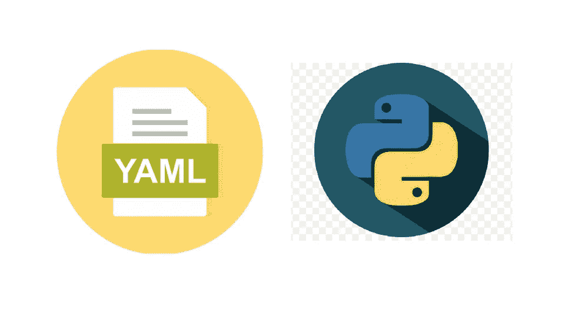
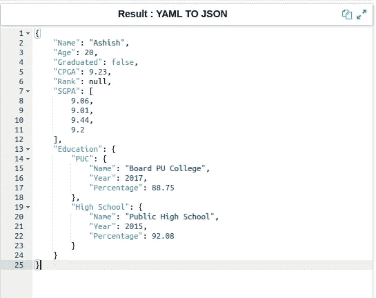
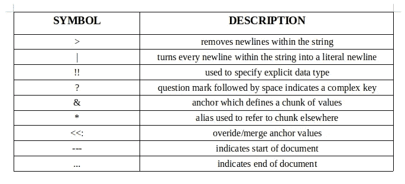
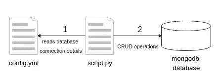
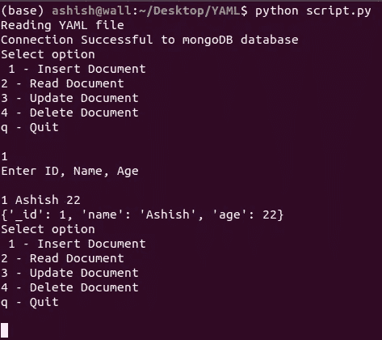

# 蟒蛇皮 YAML

> 原文：<https://blog.devgenius.io/yaml-with-python-d6787a9bd8ab?source=collection_archive---------0----------------------->

本文旨在概述 YAML 的基础知识，并编写一个简单的 python 脚本来从 YAML 文件中读取配置细节。

# 什么是 YAML？

*   YAML 标记语言是一种人类可读的数据序列化语言(将对象编码成另一种格式)
*   它是 JSON 的一个超集，具有评论、锚、别名等附加特性
*   许多编程语言都使用它，它可以简单地表示复杂的映射，因此被用作配置语言
*   YAML 文件创建时带有扩展名”。yml“或”。yaml "
*   支持单个文件中的多个文档

# YAML 基础知识

YAML 的结构是一个键值对。键是一个字符串，值可以是任何类型。YAML 支持的数据类型有*布尔*、*字符串*、*整数*、*浮点、数组*、*字典*。空白的缩进用来表示结构。YAML 根据值确定类型，在使用特殊字符时使用单引号或双引号。

下图是 YAML 转换成 JSON 的结果，注释被忽略。

YAML 转换为 JSON

# 推进 YAML

推进 YAML

# 入门指南

我们将创建一个简单的项目，它由一个从 YAML 文件中读取数据库配置细节的 python 脚本组成，一旦连接建立，它就执行 CRUD 操作。

# 1 .装置

*   下载 [MongoDB](https://docs.mongodb.com/manual/installation/) 并创建一个名为 *College* 的数据库，名为 *Student_Info* 的集合。在数据库上启用[认证](https://medium.com/mongoaudit/how-to-enable-authentication-on-mongodb-b9e8a924efac)。
*   安装库 [pyyaml](http://pip install PyYAML)

# 2.密码

*   yml 包含数据库配置细节，如 URL、端口、编码的用户名、编码的密码、数据库名称、集合名称。

*   script.py 读取 config.yml 并建立数据库连接，然后执行 CRUD 操作

# 3.奔跑

运行 script.py

# 结论

在这个故事中，我们已经了解了 YAML 的基本知识，并创建了一个简单的项目，该项目由一个从 YAML 文件中读取数据库配置细节的 python 脚本组成。YAML 在视觉上更容易看，它的高级特性，比如评论、锚、别名，使它比 JSON 更好。

希望你已经了解了 YAML 的基本知识。

感谢阅读！

[Github](https://github.com/ashish-mj/YAML) [网站](https://ashishmj.vercel.app/) [Linkedin](https://www.linkedin.com/in/ashish-mj/)

**附加资源** [https://spacelift.io/blog/yaml](https://spacelift.io/blog/yaml)