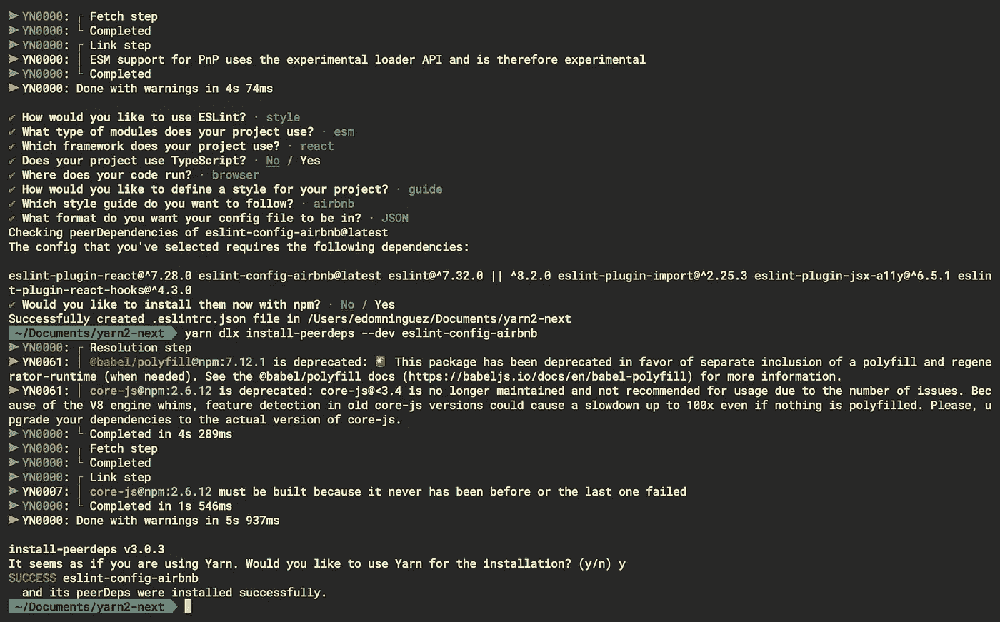

# 使用纱线 2 设置 NextJS 环境

> 原文：<https://blog.devgenius.io/yarn-2-setting-up-a-nextjs-env-ae503a2f9f7f?source=collection_archive---------5----------------------->

## *还有，纱 2: ALE & ESLint 不工作？*


**纱线 2** (或者是纱线 3？当我检查`--version`时，它显示为 3，但我实际上是在外壳上调用`yarn init -2`……)通过其“[零安装](https://yarnpkg.com/features/zero-installs)”和“即插即用”诡计提供了一些漂亮的功能。如何做超出了本文的范围，但是我们只能说你可以给`**node_modules**`一记*结实的屁股*一脚。

这一切都很美好，直到你意识到 **ALE 并没有显示 ESLint 错误**，即使你故意写了一段愚蠢的胡言乱语。我们稍后会解决这个问题。所有维姆的粉丝们，冷静点。

**TL；** `let g:ale_javascript_eslint_use_global = 1`博士

编辑:由于我不使用 VSCode，我不知道这也是一个问题。我测试了一个解决方案，详情在文末。

# WTF 是纱 2？

Yarn 1 很可能仍然是默认的全局，所以如果出于某种原因你从来没有听说过它，那么绝对是时候尝试一下了…

根据[文档](https://yarnpkg.com/getting-started/install)，如果你有**节点 v. ≥16.10** :

```
$ corepack enable
```

如果不是，即**节点< 16.10** :

```
$ npm i -g corepack
```

现在让我们

```
$ mkdir yarn2-next && cd yarn2-next
```

然后:

```
$ yarn set version stable
```

不幸的是，`init`会自动运行，这意味着你基于旧架构的命令，比如`create next-app`，将无法工作。我试过了，但是失败了，所以我们现在只能手动操作了。

但是不要绝望，NextJs 跟他妈的一样流畅*，即使是手动完成的时候。你有没有尝试过从头开始建立一个 vanilla React 环境？*


从 [Fireship](https://www.youtube.com/watch?v=1L2hrG-7i2Y) 偷了这个，看看他的 youtube 频道。

如果你正在读这篇文章，我想你已经对 NextJs 略知一二了。如果没有，[这是一个很棒的 100 秒介绍，包括所有的基础知识和 10 分钟的额外教程](https://www.youtube.com/watch?v=Sklc_fQBmcs&t=601s)。

没有其他事要做，

```
$ yarn add next react react-dom
```

一切都将由纱 2 来完成。像往常一样，我扔了一些

```
"scripts": {
  "dev": "next dev",
  "build": "next build",
  "start": "next start",
  "lint": "next lint"
}
```

进入`package.json`然后继续进行

```
$ yarn add eslint --dev$ yarn create @eslint/config
```

而当你选择了一套类似 *Airbnb* 的规则，并被提示用 **npm** 安装额外的东西时，只要说**不**就可以了。这会毁了你一直努力争取的一切。只需说“不”,然后尝试这样的方法:

```
$ yarn add --dev eslint-config-airbnb@latest eslint-plugin-react eslint-plugin-react-hooks eslint-plugin-jsx-a11y eslint-plugin-import
```

或者你喜欢的规则的对等 dep。或者像往常一样，花一下午的时间一条一条地挑选规则。纱线 2 看起来像这样:



不幸的是，npx 安装程序不起作用

现在我们要添加一些文件夹和文件！我们针对的就是这种**文件夹**结构:

```
.
├── public/
│   └── static/
│
└── src/
    ├── api/
    ├── components/
    ├── contexts/
    ├── pages/
    └── styles/
```

我选择将所有静态文件，如 SVG 和 png，放在 public 文件夹中。主要原因是您不必导入文件，因为 Next 会自动将路径`/`理解为公共文件夹。您可以随时使用`./src/assets/`子文件夹导入文件，如果您喜欢这样做的话。

`**src**`文件夹是完全可选和支持的。像往常一样，Next 将自动为在`./pages/`或`./src/pages`中找到的所有内容创建路由，但是如果您错误地创建了这两个目录，它将忽略嵌套的目录。

对于小项目，我通常创建并设计自己的迷你可重用组件库。[原子设计方法论](https://atomicdesign.bradfrost.com/chapter-2/)是给定的。大多数时候我会将各自的`atoms/`、`molecules/`、`organisms/`和`templates/`子文件夹添加到`src/components/`中，但有时这样做只是矫枉过正。不管怎样，我喜欢用单独的`MyComponent.module.sass`文件来设计组件的样式，因为 Next *会自动给你编译的类名加上前缀*，以避免所有模块被捆绑到一个缩小的 css 文件中时发生冲突。这允许你保持你的名字简短并区分大小写，这使得它们更容易从 styles 对象中导入(如果你不知道我在说什么，[我会让你参考 docs](https://nextjs.org/docs/basic-features/built-in-css-support#adding-component-level-css) ，非常简单的东西)。您还可以避免像 BEM 这样的命名约定的缺点，因为您可以在不同的文件中轻松地重用像`.cardContainer`这样的名称。自然，全局样式放在`styles`文件夹中。在那里，我通常会定义所有的彩色和印刷样式。

如果你打算使用`**sass**`，别忘了安装它。虽然没什么可配置的，接下来会处理的。

```
$ yarn add sass
```

让我们转到 pages 目录并创建一些文件:

```
src
├── pages/
    ├── _app.jsx
    ├── _document.jsx
    └── index.jsx
```

`**_app.jsx**`文件允许您操作主要的“app”组件。如果您正在使用上下文 API 或类似的东西，并且希望在所有组件之间共享该上下文，这将非常有用。这也是你可以导入你的全局风格的唯一地方，同样的道理在应用程序范围内分享它们。它们被直接导入，而不是作为一个模块中的对象，然后剩下的自动完成。

```
// _app.jsximport React from 'react';
import '../styles/globals.sass';function App({ Component, pageProps }) {
  return <Component {...pageProps} />
}export default App;
```

如果您要添加一个上下文，只需将`<Component />`包含在其中。如果您正在运行 MUI，它可能看起来像这样；别忘了导入你所有的东西。

```
return (
    <>
      <CssBaseline />
      <ThemeProvider theme={theme}>
        <Component {...pageProps} />
      </ThemeProvider>
    </>
  );
```

注意，ESLint 可能[不喜欢道具传播](https://github.com/yannickcr/eslint-plugin-react/blob/master/docs/rules/jsx-props-no-spreading.md)。这是我避免的一种模式，但这是唯一一个我让 ESLint 闭嘴的地方。您可以简单地`/* eslint-disable */`文件或在您的`.eslintrc.json`中添加一个例外。

`**_document.jsx**`文件是完全可选的(`_app.jsx`也是可选的)。它允许你以一种非常老式的方式操作“html 文件”，比如向`<head>`添加东西或者向`<html>`添加可访问性标签。

```
// _documents.jsximport React from 'react';
import {
  Html,
  Head,
  Main,
  NextScript,
} from 'next/document';function Document() {
  return (
    <Html lang="en-US" dir="ltr">
      <Head>
        <link
          rel="stylesheet"
          href="[https://fonts.googleapis.com/css?family=Roboto:300,400,500,700&display=swap](https://fonts.googleapis.com/css?family=Roboto:300,400,500,700&display=swap)"
        />
      </Head> <body>
        <Main />
        <NextScript />
      </body>
    </Html>
  );
}export default Document;
```

当使用普通字体时(sass 不算，呵呵),我通常在我的 gobal 样式中导入带有`@import`语法的字体。但是当使用一个主题库时，你通常从一个*主题对象*中控制你的全局，我宁愿在这里导入它们，而在其他地方避免任何全局样式。请注意，该文件将影响*您的所有应用程序路线*。如果您需要一种更具选择性的基于文件的方法，[这是一种简单且自然实现的方法](https://nextjs.org/docs/advanced-features/custom-document#caveats)，但是超出了本文的范围。还要注意，它总是 SSR 的，所以不要尝试任何花哨的东西，因为它可能会失败得很惨。

在您的`index.jsx`中，让一个默认导出的功能组件返回“hello，world！”或者别的什么，检查一下是否一切正常，你就可以走了。我鼓励你阅读一下`api/`文件夹，以及文档中所有新的中间件特性。你现在可以走了。

```
$ yarn dev
```

# ALE，Vim 和 ESLint 是怎么回事？

ALE 仍然会寻找`node_modules`文件夹，所以虽然您确实可以从 shell 中“lint”您的文件，但是您不会在 Vim 中得到任何反馈。这个问题仍在解决中，但同时我们可以设定:

```
let g:ale_javascript_eslint_use_global = 1
```

你不应该使用全球诚信通，所以我认为你没有全球安装它。让我们保持这种方式。也就是说，这个否则无用的规则将使 ALE 停止寻找`node_modules`并失败，它应该从那里正常工作。

# VSCode 呢？

```
yarn dlx @yarnpkg/sdks vscode
```

它将创建一个配置文件，告诉 VSCode 在哪里查找 ESLint 可执行文件。它工作了。

如果您使用带有`coc-eslint`而不是`ALE`的 Vim，同样的命令，但是用`vim`代替`vscode`，应该可以工作。对于其他编辑，他们在这个[文档](https://yarnpkg.com/getting-started/editor-sdks)的结尾提到了如何“解包”ESLint。