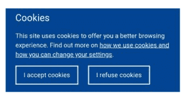
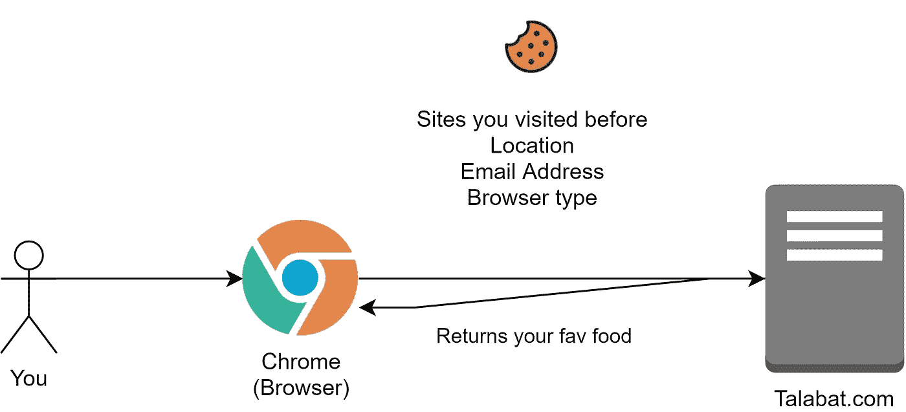
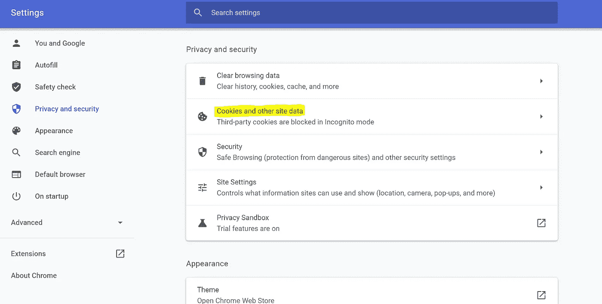
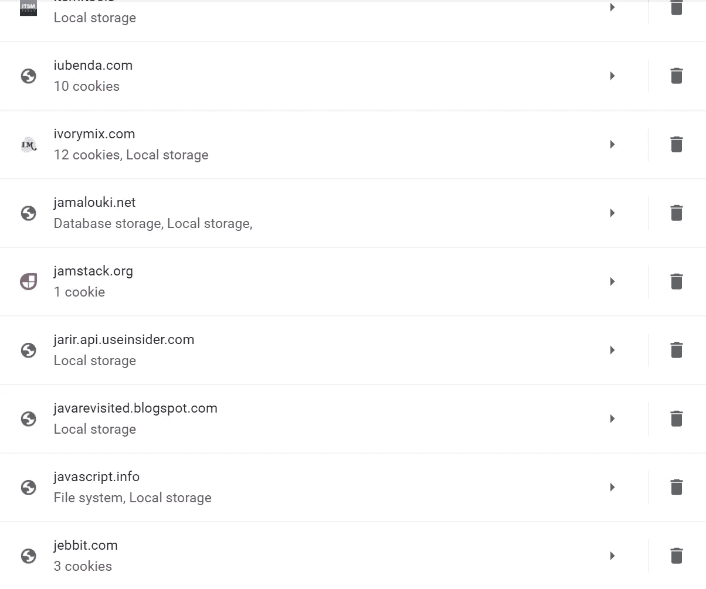
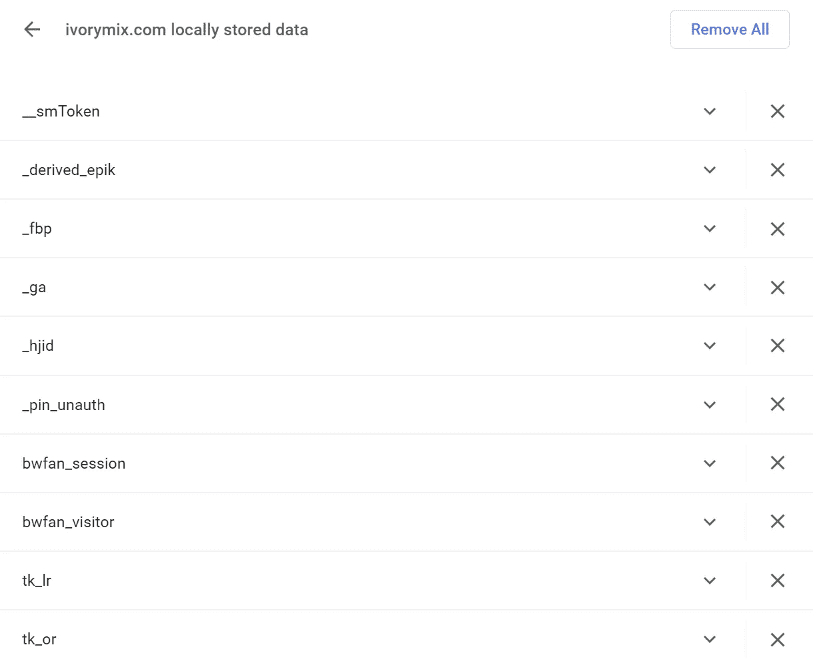
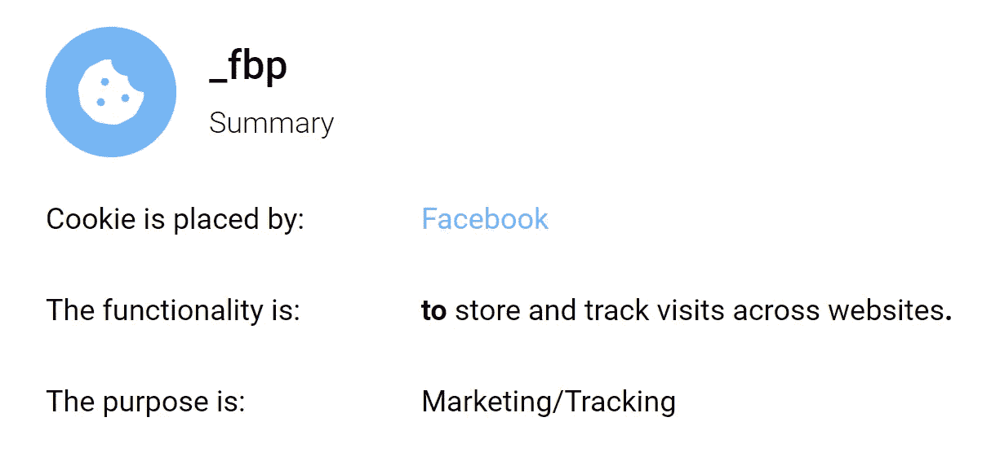
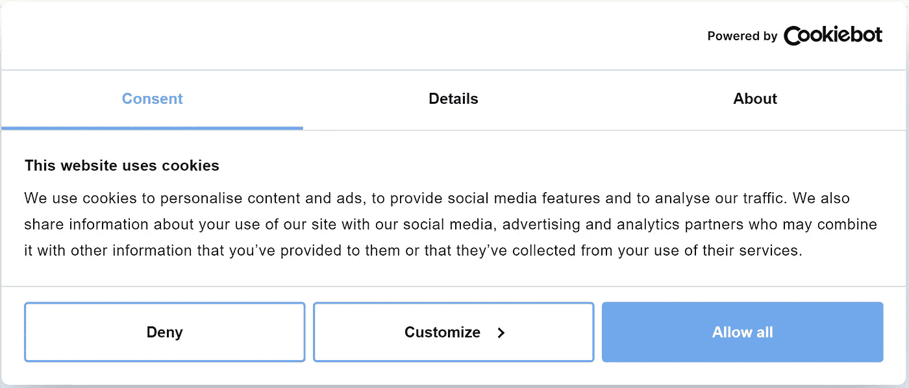
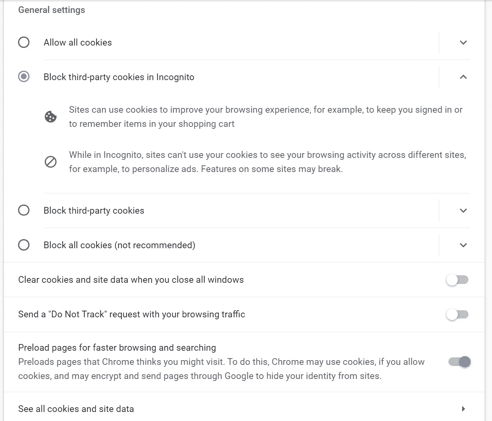

# 你被跟踪了！—网络 cookies

> 原文：<https://blog.devgenius.io/you-are-being-tracked-web-cookies-3957d3727a44?source=collection_archive---------1----------------------->

当我们第一次访问一个网页时，经常会有一个 cookies 弹出窗口提示我们。通常情况下，为了顺利进行，您可能会想通过单击“我接受 cookies”来消除此弹出窗口，但并不清楚什么是“cookies ”,为了更好的浏览体验您要牺牲什么，作为访问者您的权利是什么，这些 cookies 是如何处理的，当您授予权限时存在什么威胁，以及通过考虑这些条件和弹出窗口您会增加什么影响。

访问网站时会弹出 Cookies

# 什么是 cookie，它是如何工作的？

当你浏览一个网页时，网页浏览器会将一些关于你的信息，你的浏览行为、时间、地点等信息存储在一段文字或一个名为***“cookie”的文件中。***cookie 改善你的浏览体验。它建立了你的个人资料。这有利于个性化体验，因此当你访问一个新网站时，它会更了解你，你也会有个性化的内容。

cookies 和浏览是这样工作的:你浏览了数以千计的网站，每个网站都将 cookies 存储在 Chrome(或其他浏览器，图 4)、磁盘或本地存储器中。所以当你访问一个新的网站，比如说，【www.talabat.com】，，你的浏览器会发送所有这些 cookies(这些 cookies 很了解你！)到 talabat.com 服务器。塔拉巴特会考虑让你看他们的内容..你可能会首先看到你最喜欢的餐馆，你的位置默认设置为卡塔尔，语言是英语，更多的偏好设置已经设置好了。

这真的很方便每个人观看我们想看的东西，不用每次去[www.facebook.com、](http://www.facebook.com,)都登录脸书，还有很多其他好处……但是，你应该知道相关的风险，你的权利是什么，以及如何利用这种高度安全措施的个性化。

# 探索一些饼干…

如果打开 Chrome **→** 设置→在“隐私和安全”下→点击 Cookies 和其他站点数据。您将看到您访问过的所有网站和一些关于存储的 cookies 的信息(收集的信息)。

如果你点击其中一个条目，你会看到更多关于 ivorymix.com 网站存储的 cookies 的信息。你可以使用[https://www.cookiedatabase.org](https://www.cookiedatabase.org)来检查每个 cookie 携带的内容。

例如，_fbp 是一个由脸书放置的 cookie，可能是通过浏览发送到 ivorymix.com 的(见图 2)。此 cookie 存储并跟踪您对网站的访问。

_fbp:存储和跟踪其他网站的访问。其他一些有趣的可以保存个人信息的饼干在这里:[https://gls-group.eu/DE/en/cookie-policy](https://gls-group.eu/DE/en/cookie-policy)

# 了解你的风险和权利

## 一些风险和隐私问题

尽管大多数网站在存储您的 cookies 之前会请求您的同意，但还是会出现一些风险和隐私问题:

*   如果您拒绝 cookies，许多网站将无法正常运行
*   没有阅读就关闭或消除一个 cookies 弹出窗口，并不意味着你消除或拒绝它。它认为这是你的同意。
*   许多网站不要求您的许可来存储您的 cookies 或通知您。我们想知道哪些细节被跟踪，谁在跟踪。
*   有些 cookies 是由涉及营销和广告的第三方网站设置的。您可能将 cookies 存储在从未访问过的未知网站上。
*   你可能不知道你的信息在某些网站上会被如何使用。它可能是为了跟踪你做了什么，你花了最多的访问，你喜欢什么，以及其他个人信息。
*   一些网站或组织可能会设置 cookies 来跟踪用户从一个网站到另一个网站的移动，并可以合并个人数据，有时会将这些数据提供给任何有商业利益的人。
*   当浏览器 cookies 与其他服务器共享时，它们可能会被攻击者截获，攻击者可以建立一个关于您和您的个人信息的配置文件。

## 了解你的权利和法律

有一些关于 cookies 的法律是为了保护您的隐私而制定的，例如《欧洲一般数据保护条例》(欧盟 GDPR)和《加州消费者隐私法》(CCPA)。这些法规涉及 Cookie 法，该法要求任何网站向其用户声明网站上哪些 Cookie 是活动的，他们跟踪哪些数据，出于什么目的，以及交换的数据在哪里。它应该包含用户如何选择退出 cookies 或更改他们在您的网站上的 cookies 设置的信息。任何违反这些法律的行为都可以被举报和罚款。

这是一个来自 Cookiebot 网站的清晰 Cookie 策略的例子。它为客户提供了所有选项，非常清楚地说明了哪些 cookie 用于什么目的，还有一个“关于”部分向用户介绍 cookie。

>

## 作为用户应该怎么做？

请确保修改您的浏览器和互联网 cookies 设置。您可以阻止第三方 cookie，阻止所有 cookie(但在这里您将失去保持登录和管理浏览会话的选项)，在关闭 windows 时清除 cookie，并且您还可以选择在浏览数据发送到外部服务器时请求“不要跟踪”。不幸的是，包括谷歌在内的大多数网站和网络服务在收到“不要追踪”请求时不会改变自己的行为。Chrome 没有提供哪些网站和网络服务不跟踪请求以及网站如何解释这些请求的细节。

## 作为开发人员或隐私专家，您应该做些什么？

确保在设计和开发系统的前端和后端时遵守法律。违反 GDPR，主管当局可开出高达 2410 万美元或全球年营业额 4 美元的罚单。因此，当你建立网站时，这是值得考虑的事情。