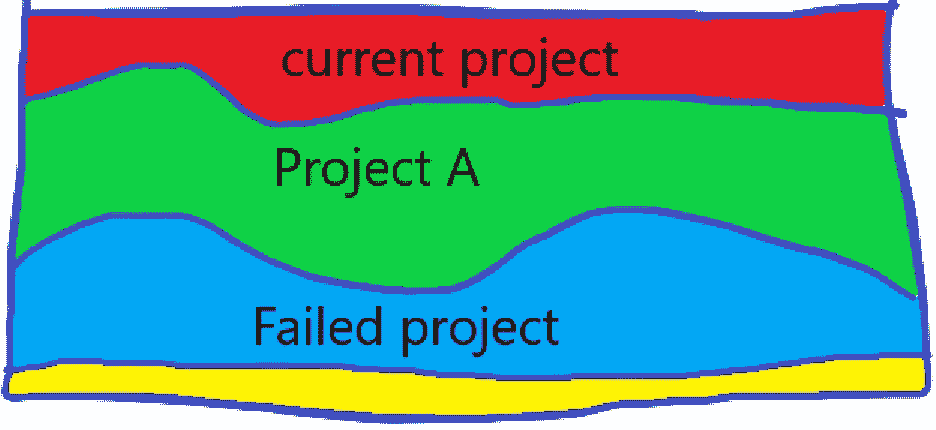

# 你不再是以前的开发者了

> 原文：<https://blog.devgenius.io/you-are-not-the-same-developer-you-used-to-be-d89d4ab29b5c?source=collection_archive---------5----------------------->

## 开发人员更改代码，代码也更改开发人员

照片由 Pexels 的 Lucas Pezeta 拍摄

> 你今天的开发者和你昨天的开发者不一样

开发人员是他们环境的产物，他们是由他们的人员、技术、解决方案和经验塑造的。[开发人员永远不会两次编写相同的代码](/no-developer-writes-the-same-code-twice-840a747ad224)。代码是相同的，但是开发者是不同的。

当时感觉像是一场斗争的事情，可能会变成你从中学到最多的项目。当你退后一步欣赏你创造的代码/软件时，你意识到你学到了什么。

# **进化**

作为一名开发人员，你必须不断发展，否则你的技能最终会过时，对它们的需求会减少(有一个策略是成为最后一个幸存的 VB6 开发人员，但这不是开发人员的生活)

如果你不改变或挑战自己，你[会停滞不前](/why-developers-stagnate-77d9bfc5c91e)，这会导致厌倦。

你经历的一些变化是自己开始的，学习新技能，承担新角色，调动公司。许多变化都是因为他们工作的环境、人员和项目。

我经常想起这句话

> “任何一年，如果你没有摧毁你最爱的想法，那很可能就是浪费的一年。”芒格

**您转变了哪些想法、技术、方法、工具、服务和良好实践？**开发者的视角来自他们的经历，这给了他们一个不同的视角。

# **过去是通向未来的钥匙**

理解你是开发人员的关键是理解过去。

理论、知识、证书和了解最佳实践是有用的，但是塑造开发者的是编写代码和创建软件。

一旦面对真实用户使用的真实软件需求，每个开发人员都知道 hello world 的例子很快变得无关紧要。

理论上，知识对于理解你的选择、方法和设计是有用的，但总会有一些讨厌的限制或看起来无辜的要求打你的嘴巴。

**这就是创建软件和成为开发人员的全部意义**。障碍和限制是创建所需软件的前进之路。

使用技术(语言、工具、服务等))创建软件是一项技能。只有通过创建软件，您才能变得更好。没有一种最佳实践、设计或项目方法每次都能奏效。开发者必须适应你的情况。

[没有人生来就是开发者，](/developers-are-made-not-born-d5c4ac4672a3)开发者是通过他们的经验创造出来的。[开发人员不是商品](https://medium.com/codex/developers-are-not-commodities-individual-developers-make-a-difference-ba07998ce46b)，个人开发人员在他们从事的项目上有所作为。

# **你怎么变了？**

不仅仅是你是否改变了，而是你如何改变了。技术环境发生了变化，开发人员必须适应它。

作为开发人员，有许多方面会导致您发生变化

*   技术
*   经验(项目)
*   知识——新知识
*   其他人的意见
*   成功/失败
*   职责/角色

经验在软件开发中起着重要的作用，这是聪明的开发人员和聪明的开发人员的区别。

我看待过去就像看待不同的项目、公司、解决方案和人一样。回顾过去，我记得在项目方面的发展，有点像当他们发现恐龙骨骼时你看到的图片。

绘画霍斯克艺术

# **新机遇**

> 在软件开发中，日子过得很快，但岁月过得很慢

只有当你回顾过去时，变化才是显而易见的，而最难应对的变化是缓慢而显著的变化。

很难看到像互联网、移动和低代码这样的技术变化，因为初始版本通常是有限的，很容易被忽略。你注意到一个新的开发团队出现了，并且发展很快。

新技术是进入现有专家较少的领域的机会，在新技术领域来自有经验的开发者的竞争较少。对于开发人员来说，这些机会经常发生在项目工作和快速学习新技能的过程中。

一些最好的机会是偶然出现的，而另一些则是偶然得到的。

# **反馈延迟**

软件开发通常是违反直觉的，好的实践是基于长期利益的，很难看到。

查理·芒格鼓励你将问题转化，以理解应该避免做什么。在软件开发中，人们做最坏的事情，这样他们可以直接学习。

*   每个人都被简单愚弄了
*   低估工作，夸大收益
*   添加新成员
*   在验证需求之前构建
*   不断改变需求

这是我从失败的项目中学到最多的东西。遭受混乱项目的痛苦帮助我感受到了软件开发做得不好的痛苦。这给了我动力，让我不再陷入那种境地。

作为一名开发人员，你只有在承认错误的时候才会学习和改变。你太忙了，没有时间去理解问题的原因，而是专注于解决问题。

向运行良好的开发团队学习可能很困难。在一个运作良好的团队中工作感觉很棒，每个人都知道该做什么。这些软件开发团队不仅能开发出好的软件，还能对变化或问题做出快速反应。

只有当你进入一个糟糕的开发团队时，你才会意识到在一个好的开发团队工作的好处。加入失败的项目帮助我理解了糟糕的开发实践的影响。

*   [处于混沌边缘的软件开发](https://itnext.io/software-development-at-the-edge-of-chaos-2934f536daf5)
*   [当糟糕的开发者制造软件开发混乱时会发生什么](/what-happens-when-bad-developers-create-software-development-chaos-c1d9125ee38d)

如果你停下来思考，你会从每个项目中学到很多东西。

# **人**

创建软件都是关于人的。他们有信息。他们做决策，测试软件，开发人员设计软件并编写代码。

优秀的开发人员会提出我从未想过的想法、设计、解决方案和代码。其他开发人员会给你不同的视角(基于他们的知识、经验和技能)，这是你可能没有想到的。

回顾过去，我发现每个人都通过他们的行动和与我共事的方式对我和我的职业生涯产生了巨大的影响。观察人们和开发人员对各种情况的反应是一种很好的学习方式。

# **结论**

有趣的是，不仅要思考我们是如何改变的，还要思考是什么事件、项目、人、知识、失败或其他原因导致了我们的改变和进化。

体验使开发人员能够更智能、更高效地工作。您可以避免大多数问题，从而节省解决问题的时间。

发展是一种你通过经验和思考提高的技能。没有快速创建软件的方法，也没有快速成为高级开发人员的方法。

> 在一个项目中，我多次确信软件开发一定是一场疯狂的游戏，而我一定是其中之一