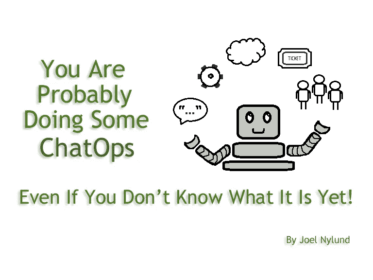
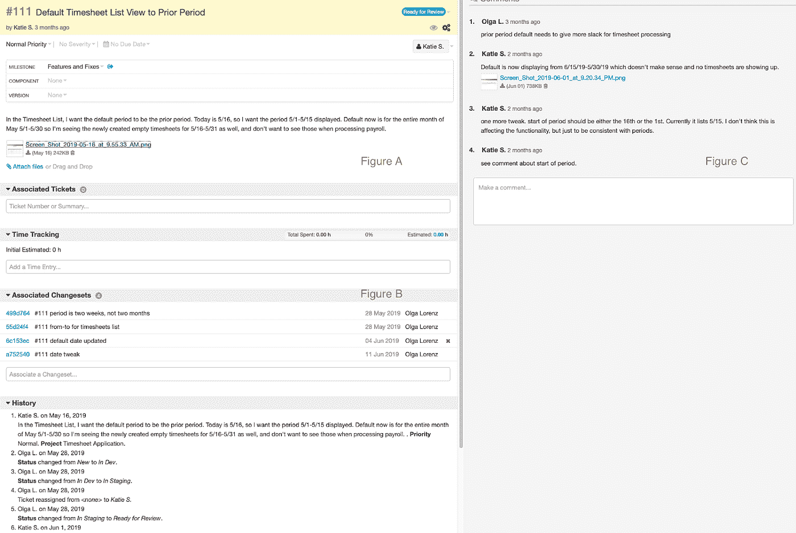
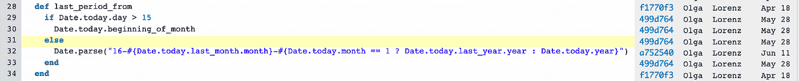

# 你可能正在做一些聊天，即使你还不知道它是什么！

> 原文：<https://blog.devgenius.io/you-are-probably-doing-some-chatops-even-if-you-dont-know-what-it-is-yet-35fa0dc4006?source=collection_archive---------13----------------------->

在我的上一篇时事通讯文章中，我谈到了团队沟通，以及拥有一份[团队沟通合同](https://www.solutionstreet.com/blog/team-communication-contract/#.XVQqwlB7lJs)如何能够提高整个团队的生产力和幸福感。对于正在经历显著增长的团队来说，其中一个沟通选项是“聊天”你可能听说过软件团队对 HipChat(现在是 Slack 的一部分)或 Slack 赞不绝口，并对自己说，“这有什么大不了的？这怎么比 Skype 好？”重要的增长领域似乎是在“ChatOps”及其周围，以及人们如何利用这些工具和其他工具来实现 ChatOps。

那么什么是 ChatOps 呢？根据 Atlassian(Slack 的制造者):

*ChatOps 是一个协作模型，它将人员、工具、流程和自动化连接成一个透明的工作流。*

对我来说，ChatOps 是利用“机器人”来做重复的任务，同时与一个小组或团队分享。

退一步说，我们大多数人多年来一直使用集成的源代码控制、票证管理、sprint 管理和 wiki 类型的服务来管理软件构建。最流行的工具是[吉拉](https://www.atlassian.com/software/jira)，但是我们也为我们的项目使用 [Unfuddle](https://unfuddle.com/) 和[Team Foundation Server](https://azure.microsoft.com/en-us/blog/introducing-azure-devops/)(TFS)。这些工具的美妙之处在于，您可以轻松有效地管理、链接和集成作为软件构建一部分的所有工作产品。例如，Katie 可以为我们的时间表系统创建一个变更单，她可以描述她想要的变更，附加文件(图 A)，然后与开发人员 Olga 交谈并向其提供反馈(图 C)。Olga 可以将她的代码更改与该票证相关联(图 B)。

见下图 A、B 和 C。

此外，在查看系统中的任何代码时，我可以找出代码为什么会在那里，以及是谁创建或修改了它。因此，如果我在查看 timesheets_helper.rb 文件并想知道为什么这个日期代码在这里，我可以看到 Olga 在 6 月 11 日进行了更改。我可以单击“change ”,它会将我带回到 Katie 请求的票证，并知道想要更改的企业所有者(见下图 D)。

图 d。

许多工具都有允许这些关联的快捷方式。Unfuddle 使用“强大的提交”,我可以通过使用“#”符号、票号和描述将票与提交相关联。我还可以通过使用关键字来更改票证状态。当我以这种方式提交 Git 时，它会自动将更改与票据关联起来，并更新状态。因此，如果 Olga 将“#111 已解决变更结束日期”设为当前期间，此变更将与标签 111 和标记为已解决的标签相关联。

hatOps 可以作为软件构建的下一个自动化级别。

这和 ChatOps 有什么关系？首先，ChatOps 可以作为软件构造的下一级自动化。我可以使用 ChatOps 自动通知团队中的其他开发人员(通过聊天组和一些自动化)重要事件。在上面的例子中，如果我和 Olga 在一个 QA 团队，当 Olga 解决一个问题时会很好。要做到这一点，我们可以自动向我们的群组聊天发送一条关于票据解析的消息。例如，在这种情况下，我们会收到一条聊天消息，称“Olga 解决了 111 号罚单。”

第二，ChatOps 对于我们在管理票证时经常遇到的问题很有用，通过电子邮件和聊天等其他媒体进行的附带对话不会记录到票证摘要或评论中。ChatOps 可以通过在使用标记时自动向票证添加评论来解决此问题。所以我可以在聊天中说，“嘿 Olga，我注意到你改变了 111 号机票的默认结束日期。你认为这在这个月的最后一天会是个问题吗？”她可以回答说，“我已经想到了那个角落的情况。”使用 ChatOps，我们可以将此对话自动添加到票证 111 中。

我上面描述的场景仅仅是在团队环境中使用 ChatOps 实现自动化的皮毛。我们看到人们做的其他流行的事情是与 CI/CD 过程相关的通知；例如，“Joel，你提交的 ZYZ 破坏了单元测试 1、2、3，构建失败，请尽快修复。”

Atlassian 写了一篇关于团队可以使用的聊天工具的[等级的文章。在 Solution Street 对团队进行的一项简短调查显示，大多数团队都使用某种级别的 ChatOps，大多数团队使用级别为 1，但有些团队使用级别高达 3 和 4。](https://www.atlassian.com/blog/software-teams/what-is-chatops-adoption-guide)

我希望这能让你很好地理解 ChatOps 是什么，以及如何使用它来改善你的团队任务的交流和流程！

[订阅](https://us10.list-manage.com/subscribe?u=6a3b68411070f7dab1adb3a8b&id=f0193ac93e)我们的时事通讯，获取更多类似的精彩文章！