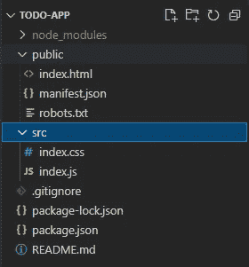
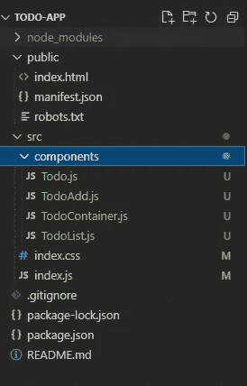
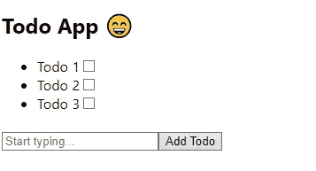
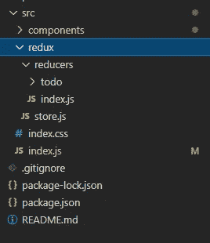
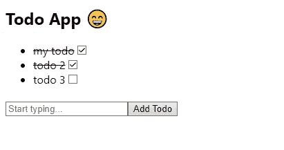
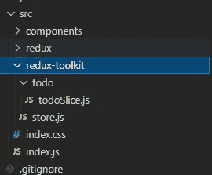

# 你不再需要 react-redux 了

> 原文：<https://blog.devgenius.io/you-dont-need-react-redux-anymore-7e3e1bc8e370?source=collection_archive---------1----------------------->


如果你喜欢这个内容，你可以支持我😊

[](https://www.buymeacoffee.com/stasoz)

大家好，今天我就来说说 react 的一个新替代品——redux，以及它为什么更好。

我将通过用两个不同的库(react-redux 和 react-toolkit)创建 Todo 应用程序来进行比较。

我假设你已经熟悉 Redux 了。如果没有，可以在[官网](https://react-redux.js.org)上找到。

现在，让我们构建一个简单的 todo 应用程序进行比较。

首先，让我们创建项目:

```
npx create-react-app todo-app
```

或者通过纱线

```
yarn create react-app todo-app
```

然后打开项目，去掉不必要的文件和依赖: *reportWebVitals.js，App.js，App.css，App.test.js，setupTests.js，logo.svg* 等等。

所以我的项目结构是这样的:



初始项目结构

现在让我们在 src 中创建组件文件夹，在组件文件夹中创建下一个文件: *Todo.js，TodoAdd.js，TodoContainer.js，TodoList.js*



仔细检查每个组件。

1.  *TodoContainer* —包含 TodoList 和 TodoAdd 组件的组件。

2. *TodoAdd* —用于添加新待办事项的组件，它有一个用于存储和键入标题的输入字段和用于创建新待办事项的按钮。

3. *Todo* —表示简单 Todo 并显示标题和复选框以标记 Todo 已完成或未完成的组件。

4.最后一个是*待办事项* —代表待办事项列表:)

是时候将我们的 *TodoContainer* 添加到 *index.js* 中了

并通过终端中的`npm run start`启动我们的应用程序。瞧啊。



但是在我们的应用程序中没有逻辑。所以还是补充一下吧。首先，我们要建立一个 redux (store，actions，reducer，types)来存储应用程序的一般状态。

通过下一个命令添加 redux

```
npm install react-redux
```

或者纱线

```
yarn add react-redux
```

然后在 *src - > redux* 中新建一个文件夹，添加到 redux 文件夹下一个文件夹和文件:

1.  *redux->reducers->index . js*
2.  *redux->reducers->todo:actions . js，actionsTypes.js，todore reducer . js*
3.  *redux - > store.js*



*store.js* —这里我们有 redux 的 **createStore()** 函数，创建一个商店(我觉得不值得解释函数是做什么的，名字本身就说明了一切)。我们还在这里导入了一个名为 **rootReducer、**的文件，我们还没有创建它，所以现在让我们开始吧。

*reducers->index . js-*主减速器，您可以在其中放置许多不同的减速器用于不同的操作，他会通过**combiner reducers()将它们组合成一个减速器。为什么我们只需要一个主减速器？因为 *store.js* 中的 **createStore()** 只能带一个减速器。**

好，我们已经创造了主减速器，它进口到一个减速器，我们还没有它。

首先，让我们为 todoReducer 添加**动作类型**。我不会实现所有的功能，只有添加和完成。

*redux->todo->action types . js*

接下来，为 todo 创建**动作**。

*redux->todo->actions . js*

这里，我们从**动作类型** 导入常量，并在各自的动作中作为类型传递。

最后我们可以创建 reducer:)

这里，我们将*开关盒*所需的动作类型导入到**to dore reducer()**函数中。

然后我们为这个缩减器声明一个名为 *initialState* 的状态。

在这之后，我们创建一个名为*的函数来减少*的变量，它有两个参数——状态*，动作*。*状态*取一个初始值 *initialState，动作*从 *actions.js* 文件接收我们的动作创建者传递的数据 *(* 有效载荷 *)* 。

在 **todoReducer()** 内部，我们使用来自 JS 的 [**switch-case**](https://developer.mozilla.org/en-US/docs/Web/JavaScript/Reference/Statements/switch) ，在每个 case 内部，我们返回更新后的状态。我们使用 [**扩展运算符(…)**](https://developer.mozilla.org/en-US/docs/Web/JavaScript/Reference/Operators/Spread_syntax) 将状态复制到我们的新对象中，然后在状态中添加我们想要更改的内容。

> ⚠️ 永远记住*:我们永远不会改变原来的状态！每次我们必须做出改变时，我们返回一个新的状态对象。*

设置 redux 的最后一步是连接到 *src - > index.js*

这里，我们从 react-redux 导入**提供者**来包装应用程序的所有组件，并将**存储**传递给**提供者**。因此，每个组件都可以访问该状态。

然后，让我们添加在 store 中添加新 todo 的逻辑。修改*以加载*组件，如下所示。

我们从 Todo 操作中导入 **addTodo** 操作，并在**上添加逻辑 onAddBtnClick()** 。现在，当用户键入一些内容并点击添加按钮时，我们将把新的 todo 保存到我们的存储中。

如果你不熟悉**使用 Dispatch** ，**使用 Selector** 挂钩，在这里阅读关于它们的挂钩[。](https://react-redux.js.org/api/hooks)

现在剩下的就是在屏幕上输出我们的待办事项了。让我们修改我们的 TodoList 并在那里添加一些代码。

**useSelector()** 允许我们访问我们的商店并获取数据，然后我们只需通过 [**map()**](https://developer.mozilla.org/ru/docs/Web/JavaScript/Reference/Global_Objects/Array/map) 输出我们的 todo，并通过 props 传递给每个 todo 必要的数据。没什么特别的。

只保留更改 Todo 组件。我们从 Todo 操作中导入 **completeTodo** 并在用户点击复选框和 todo 是否完成时调用它:)

现在，你可以启动 app，玩一点点。

```
npm run start
```



所以，我们用 redux store 构建了一个 todo 应用程序。但是告诉我，redux 中的代码看起来是冗余的还是复杂的？请在评论中写下你的观点。对我来说——是的，我们可以通过[**redux-toolkit**](https://redux-toolkit.js.org)**修复它。**

Redux Toolkit 是一个软件包，它使得使用 Redux 变得很容易。它旨在解决三个主要问题:

*   商店设置太复杂
*   为了让 Redux 做一些有用的事情，你必须使用额外的包。
*   太多样板文件

Redux Toolkit 提供了配置存储和执行最常见操作的工具，以及简化代码的实用工具。

通过下一个命令安装

```
npm i @reduxjs/toolkit
```

或者纱线

```
yarn add @reduxjs/toolkit
```

接下来，在 src 中创建 redux-toolkit 文件夹，并在其中添加下一个文件夹/文件:

1.  *redux-toolkit->store . js*
2.  *redux-toolkit->todo->todo slice . js*



store . js——与 redux 中的 store 相同，但不同之处在于我们从@reduxjs/toolkit 导入了 **configureStore()** 。

此外，我们需要创造一个减毒器。

*todoSlice.js —* 导入 redux-toolkit 的主要特性之一—**[**create slice**](https://redux-toolkit.js.org/api/createslice)**()**。 **createSlice()** 是一个高阶函数，它接受一个片名、一个初始状态和一个充满 reducer 函数的对象。它自动生成对应于减少器和状态的动作创建者和动作类型。**

**在 Redux-Toolkit 中，createSlice 方法帮助我们创建 redux-store 的一部分。该函数旨在减少以规范方式向 redux 添加数据所需的样板文件。内部使用 [**createAction**](https://redux-toolkit.js.org/api/createAction) 和 [**createReducer**](https://redux-toolkit.js.org/api/createreducer) 。
我推荐你使用 **createSlice** 而不是 **createAction** 和 **createReducer** ，因为这样更简单。**

**你可能注意到我直接改变了状态，但是我上面说的是不正确的。是的，但不是用 redux-toolkit。**

****createReducer** 和 **createSlice** 使用 [Immer](https://immerjs.github.io/immer/) 在内部使用“变异”语法，让您编写更简单的不可变更新逻辑。这有助于简化大多数 reducer 实现，不是吗？**

**让我们为应用程序添加新的商店。我只更改了存储路径。请记住，我们不需要改变任何 Todo 的组件逻辑，因为我们有相同的状态结构和动作名称。**

**现在，您可以启动应用程序，它的工作与以前的实施版本。**

**总结一下:**

*   **用 **react-redux** 我们创建了太多的文件，比如:动作类型、动作、还原器和用展开操作在还原器中写逻辑很无聊。**
*   **使用 redux-toolkit ,我们只创建了一个文件，它为我们生成所有的动作和动作类型，此外，我们可以使用“突变”语法更新逻辑。**

**这些还不是 redux-toolkit 的全部好处。还可以了解: [RTK 查询](https://redux-toolkit.js.org/rtk-query/overview)， [createThunkAsync](https://redux-toolkit.js.org/api/createAsyncThunk) ， [createSelector](https://redux-toolkit.js.org/api/createSelector) 。**

**为了更好地理解差异，请尝试在上面的示例中添加删除和更新功能。你可以以我的项目为基础——[https://github.com/stasoz1/todo-redux-toolkit](https://github.com/stasoz1/todo-redux-toolkit)。**

**感谢您的阅读和快乐编码！**

# **学到了新东西？**

**如果你喜欢这篇文章，可以 [**给我买杯咖啡**](https://www.buymeacoffee.com/stasoz) 我写下一篇文章的时候再喝:)**

**[](https://www.buymeacoffee.com/stasoz)**

***更多内容尽在*[*blog . dev genius . io*](http://blog.devgenius.io)*。***