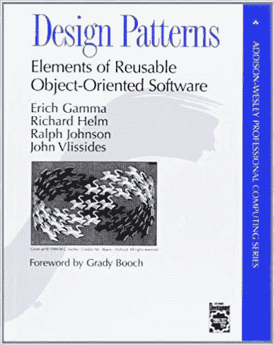

# 你不需要使用设计模式(直到你需要)！

> 原文：<https://blog.devgenius.io/you-dont-need-to-use-design-patterns-until-you-do-1f2404d38ff?source=collection_archive---------1----------------------->

而且你需要使用设计模式(直到你不用)！

[沙扬·吉斯凡德](https://unsplash.com/@shayangh96?utm_source=medium&utm_medium=referral)在 [Unsplash](https://unsplash.com?utm_source=medium&utm_medium=referral) 上的照片

我已经在软件开发市场呆了 15 年了！我没有一天不听说设计模式！

我经历了不同的工作面试！他们总是问设计模式！他们中的一些人知道他们在谈论什么。他们中的大多数人没有任何线索！他们只是认为“完美的候选人”应该熟悉模式！有趣的是，大多数时候，你向他们解释什么并不重要！你只需要随便捡几个词，然后努力让自己看起来聪明点！这就够了。

来说说课程和训练营吧！你注册它们是希望你能很好地理解编程语言、框架或工具！你的意图和期望是明确的！然后又是设计模式。教师们试图用各种模式和口味来给所有的东西增添趣味。

一些编码挑战也让我笑得要命！如果你尝试用模式解决问题，他们会给你奖金！不管你的代码有多快，多可靠，多优化！如果你没有在里面使用任何模式，你就失败了！

然后我们有了我们热爱的朝九晚五的技术工作！在那里，要么你知道设计模式，要么你看起来像个傻瓜！你不得不参加冗长的会议来讨论使用模式的架构设计…而这些会议的结果只会让你慢下来！您必须使用模式重构现有代码！你必须用这些模式把它转换成一个干净的代码。大多数时候，它会使你的代码变得复杂，变得难看！

终于，你和自己有私人时间了！你扪心自问，当所有的编码员都在使用设计模式的时候(或者至少假装在使用)，你为什么不使用设计模式！你难受！你厌倦了这个！

我对设计模式没什么可说的！我已经一行一行地读了三遍“四人帮”的书！我还对 23 种著名的模式(以及一些不著名的模式)有相当的了解。我在代码的某些部分大量使用了设计模式！

四人组设计模式书

然而…

我确实相信(大部分时间)我的开发伙伴不知道他们在说什么！或者更糟的是，他们不知道他们想要使用设计模式实现什么！

## (严肃地)你想用设计模式改进什么？

这是目前为止社区中最重要的误解！许多开发人员在他们的代码中使用设计模式仅仅是因为他们认为模式很酷！

不对！

设计模式背后的主要思想是帮助你改进你的代码库。我说的改善是指:

❋码可读性

❋表演

❋clean 电码

❋冗余码

❋可扩展性

等诸多因素！

比较使用和不使用设计模式的代码！看看你是否成功地提高了你的项目在上述领域的质量？如果没有，就把它当作一个信号！它警告你可能没有理解设计模式背后的想法！

⛔如果你的代码已经是可读的，你不需要让它不可读！

⛔如果你的代码是干净的，就不要让它难看！

⛔如果你的代码不是冗余的，就不要在你的解决方案中强迫自己冗余！

⛔:如果你用其他方法也有出色的表现，你就可以走了！

⛔:如果你有令人信服的架构，并且你确保你的解决方案是可扩展的…那么它就是可扩展的！

就这么简单！

## (大多数情况下)从哪个阶段开始在代码中使用模式并不重要！

你需要转变心态！多想想“怎么样”，少想想“什么时候”！

我经常从初级研究员那里得到的问题是:

当我开始编码时，我应该使用设计模式吗？

运筹学

我应该在重构过程中使用它们吗？

答案很简单！

如果你是一个编码天才，并且你已经记住了 23 种常见模式的用例，那么在任何阶段都可以随意使用它们！👏

但事实是大多数开发人员(包括我在内)没有这种奢侈(和知识基础)！我们尽最大努力开发一个无 bug 且干净的代码！那我们就被困在某个地方了！有东西坏了！

你知道吗？这完全没问题！它发生了！

☛:是的，你必须遵循最佳实践！

☛:是的，你应该在你的代码中关注垃圾收集！

☛:是的，你应该考虑到复杂性！

☛:是的，你最好把可伸缩性、可测试性等问题分开！

这个清单可以一直列下去！

事实是，无论你多么努力，在你的编码之旅中总会有很多时候你会陷入困境！

卡住了还不错！不知道如何摆脱它才是！⚡️

设计模式帮助你在问题变得越来越大之前摆脱它！在你无法控制它之前！

我在这里的主要观点是，你不需要强迫自己去了解关于模式的一切，并从零开始在你的代码库中使用它们！

放松点。

尽最大努力遵循最佳实践，然后如果您在代码中发现一些错误/瓶颈，尝试思考使用设计模式是否有可能获得更好的结果？

顺便说一句，如果你选择一些关于这个主题的课程或书籍来教育自己，这并没有坏处！这样，至少你对不同的场景和用例有一些基本的了解，如果将来你遇到类似的情况，那会触发你！

## 你确定你用的是设计模式(而不是反模式)！

这是非常典型的开发者之间的错误！他们使用一些模式，希望能够改进他们的代码！相反，他们用反模式杀死他们的代码！

一个著名的例子就是单例设计模式！

单例设计模式可能是最容易学习和使用的模式！也是很多开发者认为 Singleton 使用最多(过度使用？)设计模式。

这种模式背后的基本思想是，一个对象可以有一个(且只有一个)实例。我不打算深入探讨这个问题。为此，请查看在线资源。

Singleton 是一种容易学习和使用的模式，这一事实也使它变得非常有害！编码人员在他们的代码中的很多地方都使用了它，却没有一个清晰的想法，他们想要实现什么？

您希望您的“日志记录”系统只有一个对象吗？可能是你的数据库连接器？

很公平…使用 Singleton！

但是如果你的代码中的每一个类和对象都有单例，那么肯定有问题！你被反模式诅咒影响了！

## 最后的想法？

设计模式很酷！他们能帮你很多！他们会给你提供你从来不知道存在的捷径！他们可以保存你的代码！然而，你必须小心，什么时候用，什么时候不用。

这里有一个简单的清单:

当设计模式在以下方面改进您的代码时，请务必使用设计模式:

1.  可读性
2.  易测性
3.  可量测性
4.  表演
5.  更好的编码结构
6.  清除器代码
7.  较少冗余

和

如果你认为设计模式对你没有任何帮助，那就避免使用它们！

> 我夸大了一切，这就是我错的地方
> 
> — **陀思妥耶夫斯基**

如果你喜欢这个内容，并且你有兴趣在将来阅读我的类似文章，请考虑加入我的推荐链接。如果你注册使用我的链接，我会赚一小笔佣金，你可以无限制地访问所有媒体作者的内容。这样你就在平台上支持我和你其他喜欢的作家了。谢了。

 [## 通过我的推荐链接加入媒体- Ehsan Yazdanparast

### 作为一个媒体会员，你的会员费的一部分会给你阅读的作家，你可以完全接触到每一个故事…

ehsan-yazdanparast.medium.com](https://ehsan-yazdanparast.medium.com/membership)  [## 每当 Ehsan Yazdanparast 发布内容时，都会收到一封电子邮件。

### 每当 Ehsan Yazdanparast 发布内容时，都会收到一封电子邮件。通过注册，您将创建一个中等帐户，如果您没有…

ehsan-yazdanparast.medium.com](https://ehsan-yazdanparast.medium.com/subscribe)