# 你喜欢 GitHub，但不喜欢把你的代码放在云端。免费托管自己的 GitLab 服务器。

> 原文：<https://blog.devgenius.io/you-love-github-but-dont-like-putting-your-code-in-the-cloud-79d69f052db7?source=collection_archive---------7----------------------->

使用 Docker Compose 的自宿主 GitLab 是一个免费的 Git 管理系统，类似于 GitHub 和 BitBucket，但适用于您的本地环境。

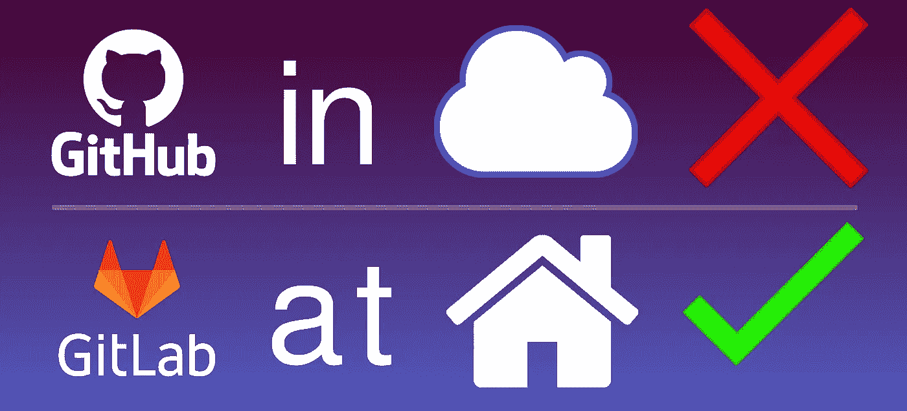

免费使用 Docker Compose 的自宿主 GitLab。

# TL；速度三角形定位法(dead reckoning)

如果您想在独立于云的私有本地网络上免费自托管 Git 版本控制系统，GitLab 是 GitHub 和 BitBucket 的一个很好的替代方案。从[这里](https://github.com/PhiCygni/gitlab-free-local-server-using-docker-compose)克隆我的 repo，按照说明操作，很快就可以自托管一个 GitLab 容器。

# 目录

- [简介](https://medium.com/@emileross/you-love-github-but-dont-like-putting-your-code-in-the-cloud-79d69f052db7#382d)
-[git lab 是什么？](https://medium.com/@emileross/you-love-github-but-dont-like-putting-your-code-in-the-cloud-79d69f052db7#c53e)
- [按照以下步骤自托管一个 GitLab 容器](https://medium.com/@emileross/you-love-github-but-dont-like-putting-your-code-in-the-cloud-79d69f052db7#972c)
- [如何创建新用户？](https://medium.com/@emileross/you-love-github-but-dont-like-putting-your-code-in-the-cloud-79d69f052db7#8451)
- [如何新建回购？](https://medium.com/@emileross/you-love-github-but-dont-like-putting-your-code-in-the-cloud-79d69f052db7#b0f7)
- [如何查看 GitLab 回购？](https://medium.com/@emileross/you-love-github-but-dont-like-putting-your-code-in-the-cloud-79d69f052db7#2962)
- [使用带有 SSL 证书的 GitLab](https://medium.com/@emileross/you-love-github-but-dont-like-putting-your-code-in-the-cloud-79d69f052db7#3d1c)
-[如何彻底移除 git lab 容器？](https://medium.com/@emileross/you-love-github-but-dont-like-putting-your-code-in-the-cloud-79d69f052db7#0864)
- [参考文献](https://medium.com/@emileross/you-love-github-but-dont-like-putting-your-code-in-the-cloud-79d69f052db7#0fa9)

# 介绍

有时，出于安全或隐私方面的考虑，不允许将代码放入云中，或者只是觉得不舒服。如果有像 GitHub 这样的服务来管理你的 Git repos，而且是在你的私有网络上自托管的，那不是很好吗？利用 GitLab 解决了这个问题，git lab 是一个类似于 GitHub 和 BitBucket 的企业级版本控制系统。下面展示的是一个方便可靠的 Docker 编写脚本，用于自宿主 GitLab。

# GitLab 是什么？

GitLab 是一个开放核心的版本控制管理系统，具有许多与 GitHub [ [1](https://about.gitlab.com/devops-tools/github-vs-gitlab/) ]相关的特性。GitLab 特性的完整列表可以在这里和这里找到[ [2](https://about.gitlab.com/features/) ， [3](https://about.gitlab.com/pricing/self-managed/feature-comparison/) ]。然而，在我看来，它最重要的特性是它可以免费自托管，这是 GitHub 和 BitBucket [ [3](https://about.gitlab.com/pricing/self-managed/feature-comparison/) ， [4](https://www.atlassian.com/software/bitbucket/pricing?tab=self-manageddata-center) ， [5](https://docs.github.com/en/get-started/learning-about-github/githubs-products) ]无法实现的特性。GitLab 的作者 GitLab Inc .也提供了一个 Docker 映像，这意味着安装过程可以在几乎任何能够运行 Docker [ [6](https://docs.gitlab.com/ee/install/docker.html) ， [7](https://hub.docker.com/r/gitlab/gitlab-ee/) ]的平台上自动化和托管。在接下来的部分中，我将解释如何使用我的 Docker Compose 脚本，通过几个简单的步骤来安装 GitLab。

# 按照以下步骤自托管 GitLab 容器

查看我的[回购](https://github.com/PhiCygni/gitlab-free-local-server-using-docker-compose):

```
$ git clone [https://github.com/PhiCygni/gitlab-free-local-server-using-docker-compose.git](https://github.com/PhiCygni/gitlab-free-local-server-using-docker-compose.git)
```

获取您想要托管 GitLab 的机器的本地主机名:

```
$ hostname
```

修改。env 文件，并将 localhost 值更改为您的本地主机名。例如:

```
GITLAB_HOSTNAME=mydesktop
```

构建并启动 GitLab 容器:

```
$ docker-compose up
```

在构建和启动的同时，打开另一个终端到相同的目录并运行命令:

```
$ docker-compose ps
```

该命令将报告容器的当前状态。等到状态列报告容器为**启动(健康:正常)**而不是**启动(健康:正在启动)**。这可能需要大约 5 分钟，请耐心等待！这就是我们如何知道容器的构建已经完成并可以使用了。

现在检索新创建的 GitLab root 密码:

```
Linux: $ sudo cat ./config/initial_root_passwordWindows: $ type .\config\initial_root_password
```

示例输出:

```
Password: zsFHw3SpgwSTal1+Ufiurw4DaghDIcKlVy+MUctmxwE=
```

确保在某个地方记下这个 root 密码，因为 GitLab 会及时删除它！

# 如何创建新用户？

使用 root 用户登录 GitLab:


以 root 用户身份登录。

转到管理页面:

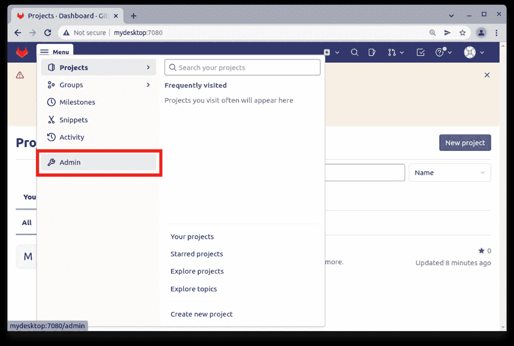

转到管理页面。

点击“新建用户”按钮创建新用户:

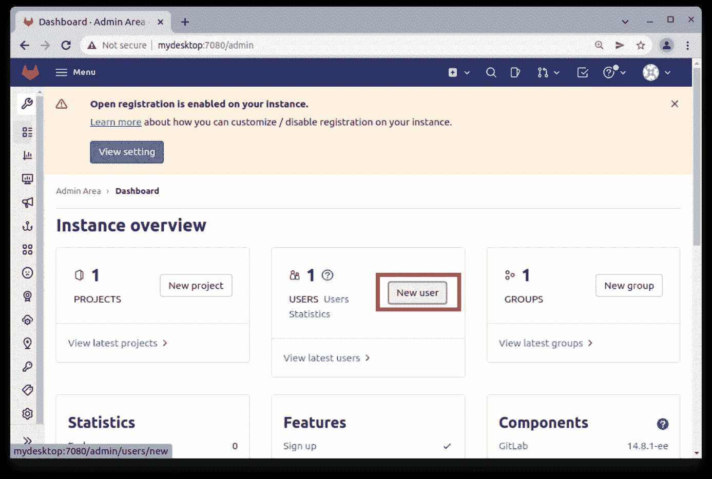

点击“新用户”按钮。

填写新用户的详细信息。在本次演示中，我将使用名称 *Jim* :

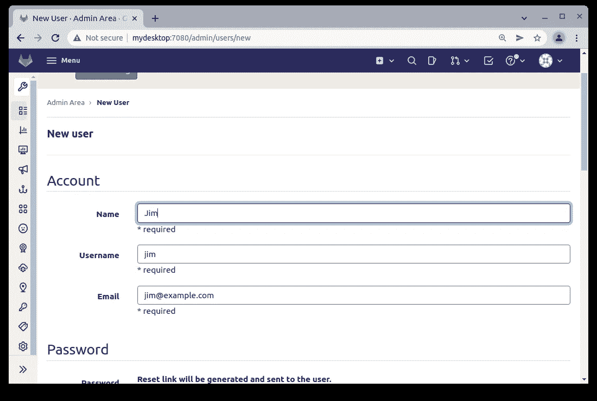

填写新用户的详细信息。

例如，我们将该用户的访问级别设置为管理员:

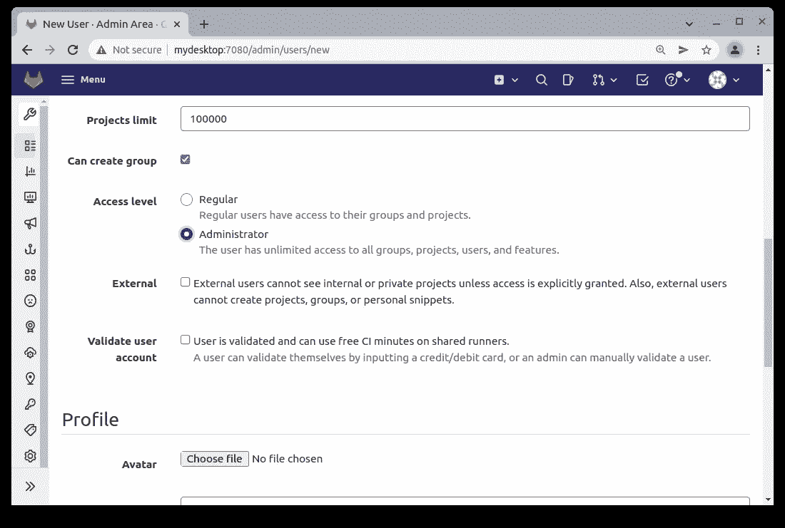

我们将该用户的访问级别设置为管理员。

最后，单击“创建用户”按钮创建用户。

我们现在需要设置这个新用户的初始密码。转到用户列表，编辑我们刚刚创建的用户:

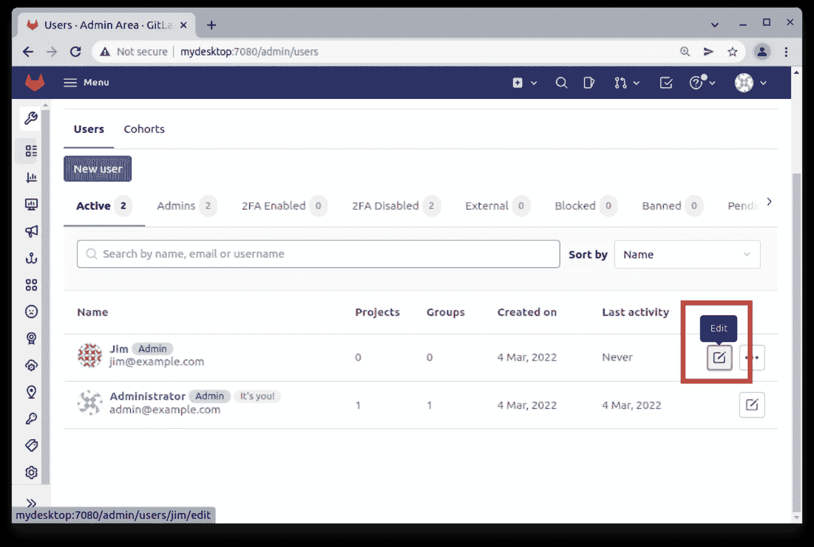

我们需要设置用户的初始密码，以便在创建后进行编辑。

给用户一个初始密码。用户将有机会在第一次登录时设置密码，因此这只是一个临时密码。

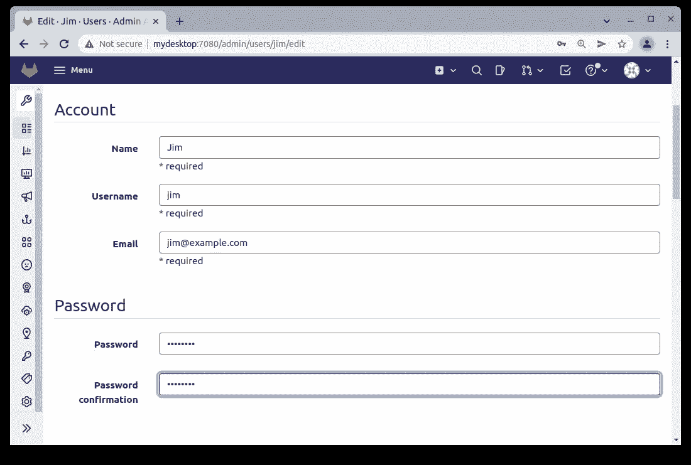

为新用户设置临时密码。

最后设置密码，并以 root 帐户身份注销。现在作为我们的新用户登录:

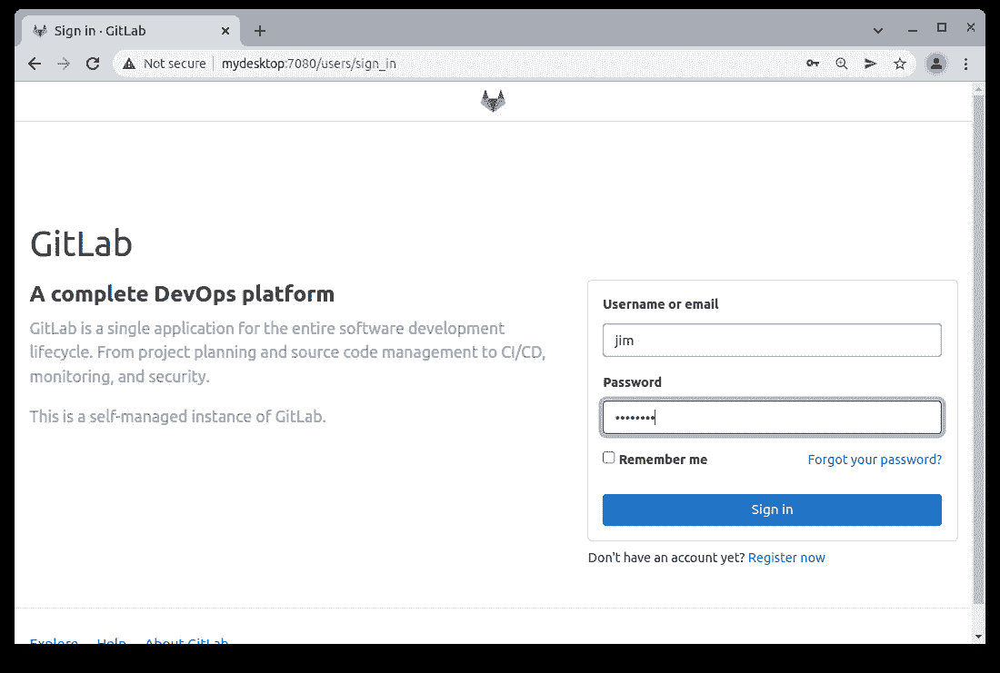

以新用户身份登录 GitLab。

登录后，用户将看到一个密码重置页面。设置新密码:

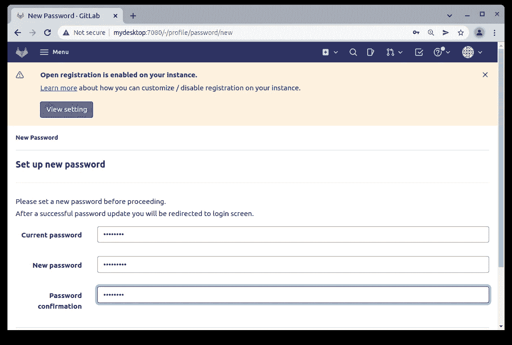

用户第一次登录时必须设置密码。

密码现已成功更改，允许我们登录:

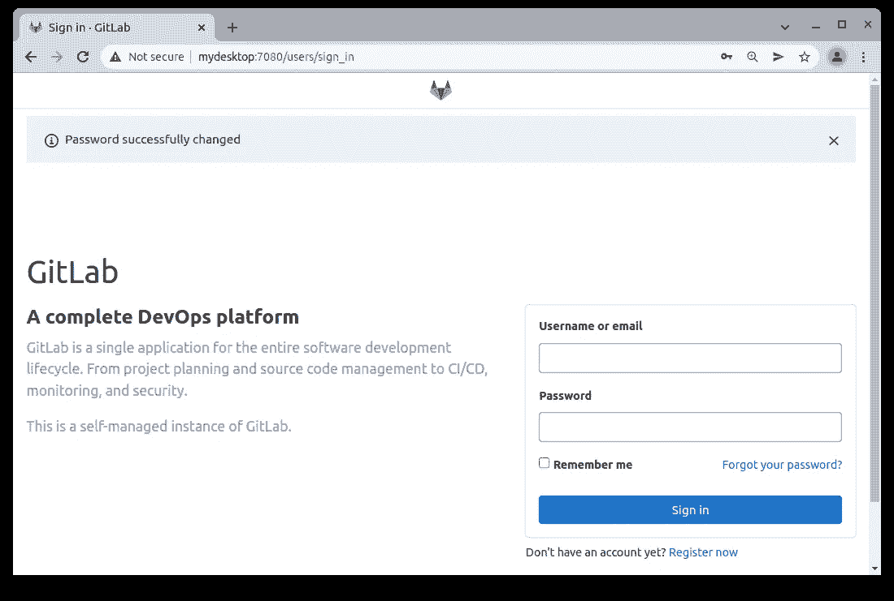

顶部横幅表示密码更改成功。

# 如何创建一个新的回购协议？

以新用户身份登录，并按照以下步骤创建新的存储库:

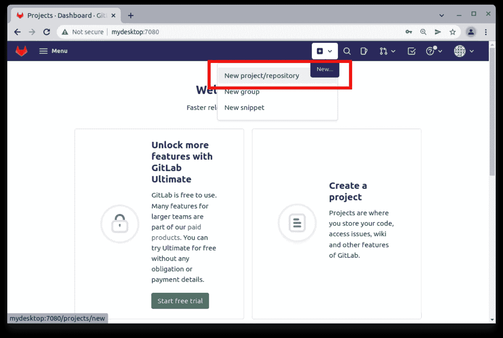

单击下拉菜单中的“新建项目/存储库”列表项。

为新的存储库设置名称:

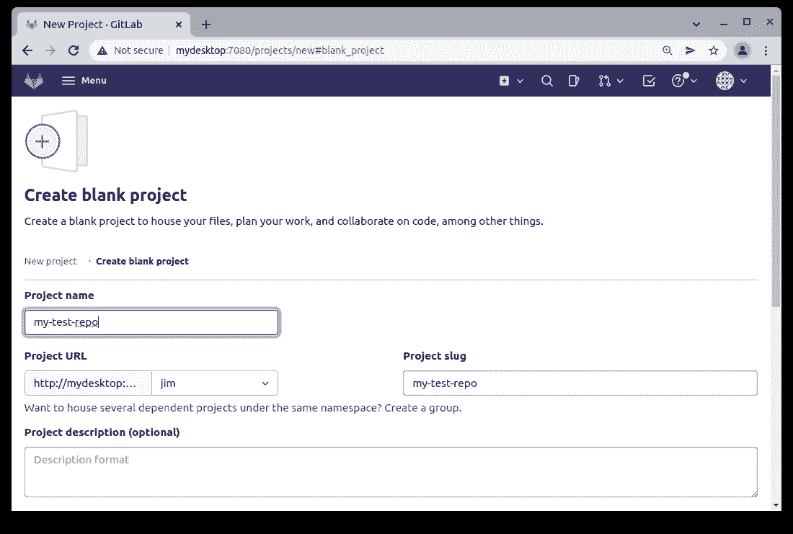

设置新回购的名称。

最后，创建 repo 并复制其 HTTP URL:

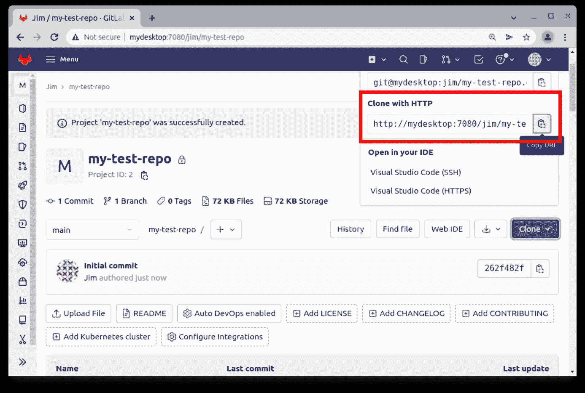

创建 repo 后，复制它的 HTTP URL。

# 如何查看 GitLab 回购？

从 GitLab 签出回购协议与从其他流行的基于云的管理器签出回购协议非常相似。让我们来看看我们从 GitLab 复制的 URL 中的回购。这些步骤是:

```
$ git clone [http://mydesktop:7080/jim/my-test-repo.git](http://mydesktop:7080/jim/my-test-repo.git)
```

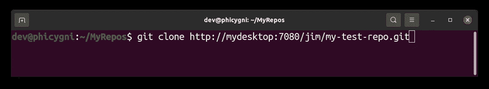

这是我们刚刚创建的 repo 的 Git clone 命令。

出现提示时，提供用户名:

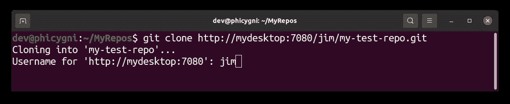

出现提示时，提供用户名。

最后，在出现提示时提供密码:

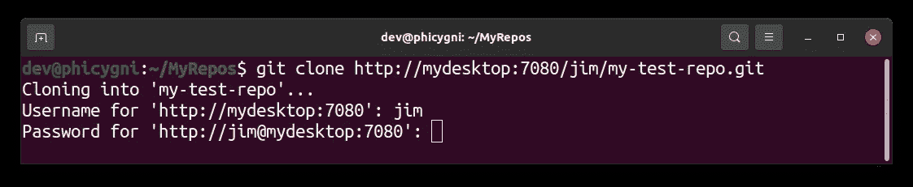

出现提示时提供密码。

回购现在将被签出，命令行输出如下所示:

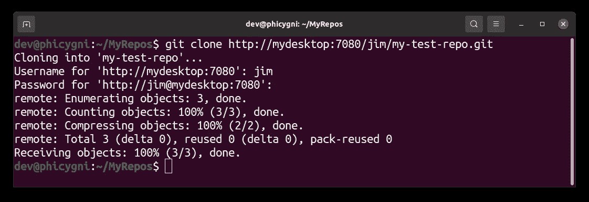

Git repo 已成功签出。

# 使用带有 SSL 证书的 GitLab

应该注意的是，我的脚本设计目前没有 GitLab 的 SSL HTTPS 功能，只使用了非加密的 HTTP 协议。这是有意将安装步骤保持在最少，并尽可能简化事情。在我看来，只使用 HTTP 并不是世界末日，因为我的脚本的推荐用例是用于私有本地网络。

然而，很有可能为 GitLab 生成一个 SSL 证书，这样就可以使用 HTTPS，而不仅仅是 HTTP。用户可以生成一个证书授权，然后将其添加到所有需要验证 HTTPS 连接到 GitLab 服务器的客户端计算机。如果我看到有足够的兴趣，我会扩展这个故事，加入验证 HTTPS 访问。

# 如何彻底移除 GitLab 容器？

**注意！下面的步骤将完全删除 GitLab 容器及其所有的 repos！**

只有在出于某种原因需要全新安装或者不再需要该服务时，才希望这样做。如果是这种情况，请执行以下操作来删除容器、repos 及其配置文件:

```
Linux: $ ./script-docker-compose-down-remove-everything.shWindows: $ script-docker-compose-down-remove-everything.bat
```

# 参考

[1]:[https://about.gitlab.com/devops-tools/github-vs-gitlab/](https://about.gitlab.com/devops-tools/github-vs-gitlab/)

【2】:【https://about.gitlab.com/features/ 

[3]:[https://about . git lab . com/pricing/self-managed/feature-comparison/](https://about.gitlab.com/pricing/self-managed/feature-comparison/)

【4】:[https://www.atlassian.com/software/bitbucket/pricing?tab =自我管理数据中心](https://www.atlassian.com/software/bitbucket/pricing?tab=self-manageddata-center)

[5]:[https://docs . github . com/en/get-started/learning-about-github/githubs-products](https://docs.github.com/en/get-started/learning-about-github/githubs-products)

[6]:[https://docs.gitlab.com/ee/install/docker.html](https://docs.gitlab.com/ee/install/docker.html)

[7]:[https://hub.docker.com/r/gitlab/gitlab-ee/](https://hub.docker.com/r/gitlab/gitlab-ee/)

[](https://phicygni.com/posts/a-complete-prometheus-based-email-monitoring-system/) [## 一个完整的基于 Prometheus 的电子邮件监控系统

### 需要帮助设置监控系统吗？这是一个完整、易于部署的 dockerised 监控系统，适用于本地…

phicygni.com](https://phicygni.com/posts/a-complete-prometheus-based-email-monitoring-system/) [](https://phicygni.com/posts/why-is-multi-threaded-python-so-slow/) [## 多线程 Python 为什么这么慢？

### 多线程 Python 为什么这么慢？真相和可能的解决方法。与人们可能想的相反…

phicygni.com](https://phicygni.com/posts/why-is-multi-threaded-python-so-slow/) 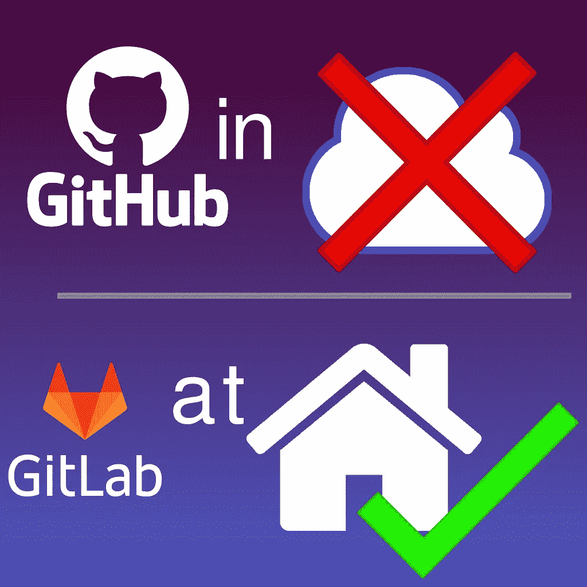

免费使用 Docker Compose 的自宿主 GitLab。