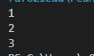
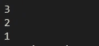

# 如果您仍然在 Java 中使用 Stack 类，您应该意识到这一点

> 原文：<https://blog.devgenius.io/you-should-be-aware-of-this-if-you-are-still-using-stack-class-in-java-87716280b788?source=collection_archive---------8----------------------->

栈是一种非常常见和有用的数据结构，在处理许多问题时非常方便。

在本文中，我们将讨论在 Java 中使用 Stack 类的利与弊，并探索是否有任何替代方法来克服 Stack 类的缺点。


布鲁克·拉克在 [Unsplash](https://unsplash.com?utm_source=medium&utm_medium=referral) 拍摄的照片

# 首先让我们复习一下什么是栈？

在计算机科学中，栈是一种抽象的数据类型，作为元素的集合。它支持两种主要操作:**推**和**弹出**。**推送**是指在顶部添加一个元素，而**弹出**是指从顶部移除一个元素。

这种从顶部添加和删除元素的原则也被称为 **LIFO(后进先出)**

# 首先，让我们来看看堆栈类的缺点

## 1.Stack 是一个类，而不是像任何其他通用数据结构那样的接口

> 接口数据结构好处是一个类可以实现多个接口，但不能继承多个类。

因此，如果你想建立一个自定义的堆栈类，如果你已经扩展了一些父类，那么你不能扩展堆栈类。

因此，从面向对象设计的角度来看，接口数据结构提供了更多的灵活性。

## 2.堆栈类扩展了向量类

是的，我也很震惊。

理想情况下，堆栈类应该只支持像 push()、pop()、peek()和 empty()这样的操作。但是由于 Stack 是 [**Vector**](https://docs.oracle.com/javase/8/docs/api/java/util/Vector.html) 的子类，它也有能力**访问**，**插入**，**移除**一个元素的索引。(你可以在这里查看它支持的所有方法[)](https://docs.oracle.com/javase/8/docs/api/java/util/Stack.html)

这基本上打破了后进先出的定义。

例如，这个代码块工作正常。它打印出 12 张。

```
import java.util.Stack;public class StackDemo {
    public static void main(String[] args) {
        Stack<Integer> stack = new Stack<>(); stack.add(0, 10);
        stack.push(12); System.out.println(stack.get(1));
    }
}
```

## 3.现在，让我们来谈谈迭代

回想一下，在本文的开始，我们讨论了堆栈数据结构遵循 LIFO 原则(这意味着后进先出)。

因此，如果我们正在迭代堆栈对象，我们会期望它是从顶部**到底部**(就像一个堆叠板的权利)，但它不是。

我们通过一个例子来理解这一点。

```
import java.util.Stack;public class StackDemo {
    public static void main(String[] args) {
        Stack<Integer> stack = new Stack<>(); stack.push(1);
        stack.push(2);
        stack.push(3); for (int item: stack) {
            System.out.println(item);
        }
    }
}
```

这个代码块的输出是



上述代码块的输出。

但是根据后进先出原则，应该是 3，2，1 对。

# 怎样才能克服这些缺点？

有一个叫做 **Deque** 的接口可以克服上面提到的大部分缺点。让我们详细地看一下例子。

## 1.首先，它是一个接口

dequee 是一个接口，所以我们可以灵活地创建自定义堆栈类，它可以**继承**其他类，**实现**其他接口，在此基础上**也可以实现 dequee 接口**。

## 2.不允许通过索引访问、插入和删除元素

Deque 不允许通过索引来访问、插入和删除元素。但是由于它是一个**双端队列**，它支持从两端插入和移除。

所以即使 Deque 不遵循 LIFO 原则，但它显然比 Stack 类好，Stack 类允许基于索引的插入/移除。

## 3.在迭代中遵循后进先出顺序

当我们迭代一个 Deque 实例时，它从顶部**到底部**迭代，正如从堆栈数据结构中所期望的。

我们通过一个例子来理解这一点。

```
import java.util.ArrayDeque;
import java.util.Deque;public class StackDemo {
    public static void main(String[] args) {
        Deque<Integer> stack = new ArrayDeque<>(); stack.push(1);
        stack.push(2);
        stack.push(3); for (int item: stack) {
            System.out.println(item);
        }
    }
}
```

这个代码块的输出是:



上述代码块的输出

正如我们所见，它从上到下。

**总的来说，我们可以看到，使用 Deque 来实现堆栈数据结构更有意义。**

但是有一个警告。让我们谈谈那个。

# 多线程

由于堆栈类是 Vector 的子类，而 Vector 类是同步的**因此甚至堆栈类也是同步的。**

另一方面，Deque 接口不是线程安全的。

因此，如果线程安全是一个问题，我们应该坚持使用堆栈类，因为它仍然有一些我们现在知道的警告。

我强烈建议您阅读上述主题的 Java 文档。

1.  [https://docs . Oracle . com/javase/8/docs/API/Java/util/stack . html](https://docs.oracle.com/javase/8/docs/api/java/util/Stack.html)
2.  [https://docs . Oracle . com/javase/8/docs/API/Java/util/vector . html](https://docs.oracle.com/javase/8/docs/api/java/util/Vector.html)
3.  [https://docs . Oracle . com/javase/7/docs/API/Java/util/deque . html](https://docs.oracle.com/javase/7/docs/api/java/util/Deque.html)
4.  [https://docs . Oracle . com/javase/7/docs/API/Java/util/array deque . html](https://docs.oracle.com/javase/7/docs/api/java/util/ArrayDeque.html)