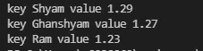
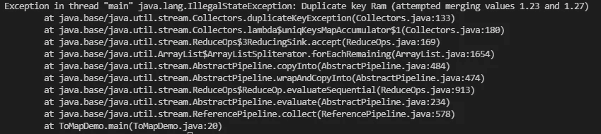
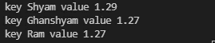
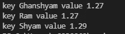
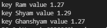

# 如果您在 Java 中使用 Collectors.toMap，您应该意识到这一点

> 原文：<https://blog.devgenius.io/you-should-be-aware-of-this-if-you-are-using-collectors-tomap-in-java-5d2e7bbd136?source=collection_archive---------6----------------------->

已经使用过 stream 和 Collectors 的人可能已经知道了这一点。但是我最近犯了一个错误，我想和大家分享一下。如果你已经知道了，我希望这是对你的一个修正，如果没有，那么你会学到一些新的东西。


照片由[艾米丽·莫特](https://unsplash.com/@emilymorter?utm_source=medium&utm_medium=referral)在 [Unsplash](https://unsplash.com?utm_source=medium&utm_medium=referral) 上拍摄

# 首先，Collectors.toMap 做什么？

如果你有一个集合(它可以是一个列表，集合，链表，栈等等。)并且你想把它转换成地图，那么这个`Collectors.toMap`可以帮你解决。

# **让我们举一个例子**

我们有一个跳远运动员的列表，我们想把它转换成一个`<name, length>`的地图。

```
// This is our Long jump athlete class
public class LongJumpAthlete {
    private String name;
    private double length;
    private String state; public String getName() {
        return this.name;
    } public double getLength() {
        return this.length;
    } public String getState() {
        return this.state;
    } public LongJumpAthlete(
        String name, double length, String state) 
    {
        this.name = name;
        this.length = length;
        this.state = state;
    }
}
```

现在让我们看看如何将它转换成一个`Map<name, length>`。

```
// Here we are converting the list of Long jump athletes to Map<name, length>
public class ToMapDemo {
    public static void main(String[] args) {
        List<LongJumpAthlete> athletes = new ArrayList<>();
        athletes.add(new LongJumpAthlete("Ram", 1.23, "UP"));
        athletes.add(new LongJumpAthlete("Shyam", 1.29, "Delhi"));
        athletes.add(new LongJumpAthlete(
            "Ghanshyam", 1.27, "Karnatka")
        ); Map<String, Double> map = athletes.
           stream().
           collect(Collectors.toMap(
              LongJumpAthlete::getName,  
              LongJumpAthlete::getLength)
           ); for(Map.Entry<String, Double> entry: map.entrySet()) {
            System.out.println(
                "key " + entry.getKey() + 
                " value " entry.getValue()
            );
        }
    }
}
```

让我们运行程序。它将在输出终端中打印出来。



程序的输出

好吧，你一定认为这很好，那还有什么问题。

# 让我们现在讨论这个问题

在上面的例子中，我们没有任何重复的条目，对吗？让我们看看如果我们向列表中添加另一个同名条目会发生什么。

```
athletes.add(new LongJumpAthlete("Ram", 1.27, "UP"));
```

## 现在让我们运行程序。你看到了什么？



出现重复键时出现 IllegalStateException

我们得到`IllegalStateException`是因为重复的键。

## 为什么会这样？

这是因为我们的算法不知道使用哪种策略来解决冲突。

可能有不同的策略，这将取决于具体的用例。

1.  在某些情况下，我们可以让程序覆盖这个值，选择最新的值
2.  而在某些情况下，我们希望从两个值中选择最小值或最大值
3.  或者在某些情况下，我们想要合并结果或者取两者的平均值

# 让我们看看如何解决这个问题

`Collectors.toMap`接受一个合并函数，在这个函数中，您可以定义如何解决重复键的策略。

让我们看看，在我们的例子中，我们想要两个冲突条目的最佳长度。所以我们可以这样做。

```
map = athletes.
    stream().
    collect(
        Collectors.toMap(
            LongJumpAthlete::getName, 
            LongJumpAthlete::getLength, 
            (a,b) -> Math.max(a,b)
        )
    );
```

现在输出将是这样的。



使用 toMap 的程序输出

# 额外小费

`Collectors.toMap`还接受了一个供应商函数，通过它你可以指定你想要作为最终地图使用的地图的具体实现。

在上面的例子中，如果你注意到我们在列表中插入条目的顺序和映射的顺序不匹配。这是因为默认情况下它返回一个`HashMap`。但是假设我们想要保持顺序，那么我们可以选择`LinkedHashMap`，或者如果我们想要对键进行排序，那么我们可以使用`TreeMap`。

让我们看两个例子。

## 树形图

```
// Tree Map
Map<String, Double> map  = athletes.stream().
    collect(
        Collectors.toMap(
            LongJumpAthlete::getName, 
            LongJumpAthlete::getLength, 
            (a,b) -> Math.max(a,b),
            TreeMap::new
        )
   );
```

使用这个实现，输出将如下所示。



使用树形图实现的输出

## LinkedHashMap

```
// LinkedHash Map
Map<String, Double> map  = athletes.stream().
    collect(
        Collectors.toMap(
            LongJumpAthlete::getName, 
            LongJumpAthlete::getLength, 
            (a,b) -> Math.max(a,b),
            LinkedHashMap::new
        )
   );
```

使用这个实现，输出将如下所示。



LinkedHashMap 实现的输出

希望这能帮助到你们中的一些人。

如果你想了解更多，请浏览这个文档。

1.  [https://docs . Oracle . com/javase/8/docs/API/Java/util/stream/collectors . html # toMap-Java . util . function . function-Java . util . function . function-](https://docs.oracle.com/javase/8/docs/api/java/util/stream/Collectors.html#toMap-java.util.function.Function-java.util.function.Function-)