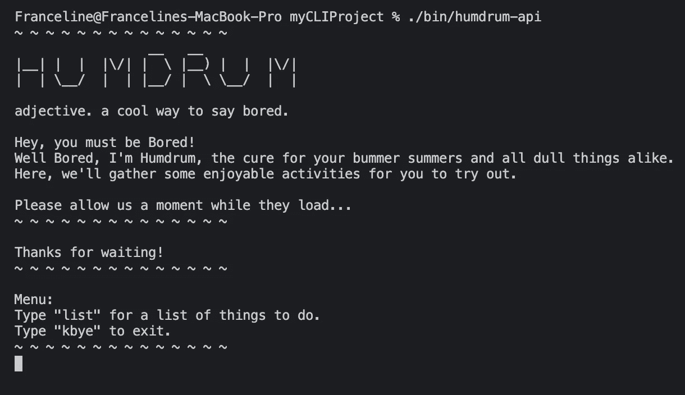
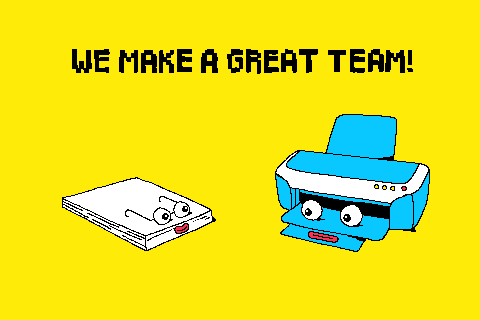
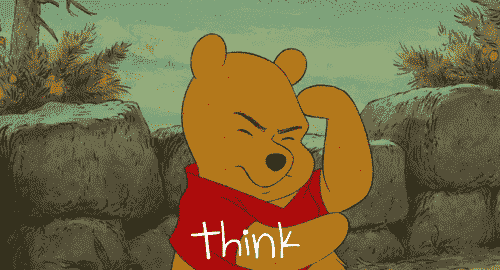

# 你认为你知道，但是你不知道…或者你知道吗？

> 原文：<https://blog.devgenius.io/you-think-you-know-but-you-have-no-idea-or-do-you-89ea02df23a7?source=collection_archive---------36----------------------->

Franceline 的 CLI 项目:单调乏味

你认为你知道，但是你不知道…或者你知道吗？这是我在熨斗学校第四周的思考过程，这是我们的第一个正式项目周。我太紧张了。我会在告诉自己“你知道这个！还是你？我当然想！嗯……”但是多亏了我的同龄人和团队领导，我熬过来了！谢谢各位。

**一周的开始:**

我看了几个视频，做了很多笔记，并对我想使用的 api 做了一些研究。有一堆很酷的，我最终坚持用一个叫 Bored API 的。这个 API 每次都会自己随机化，所以我必须想办法使用它。我知道我想列出随机的活动，活动的类型，以及活动可能需要多少参与者，但是当我打开我的文件时，我的大脑却一片空白。

> “亲爱的过去三周我了解到的一切，你在哪里？！？！?"

我曾经是。难倒了。我不确定如何让我的想法真正发挥作用。我尝试了各种各样的想法，当它们不起作用时，我几乎要从头开始这个项目。

通常，我会害怕问任何问题或承认我不知道该做什么，但正如我在这几周学到的，不要害怕问问题！大家都这么乐于助人！所以我就这样做了，问了一些问题，并得到了更多的作品！

**周中:**

我会加入整个星期的开放办公时间。即使我在会议上没有问题，我发现听到其他人的问题/解决方案是有帮助的，其他时候我发现有人有类似的问题。当我问一个问题时，我会更深刻地理解我应该做什么，为什么会这样。我会特别高兴我没有重新开始我的项目，因为我会发现我是如此接近解决方案。

**周末:**

有熬夜的时候，有些比其他人更难，但总的来说这是一次很棒的经历。我问问题，和其他人一起头脑风暴，我的项目成功了，耶！我可以愉快地玩着它，看着所有的拼图拼在一起。太棒了。

**我的故事寓意:**

你认为你知道，你知道你以前见过这个，但是为了内心的平静，问一个问题，让别人知道你需要一些帮助。我过去常常长时间无所事事，只是不知道该做些什么。但是在问了一个简单的问题后，我会意识到我离把所有的事情联系起来还差一点点。你离答案的距离可能比你想象的要近很多！再次感谢开放的办公时间和结对编程。我能够得到我需要的帮助，甚至帮助别人。随着每一天的过去，我会告诉自己，我比昨天懂得更多。耶！

这里是我的 github 回购，如果你有兴趣看看:[https://github.com/francepants/FC_cli_project](https://github.com/francepants/FC_cli_project)

