# 看完这个你会学到 Regex

> 原文：<https://blog.devgenius.io/youll-learn-regex-after-reading-this-bb80e915e391?source=collection_archive---------10----------------------->

对于任何初级/中级程序员来说，看到像^[\w]+#[\d]{4}$这样的东西会让他们抓狂，让他们希望自己以前从未接触过计算机，这并不奇怪

我本人从未种植⚽⚽来真正学习正则表达式，并且总是发现它如此令人困惑，阅读教程和观看视频没有任何帮助，所以我一直忽略这个主题，并尽一切努力避免接触正则表达式

两天前，当我发现[这个视频的宝藏](https://youtu.be/bgBWp9EIlMM)时，这一切都改变了，它完全改变了我的想法，我仍然觉得我从一个简单的视频中学到了很多，所以我想是时候我希望激励其他人也学习 regex，并真正享受它带给你的如此多的力量

资料来源:联合国人类住区规划署

**什么是正则表达式，我为什么需要它？**

正则表达式是文本模式匹配，它帮助我们根据使用特殊操作符指定的模式来匹配文本片段，因此以某种方式安排这些正则表达式操作符来执行您可以想象的任何文本处理任务

示例包括:电子邮件验证、电话号码验证、邮政编码验证、信用卡验证等……

我们将如何学习正则表达式？

正如启发了这篇博客的视频[一样，我们将使用](https://youtu.be/bgBWp9EIlMM)[这个在线工具](https://www.debuggex.com/)来帮助我们实时测试和可视化我们的正则表达式，这是一个非常好的学习工具，因为我们可以看到我们的错误，并找出为什么这种模式有效

我们将构建几个例子来学习我们需要的正则表达式，在我们遇到超级复杂的东西之前，这已经足够了

*   电话号码示例
*   电子邮件示例
*   价格标签示例
*   不和谐用户名示例
*   日/月/年日期格式示例

现在让我们开始学习

**我们的备忘单**

*   一行的开始
*   `$`行尾
*   `[]`分组——基本上意味着“范围”,如[a-z]，[0–9]
*   `{}`表示您希望这种模式出现多少次
*   `?`一次或零次又名可选运算符
*   `+`至少一次或多次，基本上意味着我不在乎这种模式出现多少次
*   `*`零次或多次
*   `\w`将匹配每个字母、数字和下划线
*   `\d`将只匹配个位数
*   `\s`空间
*   `\t`标签
*   对特殊字符进行转义——例如，如果我们想要匹配实际的美元符号

**学习基础知识**

现在让我们使用这些可用的操作符来匹配非常简单的文本

所以我们能写的最基本的正则表达式就是文本本身！假设你想提取一个名字，例如“布丽奇特”，你可以直接写布丽奇特，让我们跳到我们的在线工具上来找出答案

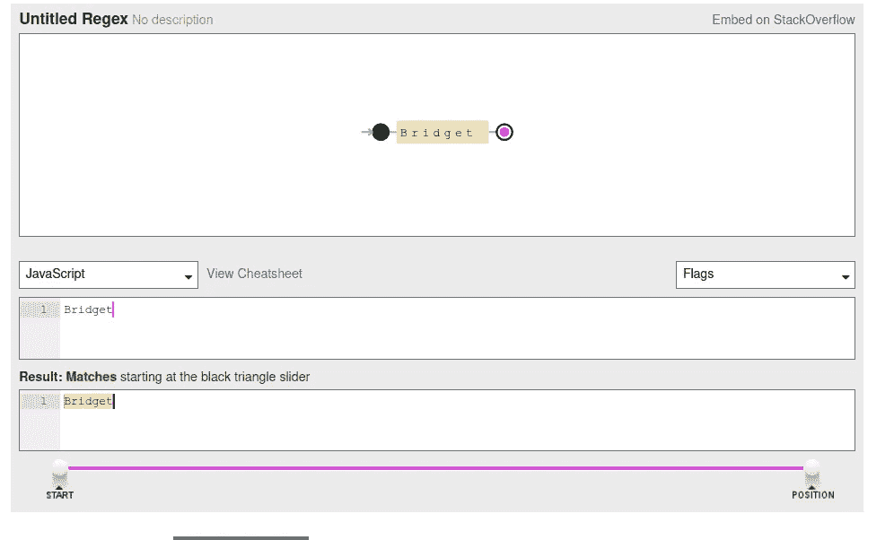

看到了吗？我们匹配了那个精确的模式，但是那很无聊，不是吗，这次让我们加入一些基本的操作符

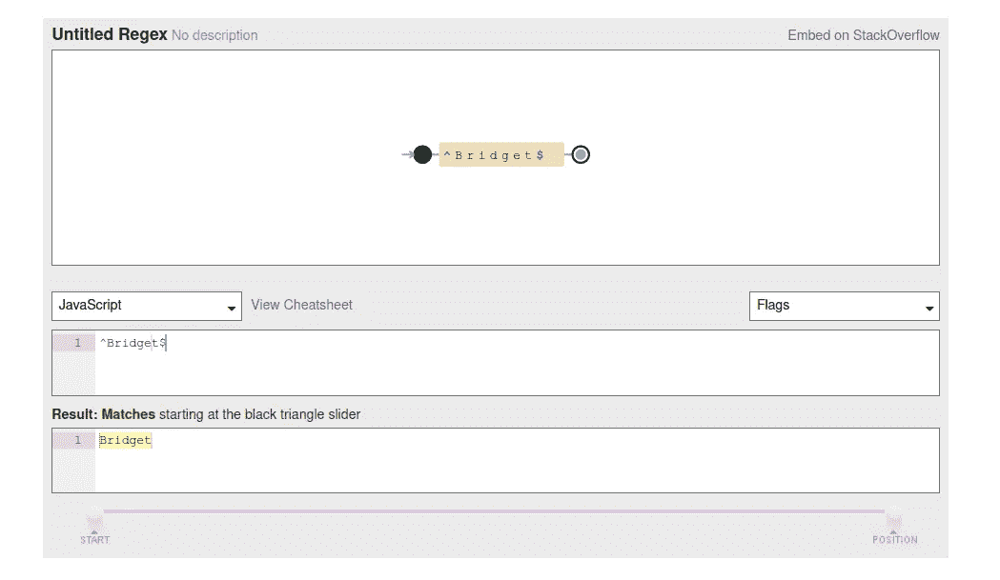

不要惊慌😄这里没有任何有趣的事情发生，所以我们的模式现在是“开始一行，找到 Bridget，结束一行”，正如前面讨论过的，胡萝卜`^`表示该行开始于……后面的所有内容，$表示该行结束，所以再次，*给我找到这个模式，其中该行以单词 Bridget 开始，该行结束于*

**使用分组增加灵活性**

好了，现在我们的正则表达式只匹配这一个词…..但是如果我们想匹配更多呢？我们不会写下每个名字吧😂

为此，我们将使用方括号来使用分组，这意味着为我找到一个由这组字母或数字或特殊字符组成的模式，因此让我们编写一个正则表达式来简单地匹配任何给定的**名字**，然后我们将扩展它以包括更多由空格分隔的单词，基本上模拟全名

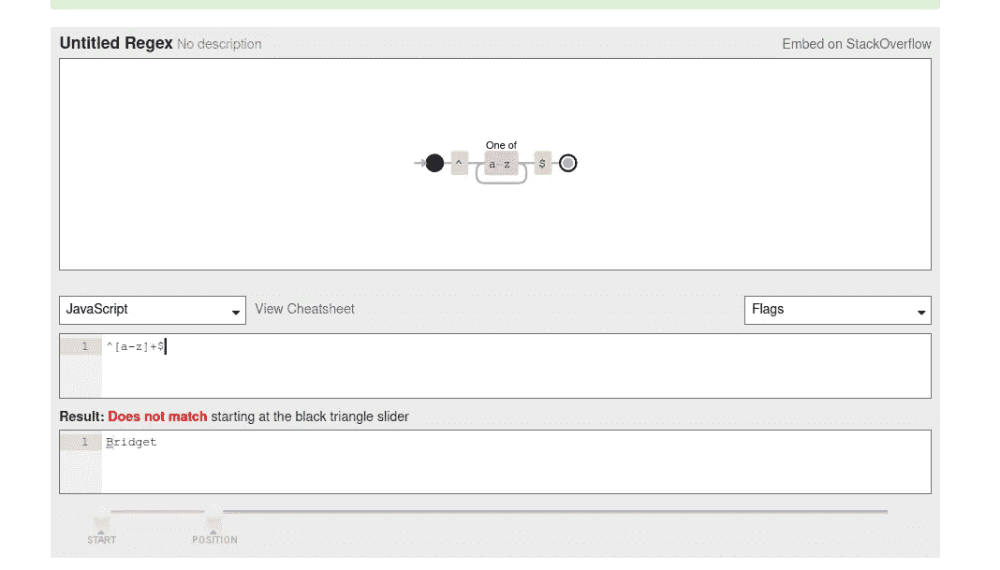

***嗯嗯嗯*** 这就奇怪了，不知道为什么不管用🤔

为了澄清我上面故意犯的错误，让我们看看这个模式是什么意思，在我们的方括号中，我们指定了字母`a-z`表示**只有小写字母**同时我们的 Bridget 有一个大写的第一个字母，所以我们也给我们的模式添加大写字母

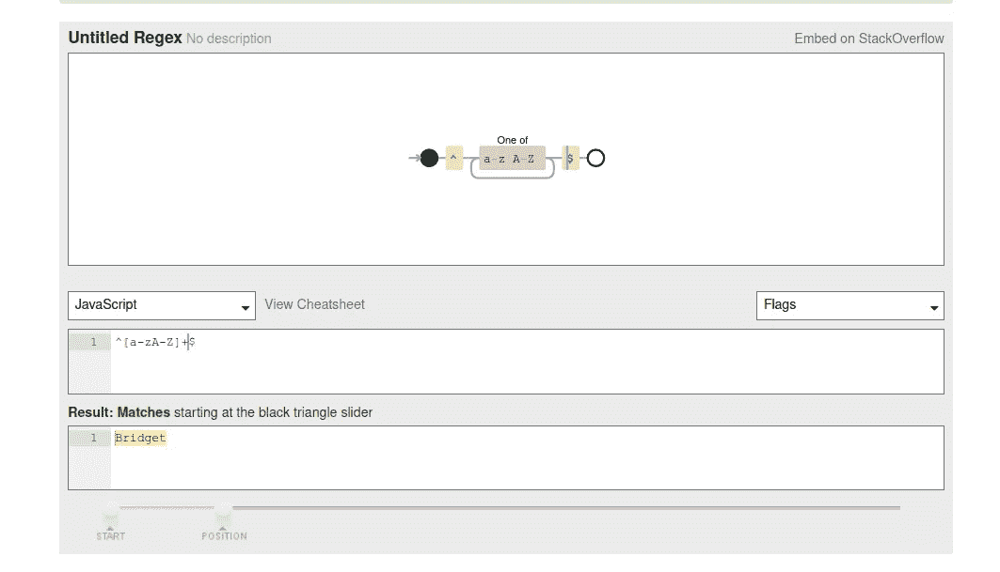

现在我们的正则表达式已经准备好匹配任何单词……但是让我们试着打破它，好吗😉

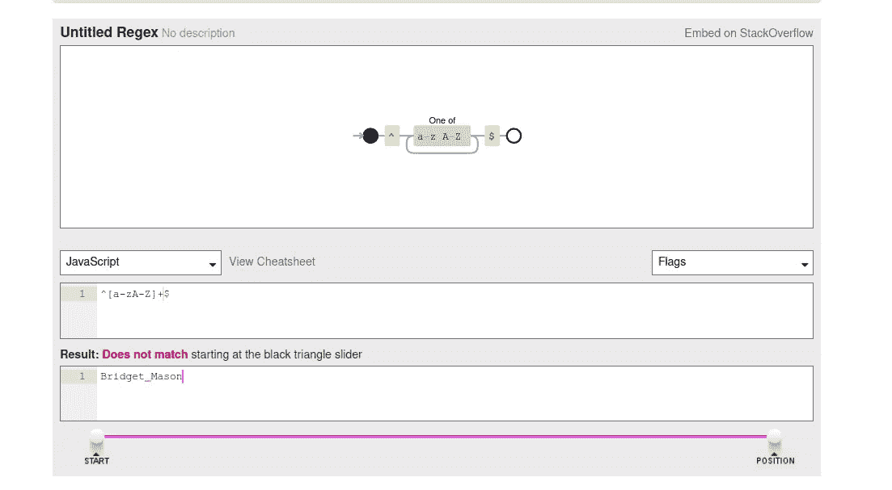

现在为什么不管用了？它不是已经和小写字母匹配了吗？

**扩展我们的正则表达式以包含更多的单词**

正则表达式匹配一个精确的模式，这意味着一个单词接一个单词，所以我的意思是，这个模式匹配一个单词，因为我们基本上提供了一个**单词+空格+单词**，这基本上是每个正则表达式的工作方式，所以让我们重复相同的精确模式，但对于第二个单词

现在注意视觉化，我们现在有两个“块”，基本上，它简单地说，**给我找出这个模式，其中有一个小写或大写字母，后面无限地跟着一个空格，后面跟着与前面的块相同的模式**

*快速注意，英语是我的第二语言，所以我的解释可能会被误解或不准确，所以请原谅，我会尽可能简单地解释并提供视觉效果*

**电话号码示例**

现在我们知道了一些正则表达式，让我们试着验证一个电话号码，所以一个美国电话号码由 3 位区号和另外 3 位代表中心局的数字组成，再加上 4 位代表用户号码的数字，所以它应该看起来像[202–555–0160](https://fakenumber.org/generator-us/usa202-555-0160)(一个假号码 btw ),我们也将包括破折号👀

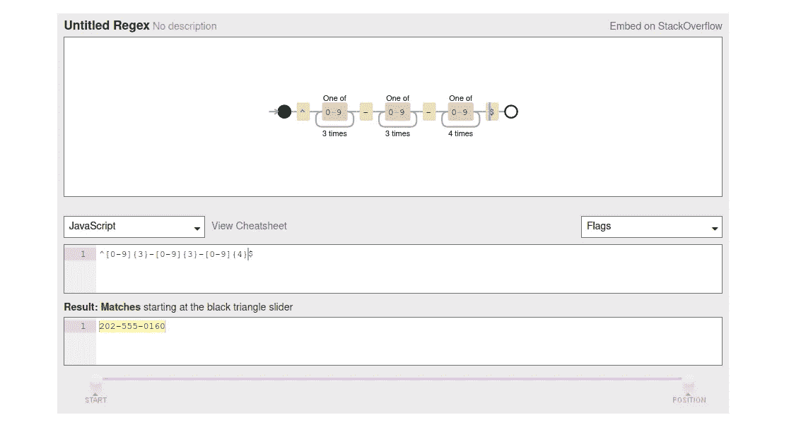

看看现在有多简单:)到目前为止 regex 不是很有趣吗😍注意，我们只是简单地添加了破折号，因为它们在 regex 中不代表任何东西，所以它们就像它们看起来一样被逐字处理，你注意到我们到目前为止是如何“绘制”我们的数据看起来应该是什么样子的吗？真希望点击了:)

**价格标签示例学习转义特殊字符**

假设您正在搜索 amazon，并且想要提取带有美元符号的产品的价格，但是$已经是一个正则表达式操作符，那么我们如何解决这个问题呢？让我告诉你这真的很简单

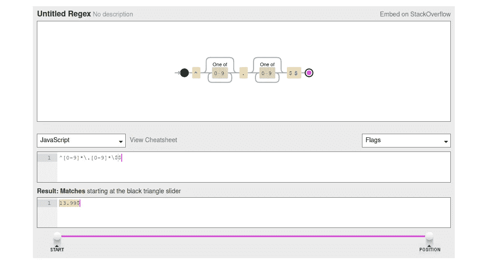

瞧，✨，我们只需要正斜杠来告诉我们的正则表达式“嘿，我们也需要实际的美元符号，不要在这里结束行”

但是如果这个价格是一个整数呢？那不会打破我们的模式吗？是的，当然会，但是我是来帮你的😎

**使用？操作员指示可选**

我们要用问号吗？操作符告诉我们的正则表达式这是可选的，所以在我们的例子中，我们想让浮动部分可选，因为价格可能是`17$`,那么我们怎么做呢？

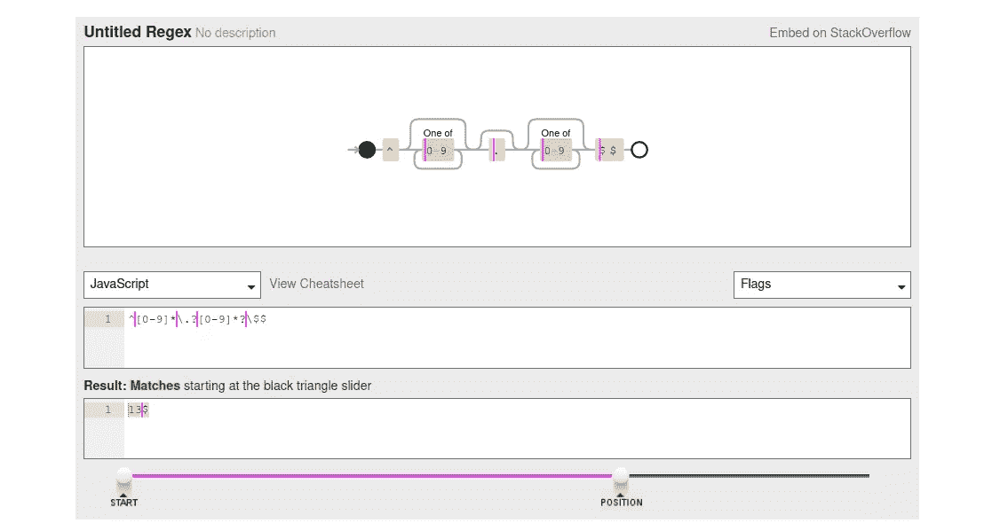

你看我们什么时候用？所需“规则”右侧的运算符**变成可选的，因此在我们的示例中，我们告诉正则表达式**可以选择从 0–9 中查找一个或多个数字和一个点****

顺便说一下，这个点也是一个正则表达式操作符，所以我们需要对它进行转义

**电子邮件验证**

现在我们要做一个验证电子邮件地址的经典正则表达式，但请记住这是非常基本的，因为我认为真正的生产级正则表达式模式要复杂得多，但我们只是为了好玩而瞎折腾:)

这个例子将演示我们如何在我们的组中添加不仅仅是数字和字母

为了这个例子，我们允许字母、数字、破折号、下划线、句点和正斜杠，但是你也可以在键盘上添加每一个特殊字符

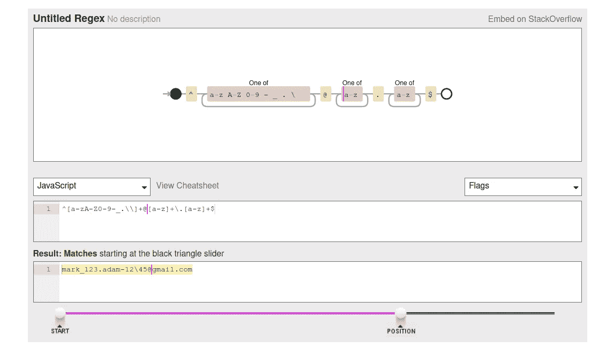

你可以添加任何你想要的特殊字符，只要它们在作为实际操作符的情况下被正确转义

**使用^算子排除图形**

我忘了说，胡萝卜运算符`^`如果用在方括号内，可以用来排除项目，所以让我们举个例子，比如我们不允许 gmail 帐户，那么我们该怎么做呢？

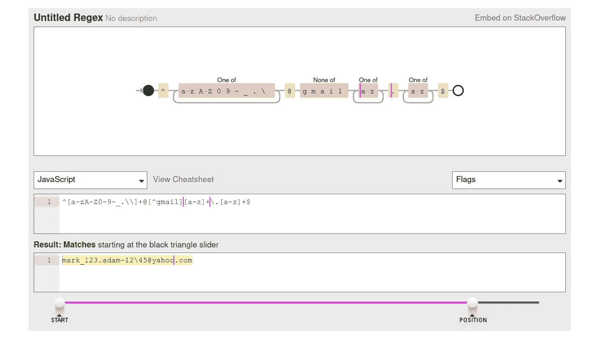

就像我们成功地应用了一个排除一样，顺便说一句，您可以添加更多的排除，如`{^yahoo}[^gmail][^hotmail]`等等，然后使用允许的模式

**不和谐名称验证**

对那些不熟悉的人来说， [discord](https://discord.com/) 是一款手机和桌面通讯应用，在游戏玩家和普通书呆子(包括我自己)中很常见😏)

不和谐用户名由一个常规用户名后跟一个#符号和四个数字组成，例如 unicorn#1111，它允许任何 unicode 字符，为了简单起见，我们将使用与电子邮件示例相同的模式，但您已经明白了

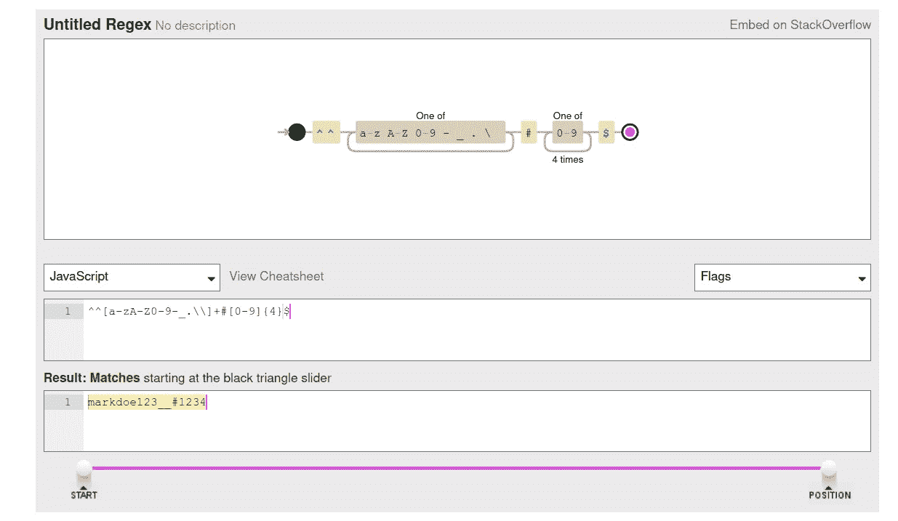

这个例子一点都不新鲜，是吧

**日/月/年日期格式示例**

我想你现在已经在脑子里想象你的正则表达式了😉但是，让我们来看看如何实现这一点，这应该很容易，因为我们以前做过类似的事情

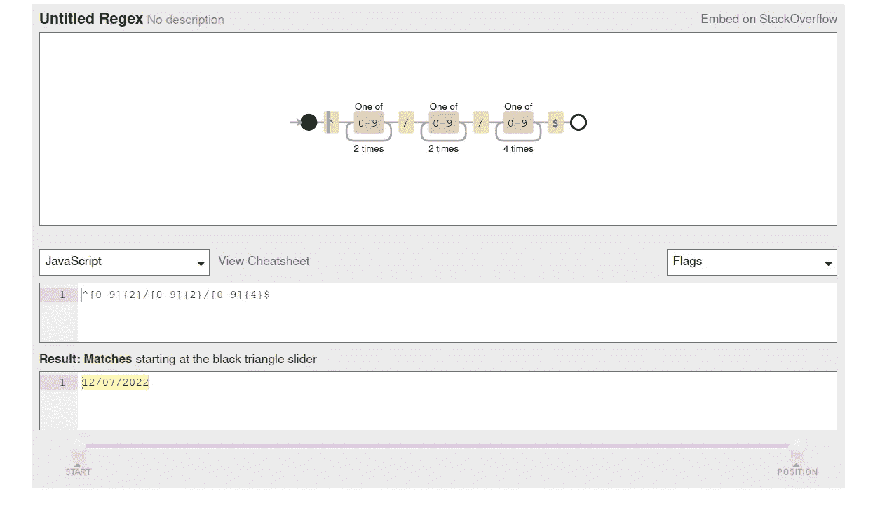

注意:这是一个非常基本的正则表达式，很容易被黑客攻击/欺骗，所以作为家庭作业，要努力使它成为一个更精确的正则表达式

现在我们已经完成了我们的例子，你现在已经知道足够多的正则表达式来完成许多任务，或者至少开始研究更多，因为它对你来说不再像是胡言乱语了……希望如此

**不要忘记在在线工具上练习，练习就是一切，所以请尽可能多地解决问题，挑战自我，这是掌握正则表达式的唯一方法**

我希望你和我一样开心，祝你在♥️度过愉快的一天/一夜