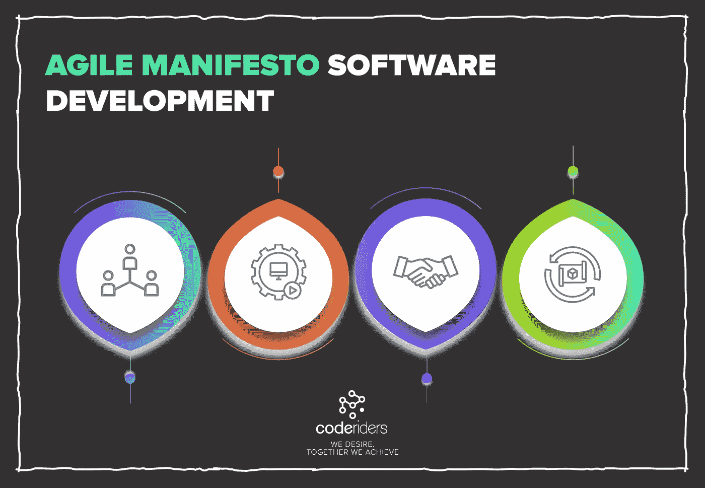
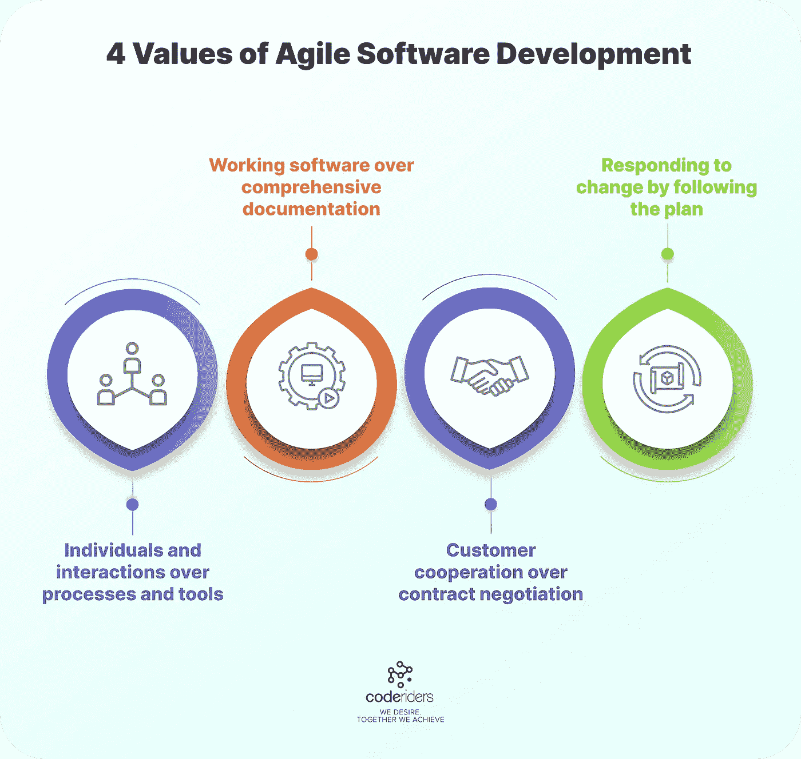
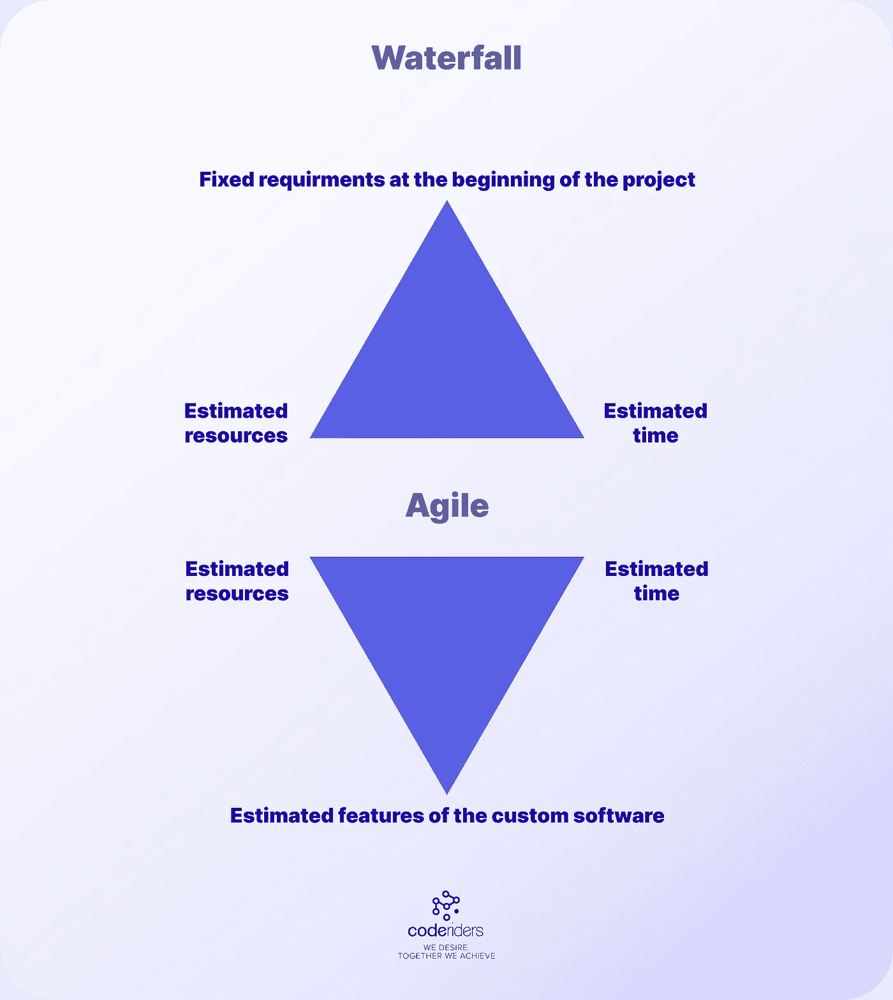

# 你的敏捷软件开发一体化指南

> 原文：<https://blog.devgenius.io/your-all-in-one-guide-to-agile-software-development-9c932cc40050?source=collection_archive---------9----------------------->

敏捷宣言软件开发方法的原则和价值

敏捷软件开发方法是一种灵活的[软件开发过程](https://coderiders.am/software-development-process)的方法。敏捷软件开发公司使用分块交付软件产品的交互式方法(连续的 MVP 版本)，结合涉众的反馈。

这是一种灵活的方法，帮助技术团队更快地交付高质量的软件开发服务，并将复杂性降至最低。

第一个敏捷软件开发哲学在小型自控团队中很流行。最终，敏捷软件开发接管了软件开发行业，因为它简单、高效。

在敏捷中，软件开发团队通过迭代交付项目。不同于瀑布方法，瀑布方法遵循一条特定的路径，并且有最小的偏差，敏捷以其速度和适应性脱颖而出。团队成员和涉众可以在迭代过程中自由地进行更改。

在当今快速发展和竞争激烈的经济中，灵活和可调整的敏捷迭代是完美的。

这篇文章是 [CodeRiders](https://coderiders.am/company-why-us) 敏捷软件开发指南的压缩版。在 CodeRiders，我们已经为敏捷软件开发创建了一个完整的实践指南。最后，你还会发现问敏捷软件开发公司最容易暴露的 6 个问题。答案将确定你未来的软件供应商是否适合你的项目。**一旦指南可用，我们将在下面插入可下载的链接。**

如果您需要快速入门，请继续阅读本文。

**敏捷软件开发原则、模式和实践**

**4 个敏捷价值观**

2001 年，一群软件经理和利益相关者聚集在一起，想办法让 SDLC 变得更好。在这次聚会中，他们提出了敏捷的 4 个价值观和 12 个原则。

以下是有史以来最著名的 4 个敏捷价值观:

**1。过程和工具上的个体和交互:**这个值强调了团队成员在软件供应商和涉众所使用的过程或工具上的关系。例如，我们团队中有两个软件开发人员，他们需要交互或共享信息来完成并交付特定的软件解决方案。在敏捷中，我们不关心软件开发人员使用哪些技术、工具或方法来实现成功的交互。我们真正关心的是团队成员之间传递信息的简单方式。

正如你可能已经注意到的，4 种敏捷价值观各有千秋。这些有时会让我们想起敏捷和瀑布的比较。

敏捷软件开发的 4 个价值

**2。在全面的文档之上工作软件:**在像瀑布一样的连续软件外包生命周期中，我们在开始软件外包伙伴关系之前要经过大量的文档。其中一些文档包括 SRS 或用户需求文档、序列图、UML 图等。在敏捷中，最重要的是工作软件，而不是全面的文档。

例如，在 Agile 中，在开始实际的开发过程之前，您不需要记录所有的登录功能需求。敏捷软件开发公司会把重点放在定制软件内部的工作和无错误的登录功能上。当然，这并不意味着我们将没有任何类型的文件。这种方法的思想是优先考虑实际的功能，而不是文档。

为了帮助我们的客户查看 SOW 文档的示例，在 CodeRiders，我们制作了一个简单的指南，用一个真实的示例来编写一个坦率的 SOW 文档。你可以在下面下载。

 [## 如何撰写可靠的工作范围| code riders 白皮书

### 里面是什么？

www.coderiders.am](https://www.coderiders.am/white-papers/how-to-write-a-solid-scope-of-work) 

**3。合同谈判中的客户合作:**在固定价格软件开发参与模式(顺序软件开发过程)中，双方在开始软件外包合作伙伴关系之前签署一份具有明确技术文档的合同。这意味着如果涉众在软件外包过程开始后不能做出改变。在敏捷中，客户可以接近项目的中间，要求一些调整。敏捷软件开发公司将接受请求，并与涉众建立某种合作。这并不意味着软件开发团队将从零开始重新构建一切，但是他们将与利益相关者合作来构建符合客户需求的最高质量的产品。

**马上联系 CodeRiders 团队！**

 [## 软件开发公司-联系我们| CodeRiders

### 让我们谈谈您在定制软件开发、网页开发和设计、软件外包方面的业务需求…

www.coderiders.am](https://www.coderiders.am/contact-us) 

**4。遵循计划应对变化:**在任何软件外包项目中，我们都有一个计划，这个计划很重要，因为它是项目的基石。在顺序软件开发模型中，比如瀑布，软件开发人员和其他技术团队成员由管理团队指导“坚持计划”，但是在敏捷中，情况正好相反。该计划对于形成未来定制软件的视图至关重要。然而，如果在 SDLC 期间环境发生了变化，并且改变计划更有利，敏捷团队会对变化做出反应。

例如，管理团队选择敏捷软件开发中使用的流行工具之一，例如。吉拉、特雷罗和阿萨纳，但是过了一会儿，他们意识到这个工具并不像他们想象的那样有效。由于敏捷软件开发方法重视[透明的 SDLC](https://coderiders.am/blog/what-is-software-development-lifecycle-stages-and-importance) 、软件质量和灵活的沟通，团队会毫不犹豫地改变无效的工具。

总而言之,《敏捷宣言》认为，如果计划和变化之间存在矛盾，敏捷团队应对变化。

**敏捷和瀑布或任何顺序开发模型的主要区别**

**软件开发生命周期:瀑布 vs 敏捷**

在瀑布项目中，我们有:

●固定要求

●清晰的技术文件

●预计时间和资源

在敏捷项目中，我们翻转这些值。

我们没有固定的要求，相反，我们有固定的资源和时间。

瀑布软件开发模型 vs 敏捷宣言软件开发模型:敏捷 vs 瀑布

**敏捷软件开发公司的项目规划**

**1。产品愿景:**团队清楚地定义了他们定制软件的目标。这个软件解决什么问题？与其他同类软件解决方案有何不同？产品愿景是由产品负责人创建的，如果我们谈论的是大型稳定的企业，应该至少每年评审一次。

**2。产品路线图:**产品路线图和产品愿景一样，是一种高层次的规划。它是创建产品愿景的产品需求的高级审查。产品路线图应该至少每年更新和审查两次。

**3。发布计划:**发布计划也包含在高级产品计划中，但是它比产品愿景和产品路线图更具体。产品负责人通过提及发布顺序和应该发布到市场的产品增量(版本)的类型来制定发布计划。发布计划应至少每季度进行一次。

**4。冲刺计划:**在 Scrum 中，冲刺计划是 Scrum 团队成员之间的协作活动，包括产品负责人。Scrum 团队创建迭代目标、任务和可交付成果，并且每 1 到 4 周重复一次这个过程。

**5。每日 Scrum:** 在敏捷团队中，团队成员每天召开例会，讨论当前的任务，这将有助于实现迭代的目标。

在每次迭代或冲刺的最后，敏捷项目有两种形式的计划:

**●Sprint review:**Sprint review 包括已创建产品的演示，由产品负责人和软件开发团队在每个 Sprint 结束时完成。

**●冲刺回顾:**组织冲刺回顾会议是为了衡量团队的进步。在 sprint 回顾中，敏捷团队成员讨论过程和环境，并为下一次 sprint 中的过程改进制定计划。

***注意:*** *不是所有的敏捷团队都执行所有的项目计划步骤，因为它高度依赖于特定软件开发项目的特征。最流行的计划包括冲刺计划、回顾、冲刺回顾和每日 Scrum。初创公司或小团队也没有产品愿景或路线图，但是，建议事先有。*

**敏捷软件开发方法论中的** [**技术需求文档**](https://coderiders.am/blog/tips-for-writing-a-candid-technical-documentation) **是如何制作的？**

敏捷中的用户需求是以一种叫做“用户故事”的形式编写的。

编写用户故事是为了从软件开发人员、测试人员(QA 专家)和业务代表的角度捕捉需求。用户故事必须强调功能性和非功能性特征。

**敏捷方法**

有 3 种最广泛使用和流行的敏捷软件开发方法。这些是:

**● Scrum**

什么是敏捷 Scrum 方法论？使用 Scrum 成功进行敏捷软件开发。

Scrum 是一个敏捷的项目管理框架，帮助团队高效地合作。Scrum 描述了一组会议、工具和角色，它们一起帮助团队组织和管理他们的工作。在 Scrum 敏捷方法中，最广泛使用的工具是 JIRA·阿特兰西亚。

什么是吉拉 Scrum 工具？敏捷软件开发公司的吉拉。

吉拉软件是 Atlassian corporation 设计的产品系列的一部分，用于帮助各种规模和类型的团队管理和组织他们的工作。吉拉是作为一个 bug 跟踪工具创建的，但它最终被扩展成一个强大的工作管理工具，用于 SDLC 中的各种目的，从需求和测试用例管理到敏捷软件开发。

**●看板**

**什么是敏捷看板方法？使用看板成功进行敏捷软件开发。**

看板是一种有时在敏捷项目中使用的管理方法。看板的总体目标是可视化和优化增值链中的工作流程。

看板不是像 Scrum 那样的传统敏捷方法。相反，它通常用于工作和任务管理。在看板方法中，最流行的工具是 Trello。

**什么是特雷罗看板工具？特雷罗为敏捷软件开发公司**

特雷罗和吉拉一样是亚特兰蒂斯人的产物。因此，如果你已经在吉拉注册了，你可以用同样的凭证在 Trello 注册。与基于 Scrum 的吉拉不同，Trello 基于看板。可以认为是看板。Trello 由独立的董事会组成。Trello 为敏捷项目管理、产品管理和团队管理提供模板。敏捷软件开发团队使用任何可用的敏捷模板，按照敏捷原则工作，并通过迭代/冲刺来管理软件开发项目。

**●极限编程(XP)**

XP 是一种敏捷方法，自 20 世纪 90 年代以来一直在软件开发团队中流行。XP 不仅仅关注项目管理(像 Scrum ),还关注构建代码。如果 Scrum 侧重于工作管理，确定项目中的具体角色，并将项目划分为迭代，那么 XP 也侧重于软件开发和测试(而不是软件开发外包管理)。

以下是 XP 中最重要的定义:

**季度周期:**每季度一次，XP 团队组织会议做规划和反思。

**周周期:**周周期实践是一个为期一周的迭代，团队选择故事并构建在周末“完成”的工作软件。

*现在敏捷项目中很少使用季度和周周期。大多数敏捷团队现在遵循 Scrum 进行项目管理:发布——产品积压——冲刺计划——冲刺积压。*

**时差:**每当团队创建一个计划时，团队都会通过加入少量可选或次要的项目来增加时差。

总而言之，敏捷宣言是当今广泛传播的软件开发参与模型。它既用于软件开发外包，也用于内部软件开发过程。敏捷宣言对于灵活的软件开发生命周期是理想的，在这种生命周期中，变化比固定的计划更受欢迎，个人和交互比过程和工具更重要，工作定制软件是目标，而不是全面的软件开发文档。

立即给 CodeRiders 留言，获取免费咨询！

 [## 软件开发公司-联系我们| CodeRiders

### 让我们谈谈您在定制软件开发、网页开发和设计、软件外包方面的业务需求…

www.coderiders.am](https://www.coderiders.am/contact-us)