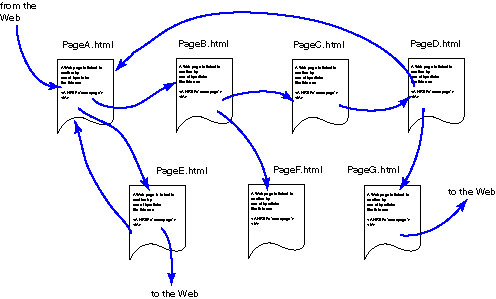

# 你的 API 不是 RESTful 的:让我告诉你为什么

> 原文：<https://blog.devgenius.io/your-api-is-not-restful-let-me-tell-you-why-98b32e9fdaa9?source=collection_archive---------0----------------------->

REST 是**表象状态转移**的缩写。REST 是一个软件架构，它有一些最佳实践，由 [Roy T. Fielding](https://en.wikipedia.org/wiki/Roy_Fielding) 定义，用于创建 web 应用程序。

随着 web 服务的发展和 REST 的流行，我越来越多地听到开发人员说他们的 API 是 RESTful 的。

但是他们是对的吗？他们的 API 是否遵循了 RESTful 所需的所有限制？

简短的回答是:*大概不是*。为了理解我为什么这样想，让我们先熟悉一些概念，然后你可以让我知道你是否同意我的观点。

你看了标题后😅|照片由[拉拉·阿兹利](https://unsplash.com/@lazizli?utm_source=medium&utm_medium=referral)在 [Unsplash](https://unsplash.com?utm_source=medium&utm_medium=referral) 上拍摄

# 什么是宁静

与许多人认为的相反， **REST 不一定是一种通信协议。**

由 Roy T. Fielding 在他的博士论文中创建，REST 是一种架构风格，换句话说，是在创建 web 服务的过程中必须遵循的一系列限制。

RESTful 将会是符合 Roy 定义的所有约束的 API。

这也是大多数 RESTful APIs 失败的地方，因为它们很难遵守所有这些约束，它们有不同的成熟度，我们将在后面讨论。

## RESTful API 的限制

一个 API 成为 RESTful 的主要标准是:

*   统一界面
*   无国籍的
*   可缓冲的
*   客户端-服务器
*   分层系统

如果不遵循所有这些约束，您的 API 将不是 RESTful 的，它将只是 HTTP 协议之上的另一个 RPC 实现。

在所有这些约束中，有一个通常最少被满足的约束，即**统一接口**。但是，这意味着什么呢？

实现统一接口意味着满足四个标准:

*   **基于资源:**与常见的 RPC 相反，REST 试图处理资源而不是方法。如果你通过调用`/posts/create?title=lorem`创建一篇文章，由于 url 中的方法处理，你**没有遵循 REST 模式**。在这个场景中，您应该理想地对`/post`路由进行 POST 调用。
*   **通过表示操纵资源:**客户端通过表示(JSON、XML 等)访问资源。)包含足够的信息来在服务器上操作它，只要它有权限这样做。
*   **自描述性消息:**回复是自描述性的，包括足够的信息让客户知道如何使用它们。例如，使用 HTTP，您需要在头中包含一个 Content-Type 属性来描述所使用的表示类型。
*   超媒体作为应用状态的引擎( **HATEOAS** )。

## HATEOAS 到底是什么意思？

这是棘手的部分。很少有 API 能够适应的限制。“ **HATEOAS** 的意思表示与我们接下来要谈论的东西**万维网**有许多相似之处。

注意，对互联网上的网页的探索是在我们称之为“*路径*中完成的，我们有一个起点，从那里我们找到其他页面。

同样的逻辑也适用于 RESTful APIs。基本上，**你的 API 应该是一本打开的书**，你不需要访问文档就知道，要添加一个用户到集合中，你需要一个对 URL /users 的 POST 请求。

**您应该能够通过 API 本身发现所有的资源操作。**

你知道哪些 API 可以做到这一点？只需知道初始域(起点)和协议，您就可以使用哪些？

拥有列出所有可用资源和操作的文档并不是问题，问题是当向 API 的根发出请求时，您没有获得必要的超链接，这阻碍了我对数据和功能的探索。

换句话说，这表明:**您的 API 可能不是 RESTful 的。**这样就可以了。

# 那么，REST 和 RESTful 有什么区别呢？

如前所述，要让一个 API 被称为 RESTful，它需要一些特定的属性。

**所以 REST 和 RESTful APIs 之间的区别只是满足架构需求。**

我们可以说表述性状态转移(REST)是万维网架构的抽象。它是一种架构风格，由应用于系统中的组件、连接器和数据元素的一组协调的约束组成。

REST 忽略了组件实现细节和协议语法，以便专注于组件的角色、它们与其他组件的交互约束以及它们对有意义的数据元素的解释。

# 互联网起源

蒂姆·伯纳斯·李(T21)说，“让万维网存在吧”。

那是 1989 年，虽然互联网已经存在，但它的潜力还没有被开发出来。

然后，万维网(T1)诞生了，这是一个信息系统，除了带来资源的唯一标识(统一资源定位符——URL)之外，还可以通过超级文本(T2)将它们联系起来。

网络上可用的资源可以是任何媒体类型，然而，所谓的*网页*是以一种特定的格式编写的:**超文本标记语言** (HTML)，这种标记语言能够通过超链接将不同的页面连接起来，从而在互联网上创建真正的网页。

但是，要使这一切工作，需要一个通信协议。

这就是今天众所周知的超文本传输协议(HTTP)出现的时候。

有趣的是，在当时，它只用于传输 HTML。和今天很不一样，不是吗？

在那之前，其他通信协议用于通过**远程过程调用** (RPC)传输不同类型的数据，其中从其他机器请求服务，以便获得网络上的一些资源，而不必知道该网络的细节。

1998 年，Dave Winer 决定将网络与现有的服务结合起来，创建了网络服务。第一个是 XML-RPC。

# 什么是 web 服务，它是如何工作的？

web 服务是一种允许应用程序之间独立通信的技术，不依赖于语言或操作系统。

通常，这种通信是通过 XML 格式的文件进行的。因此，不管语言是什么，一切都被翻译成 XML。其中之一是 XML-RPC，它创建于 HTTP 协议之上。

过了一段时间，XML-RPC 被洗礼成了另一个名字:**简单对象访问协议** (SOAP)。

然后，它被归类为一种通信协议，在其较低级别的协议中使用 HTTP。

该协议在向利益相关者公开数据的能力方面非常强大。但是，尽管有它的名字，它一点也不简单。

**SOAP** 很快成为行业标准，并被大多数组织所使用。

但是，我们需要更好、更简单的解决方案。这就是 Web **A** 应用 **P** 编程 **I** 接口(API)和 **Re** 表示**S**state**T**transfer(REST)出现的原因。

上下文明白了吗？现在跟我来看这篇文章的**转折。**

# 休息模式并不总是重要的

你的 API 是否 RESTful 并不重要。像大多数架构决策一样，他们并不总是以最好的方式解决问题。

也许你正在开发一个**内部 API** ，在这里你可以控制客户端和服务器。在这种情况下，发现部分可能不会带来同样多的回报。

**决定权在你。**在 **REST 架构**中仍有许多东西可以利用，尽管你的 API 可能无法满足所有需求，但它可能在许多方面是兼容的，这里我们进入了一个叫做 *Richardson 成熟度模型*的东西。

# 理查森成熟度模型

正如我之前说过的，相对于 REST 架构最重要的规则，API 有不同的成熟度等级。

有一个简单的方法来定义这个级别:Richardson 成熟度模型。

这种方法预先假设了一些限制，因为其中一些是 web 架构所固有的，但是它仍然是对 API 进行分类的良好基础。

该模型有 4 个成熟度级别(0 是不符合任何规则的 API)，其他 3 个是:

*   **资源:**从那时起，可以在不同的端点上请求不同的资源。而不需要查询参数。
*   **HTTP 动词:**在这里，**不同的 HTTP 方法**被付诸实践，与 SOAP 协议中几乎独占使用 POST 相反。此外，每个动词都有其特定的效用: **PUT** 用于更新， **DELETE** 用于删除， **GET** 用于获取， **POST** 用于创建。在某些情况下，还会使用**补丁**。
*   **超媒体:**资源开始具有到相关资源的链接，以及在这些集合之上执行动作的链接，从这一点开始，API 自文档化并启用发现功能。

每个级别都是下一个级别的条件，也就是说，API 要达到级别 3，必须先达到级别 2 和级别 1。您可以点击[此处](https://martinfowler.com/articles/richardsonMaturityModel.html)了解更多关于理查森成熟度模型的信息。

# 结论

今天到此为止。我希望您理解我为什么为本文选择这个标题，以及为什么 RESTful 并不总是您的 API 所必须的。

感谢阅读！在本平台关注我，阅读更多编程内容。祝您愉快，再见！👋