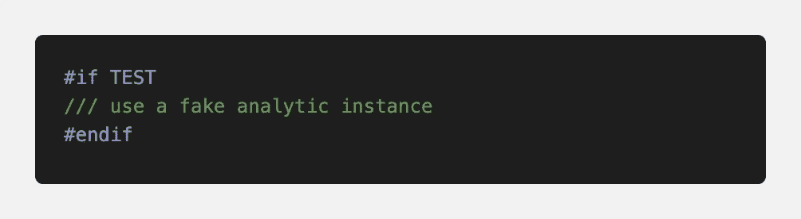
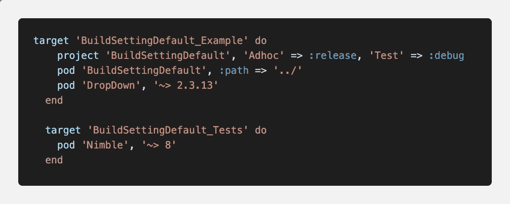
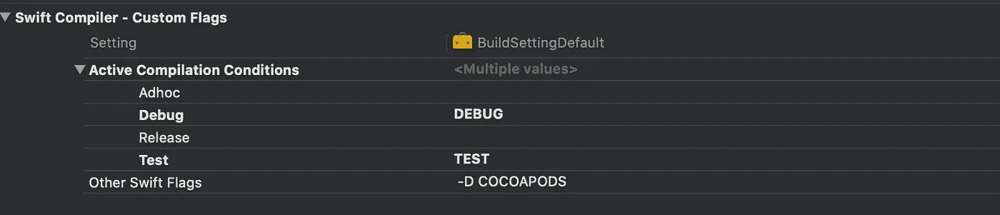
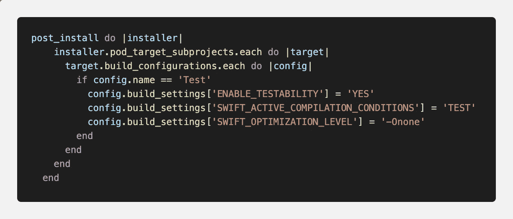

# 您的定制构建配置和 Cocoapods

> 原文：<https://blog.devgenius.io/your-custom-build-configurations-and-cocoapods-86d4e2a17633?source=collection_archive---------0----------------------->

对于一个新的 iOS 项目，它提供了两个默认的构建配置调试和发布，但有时你需要更多。例如，在我的例子中，我想要一个用于临时分发的构建配置和一个测试构建配置来防止测试代码编译到其他构建中。

在 swift 中测试宏

示例:

我有宏控制来用一个假的实例替换实际的分析实例。

我的应用程序特性被分解到由 Cocoapods 管理的多个框架中，在我的整个项目中有类似这样的测试宏。

当我开始运行集成到托管应用程序或目标应用程序的测试时，问题开始浮出水面，要么是编译失败，要么是使用了错误的构建设置或错误的实例。例如，测试性设置没有打开，单元测试失败。

我和我的团队将`post_install`添加到 force 以启用可测试性，后来我们有了缓慢的构建时间，我们使用`post_install`来更改 SWIFT_OPTIMIZATION_LEVEL 设置。在几个`post_install`补丁之后，它似乎稳定了下来。然后我面临另一个 SWIFT _ ACTIVE _ COMPILATION _ CONDITIONS 的问题；它是空的，我的 QA 版本无法完成测试。现在我认为是时候了解发生了什么以及如何解决它。

# 学习之旅

帕特里克·托马索在 [Unsplash](https://unsplash.com?utm_source=medium&utm_medium=referral) 上拍摄的照片

我试着在 google 上搜索关于使用 Cocoapods 的定制构建配置，但是没有多少。在阅读了几篇博客文章和 Cocoapods Github repo 问题以及没完没了地阅读 Cocoapods [Podfile 语法参考](https://guides.cocoapods.org/syntax/podfile.html)之后，我终于发现了我所面临的问题。在 Podfile 语法参考中，它说

> 还可以指定您的定制构建配置的构建设置是否应该在发布或调试预置之后建模。为此，您需要指定一个散列，其中每个构建配置的名称都与`:release`或`:debug`相关联。

我面临的问题是，Cocoapods 使用了`:release`配置，因为我没有在 Podfile 中指定它。显然，`:release`构建配置禁用了可测试性，优化设置为整个模块，等等。

我发现的另一个片段，我认为在这里值得一提。

> 为了使这个过程顺利运行，很明显，pod 和我们的项目必须以相同的方式配置。如果不是这样，我们可以在项目中调用库的方法，期望代码以某种方式运行，但是实际的代码会不同。
> 
> 👍经验法则是**pod 和我们的目标必须有相同的预处理器宏设置**。
> 
> Podfile 中的 Cocoapod 设置无法改变目标应用程序配置。

在我的例子中，我有测试和特别定制构建配置；我需要指定安装 pod 时，它应该在哪个构建设置后建模。所以我决定将调试映射到测试，将发布映射到临时。

一个问题突然出现在我的脑海中，我如何随着时间的推移将我定制的调试或发布与测试和临时同步？那么另一个问题，我会自定义 pod 的调试或者发布设置吗？我将不得不把它留到下次，因为我需要解决我现在的问题。

# 随身行李

现在我知道了我的问题，也知道了解决办法。这是一个简单的修复，对不对？。让我们开始吧。

我用托管应用程序做了一个新的 Cocoapods 库来测试。在我的测试 pod 文件中，我放置了推荐的设置
`project 'BuildSettingDefault', 'Adhoc' => :release, 'Test' => :debug` 我运行 pod 安装，然后验证设置是否设置为正确的值。

所以我对我的项目做了同样的事情，但是它不起作用。😱

## 陷阱#1

如果在 Pod 文件的根级别有多个目标，那么请确保将项目设置放入每个目标块中。或者您可以将该行放在根位置，Podfile 的顶部，否则它将不起作用。

我不记得为什么我和我的团队把所有的测试目标都放在外面，而不是像 Cocoapods 默认的那样嵌套在应用目标中。

## 陷阱#2

现在我把项目设置放在根目录或正确的地方，我把 pod 和我所有的应用程序和框架重新整合并安装。当我检查设置(视觉)时，我发现了另一个陷阱。即使使用项目设置，也不能解决我的问题。

空设置

SWIFT _ ACTIVE _ COMPILATION _ CONDITIONS，GCC_PREPROCESSOR_DEFINITIONS 设置仍然没有设置正确的值。当安装包和某些值不在默认预设中时，调试或发布构建设置值。我仍然需要使用`post_install`来设置构建设置，它将是跨多个 Podfiles 的多个`post_install`。

此时，我想知道我之前提到的同一个问题，如何跨不同的框架应用构建设置。

我将 post_install 函数复制粘贴到所有的 pod 文件中。在 6 个 pod 文件上运行 pod 解集成和 pod 安装是一个繁琐的过程。

## 陷阱#3

运行 pod install 后，我再次检查该值，发现 post_install 从不应用 Pods-BuildSettingDefault _ Example，但是所有子项目的构建设置都设置正确。**注:**我从 Cocoapods 1.8 开始开启了`multiple_pod_projects`和`incremental_installation`。

我认为`pod_target_subprojects`应该可以工作，因为我以前在某个地方见过它，也是我复制和使用它的原因😛

我想知道为什么，并开始另一轮阅读，然后我在评论区发现了另一颗宝石。

对于`multiple_pod_projects`和`incremental_installation`选项，我应该用`generated_projects`代替。

作者的另一个提示:

> *所以对于您的后安装钩子示例，用* `*installer.generated_projects*` *替换* `*installer.pods_project*` *应该可以防止任何异常。还值得注意的是，由于增量安装的性质，后安装挂钩可能不会应用于所有目标，因为我们只安装自上次安装以来发生更改的一组目标。因此，当添加一个新的 post install 挂钩，并希望立即应用于项目中的所有目标时，您应该将* `*--clean-install*` *标志传递给* `*pod install*` *或* `*pod update*` *。*

最后，我将所有的知识应用到我的 Podfile 中；它像预期的那样工作。

1.  将项目设置添加到 Podfile 的目标或根
2.  添加 post_install 函数，但使用 generated_projects。
3.  使用全新安装标志

我希望漫长的旅程即将结束。我找到了我的问题的答案，但同时在我的清单上添加了更多要解决的问题。回顾一下我在这个帖子中学到的东西，并没有那么难但是有很多粗心的错误。不管怎样，我享受积累知识和将小知识应用到工作中的每一刻。

# **参考文献**

 [## CocoaPods 和定制构建配置

### 如果你浏览一下这个博客里的帖子，你会发现我是椰子恐龙的忠实粉丝和拥护者。这真是一个…

www.mokacoding.com](https://www.mokacoding.com/blog/cocoapods-and-custom-build-configurations/)  [## 将 generate_multiple_pod_projects 设置为 true 后，转换 post_install 挂钩问题#8739 …

### 解散 GitHub 是超过 5000 万开发者的家园，他们一起工作来托管和审查代码，管理项目，以及…

github.com](https://github.com/CocoaPods/CocoaPods/issues/8739#issuecomment-487384110)  [## 双环软件% Blog % CocoaPods 和定制构建配置% 15 2018 年 2 月

### 问题:我有一个应用程序的 Xcode 项目，除了调试和发布之外，还有许多自定义构建配置…

tworingsoft.com](https://tworingsoft.com/blog/2018/02/15/cocoapods-custom-build-configurations.html)