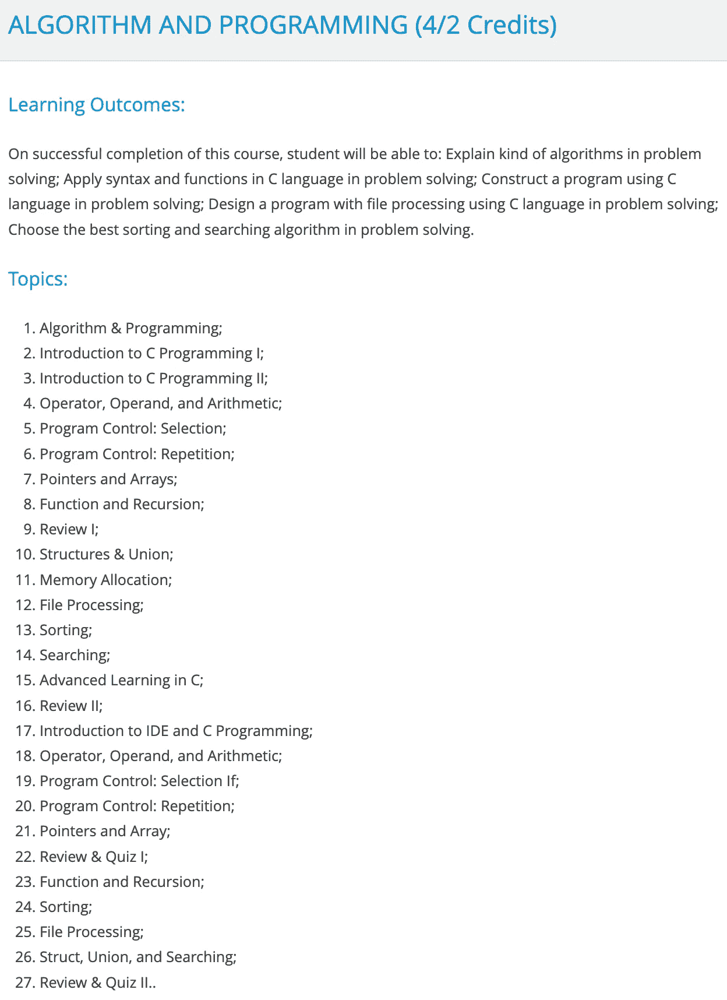

# 你的第一门编程语言

> 原文：<https://blog.devgenius.io/your-first-programming-language-76d5a3312eb0?source=collection_archive---------17----------------------->

## 您的编程之旅

## 如何选择你的编程语言，这样你就不会被抛弃。

千里之行始于足下。

我曾经在[上说过我之前写的另一个帖子](https://medium.com/@giovanni.dejan/learn-new-programming-language-with-auxiliary-language-73ae1297d5fe)“辅助方法”只对学习第二、第三、第四、下一个编程语言有用。确实如此。虽然这篇文章对现有的程序员很有帮助，但是这篇文章不能用于那些有兴趣从零开始学习编程的人。

那么对于初学程序员来说，最好的编程语言是什么呢？

# 不同的人，不同的观点

如果你问不同的人，你会得到不同的答案。这是意料之中的，因为对于初学者来说，人们对什么是理想的编程语言有不同的看法。有些人喜欢简单，而有些人喜欢更多的控制。有些人喜欢可读性，有些人喜欢性能*。因此，关于什么是最好的编程语言的争论永无止境。

如果你是编程世界的新手，一开始你不会注意到，但随后你会意识到编程语言，就像其他事物一样，有[粉丝](https://www.merriam-webster.com/dictionary/fanboy)。这些粉丝在社交媒体上为他们“最喜欢的”编程语言而战，例如 YouTube 和 Reddit。他们激烈地捍卫他们最喜爱的编程语言，从而吸引新手离开。

因此，我将讲述我在第一门编程语言上的经历，然后我们将看看如果我可以让时间倒流，我可以改变什么(也就是我的建议)。

声明:作为一个普通人，我也有我个人的偏见，但我真诚地写这篇文章，并根据我的经验尽可能公平地呈现语言。

*高性能代码和可读代码并不总是互斥的。但是，通常就是这样，尤其是对于简单的程序。

# 我的经历

## 阿尔杜伊诺

所以我对编程的第一次体验实际上不是从大学开始的，而是从 Arduino 开始的。如果你不知道，Arduino 允许你实际上编程板。大家平时教的最基础的程序就是 Arduino 的闪烁灯，可以在一定的持续时间内开灯关灯。但是，也有可能做一些更复杂的事情，例如将文本转换成莫尔斯电码，并在特定情况下控制电流。

如果你**有**一个 Arduino(没有也没关系)并且你想学 Arduino 的编程类似于我做的方式，你可以从一本叫做[编程 Arduino:速写入门](https://www.amazon.com/Programming-Arduino-Getting-Started-Sketches/dp/1259641635/)的书中学习。对于初学者来说还可以，但是有一些概念(比如指针)我觉得初学者在对编程端有足够的了解之前还是不要学的好。

## c 语言

比努斯大学算法与编程班。来源:课程表. binus.ac.id

进入大学，介绍给我的第一门编程语言是 C，是的，连 C++都不是。是丹尼斯·里奇发明的 C 编程语言*。

我们学习了标准输入(`stdin`)、标准输出(`stdout`)、for 循环、while 循环、基本逻辑分支(if-else、switch-case)等等。但有趣的是，我们也学到了[指针](https://en.wikipedia.org/wiki/Pointer_(computer_programming))。不仅在概念上，而且因为我们是在 C 中学习的，我们实际上是手工创建指针的。一旦我们使用完指针访问的内存，我们还需要从指针中“释放”内存。

尽管我喜欢这门课，但我不认为 C(和 C++对于初学者来说是一门好的编程语言。为什么？

1.  指针是手动管理的:当你学习第一种编程语言时，你想了解如何使用你编写的一组指令来编写一个程序。你不会想弄乱电脑内存的。但是在 C 中，如果你创建了一个指针而忘记了“释放”内存，你可能会无意中造成内存泄漏。
2.  不直观的函数:当你学习 C 时，有一些“基本”的方法被认为是不直观的。比如，拿`printf`功能来说。如果你看看`printf`的例子，你会发现在屏幕上打印或显示动态文本并不是最简单的方法。我们来看看 Python ( `print(f”My name is {name}”)`)和 C ( `printf(“My name is %s”, name)`)的对比。你可能会对`%s`的用法感到困惑，然后你必须记住[不同数据类型的不同字母](https://www.tutorialspoint.com/c_standard_library/c_function_printf.htm)。有些方法接受指针而不接受变量作为参数，反之亦然。
3.  整数与小数:在一些编程语言中(比如 Python，Ruby)，只有一种类型的数字***。这种通用数字类型包括整数和浮点数(编程中表示十进制的术语)，因此使得算术运算更容易。但是在 C(和 C++)的情况下，实际上有 2 种类型的数，分别是整数和浮点数。这个*应该不是问题*，但是有一种情况，你想除 2 个数，但是被除数不能被除数除尽(如`3 divided by 2`)。在某些语言中，`3 / 2`导致`1.5`，但是在 C(和 C++)中，它导致`1`。为什么？那跟整数除法有关系，等你对编程语言有了足够的了解之后再去学。

我觉得三个原因足以解释为什么 C 不适合做第一编程语言。这并不意味着 C 不好，只是不适合初学者。

*实际上不是，因为 Binus 大学教授 C99(1999 年发布的 C 语言版本)和/或 C11(2011 年发布)。所以，不是丹尼斯发明的原始 C。

**内存泄漏是计算机没有足够的内存来使用的错误，因为一些未使用的数据没有被清理。

***在“更简单”的编程语言中，可能存在整数和十进制数的区别，但是一些语言能够隐藏它。

# 我的建议

很显然，我作为一个程序员的学习之路离理想还差得很远。我常常希望我能改变学习编程的方法，包括选择我的第一门编程语言。如果我能让时间倒流，以下是我的建议。

## 通用

对于通用编程语言，基本上我的建议必须满足这些标准:

*   以过程化的方式编写*:有许多方法可以编写和构造代码。最简单的方法是过程化的，您可以将代码编写为“过程”这是最简单的，因为结构简单，很多概念不用理解。
*   标准输入/输出:您的第一个程序很可能是在命令提示符下编写的(在 Linux 和 Mac 中也称为终端)。为什么？因为这是编程最简单的界面。您不需要创建和管理窗口来实际查看输出。首先从命令提示符开始，一旦理解了基本知识，就可以继续使用图形应用程序了。

有了这些标准，我向你推荐这些编程语言:

1.  Ruby: Ruby 是一种设计得尽可能简单的编程语言。Ruby 被认为是简单的，因为它的语法是为初学者设计的，而且 Ruby 能够为初学者隐藏它的复杂性。这很容易，直到 Ruby 被认为是一种“神奇”的语言。这篇文章很好地总结了 Ruby 的魔力。Ruby 也用于网站和游戏开发。如果你想学习 Ruby，可以试试德里克·巴纳斯的 [Ruby 教程。视频是旧的，但是 Ruby 变化不大**。](https://www.youtube.com/watch?v=Dji9ALCgfpM)
2.  Python: Python 是最受初学者欢迎的编程语言。Python 简单的原因与 Ruby 相似，那就是 Python 能够为初学者隐藏其复杂性。不仅如此，生态系统***比 Ruby 大得多，因为 Python 被用于[机器学习](https://www.tensorflow.org/)、[服务器](https://fastapi.tiangolo.com/)、 [DevOps](https://www.ansible.com/) 、[游戏开发](https://www.pygame.org/news)。Python 的教程在网上很丰富，但是网上流行的都是来自 [Tech With Tim](https://www.youtube.com/watch?v=sxTmJE4k0ho) 和 [TechWorld with Nana](https://www.youtube.com/watch?v=t8pPdKYpowI) 。一旦你掌握了这个概念，你就可以继续使用 [Raspberry Pi 的 Python 之路](https://projects.raspberrypi.org/en/pathways/python-intro)。
3.  Kotlin:这看起来很荒谬，因为 Kotlin 是 [*法律上*官方支持的 Android 开发编程语言](https://developer.android.com/kotlin/first)。然而，在我看来，Kotlin 对于第一次编程的人来说已经足够容易了(虽然没有 Python 和 Ruby 那么容易)，因为 Kotlin 的语法更短，因此对初学者来说更容易。你可以在这里通过 Traversy Media 观看科特林速成班[。关于命令提示符的标准输入，你可以从 Stackoverflow](https://www.youtube.com/watch?v=5flXf8nuq60) 中读到[这个答案。](https://stackoverflow.com/a/41283570)

*这并不意味着编程语言不应该有其他范式(比如面向对象编程)。这只是意味着你不用写一个类或其他复杂的东西来创建一个`Hello world`程序。

**大多数时候，编程语言添加功能，而不是改变语法。虽然有一个从 Python 2 到 Python 3 的[语法变化的例子，但这是相当罕见的。](https://www.interviewbit.com/blog/difference-between-python-2-and-3/)

***你不必马上学习 Python 生态系统中的所有工具。你只需要确保你先熟悉 Python，然后你就可以学习 Python 的生态系统。

## 特定目的

我实际上不建议直接为特定目的编程。原因是你对编程的理解可能会受到你想要追求的特定目标的限制。也就是说，如果你觉得你不需要学习编程，或者你只是想快速解决一个问题，以下是我的建议:

*   区块链:答案很简单。在[以太坊](https://ethereum.org/en/)中有 [Solidity 编程语言](https://soliditylang.org/)用于编写[智能合约](https://www.youtube.com/watch?v=ZE2HxTmxfrI)。坚实度的教程可以在[freeCodeCamp.org 频道](https://www.youtube.com/watch?v=ipwxYa-F1uY)找到。
*   Web 开发:我会推荐 PHP、Python、Ruby 或者 TypeScript。其中三种是 web 开发的流行编程语言，因为每种语言都有框架。PHP 有 [Laravel](https://laravel.com/) ，Ruby 有 [Ruby on Rails](https://rubyonrails.org/) ，Python 有 [Django](https://www.djangoproject.com/) 和 [FastAPI](https://fastapi.tiangolo.com/) 。TypeScript 没有具体的框架，但是可以用 [Next.js](https://nextjs.org/) 来搭建网站。
*   游戏开发:这很复杂。第一，制作一个游戏有很多方法，从拖拽，游戏引擎，游戏库，甚至使用低级的多媒体库。如果你的目标只是创建一个游戏(不关心编程语言)，那么你可以从 [Scratch](https://scratch.mit.edu/) 或者 [GDevelop](https://gdevelop.io/) 开始，然后你可以继续[虚幻引擎的蓝图](https://www.youtube.com/playlist?list=PL9KfHZARfY8Z7RVgTubrw5-xWOA8dvGic)。但如果想用代码做游戏，我的建议是从 [Godot 引擎](https://godotengine.org/)或者 Unity 开始。Godot Engine 创建了类似 Python 的语言，名为 [GDScript](https://gdscript.com/tutorials/) (语法与 Python 类似)，而 Unity(使用 [C#](https://dotnet.microsoft.com/en-us/learn/csharp) )有[针对初学者的大量教程](https://learn.unity.com/pathways)。或者，如果你愿意，你可以使用 Python 的 [Pygame](https://www.pygame.org/news) 或 Ruby 的 [Gosu](https://www.libgosu.org/) 库，尽管这些比使用游戏引擎更难**些。

*对此有一个相反的论点。对于特定目的的学习，当学习一门编程语言时，你有一个明确的目标。例如，当你有一个构建游戏的目的时，当游戏结束时，你知道你完成了。

**对于第一次学习者，我不建议你直接使用 Pygame 或 Gosu，因为当你将游戏对象放到场景中时，没有图形用户界面(GUI)。

我希望你能开始你的编程语言之旅。最需要注意的是敢于犯错。跟着教程走，然后偏离，然后看你改东西的效果。只有脱离教程，你才会学到更多的编程知识。