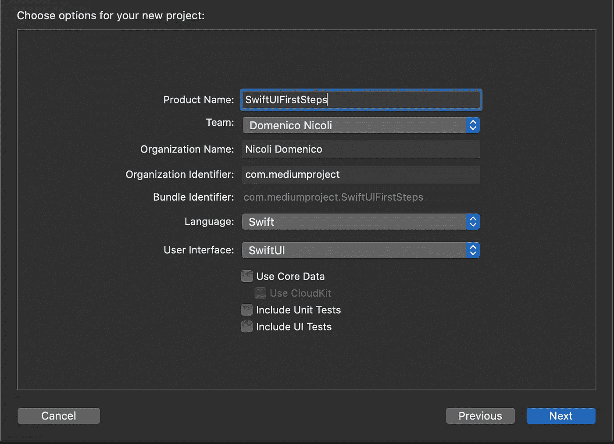
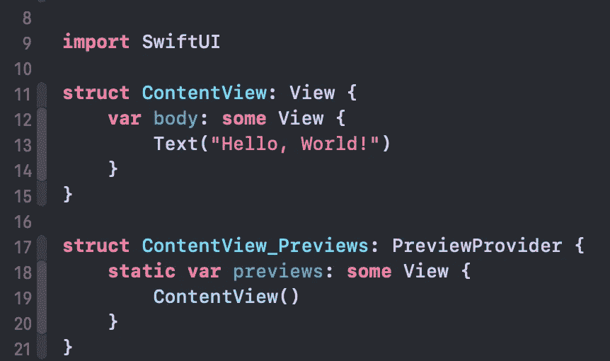
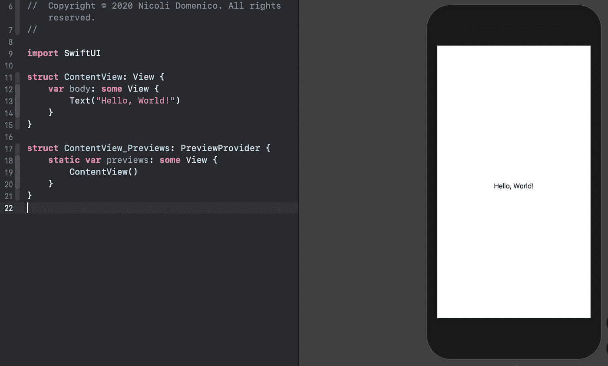
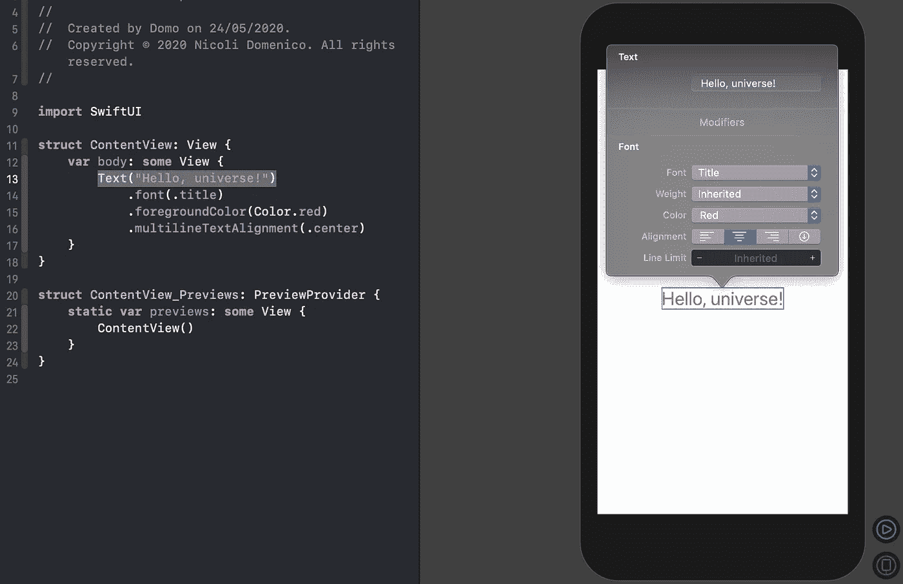
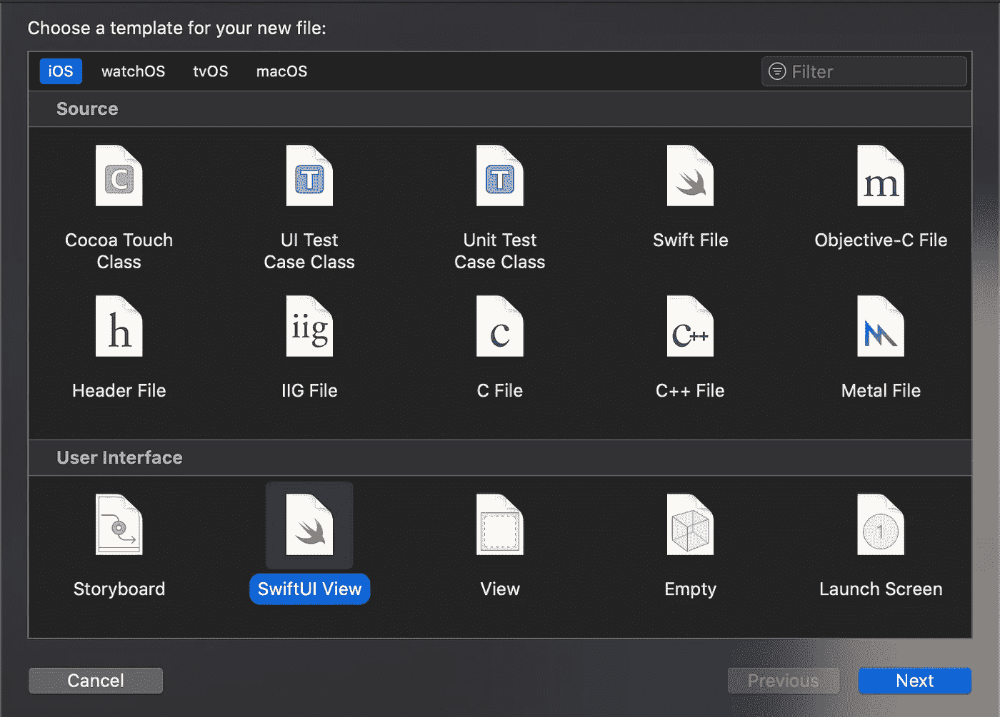
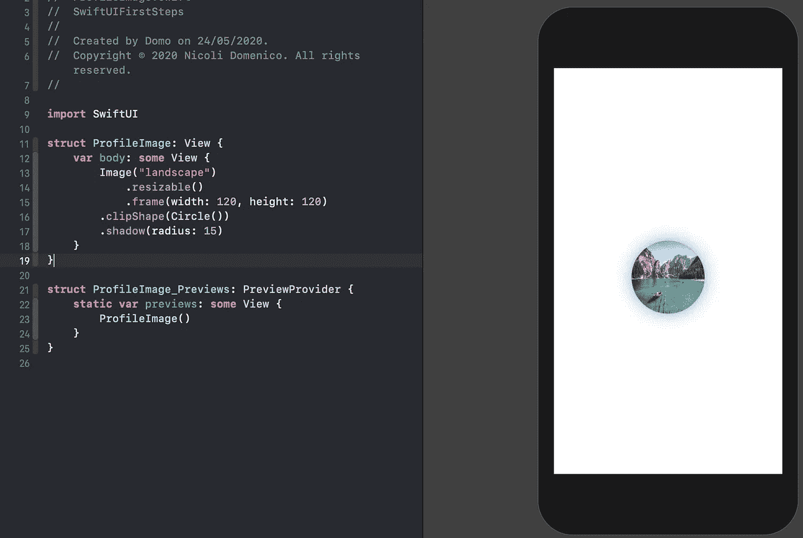
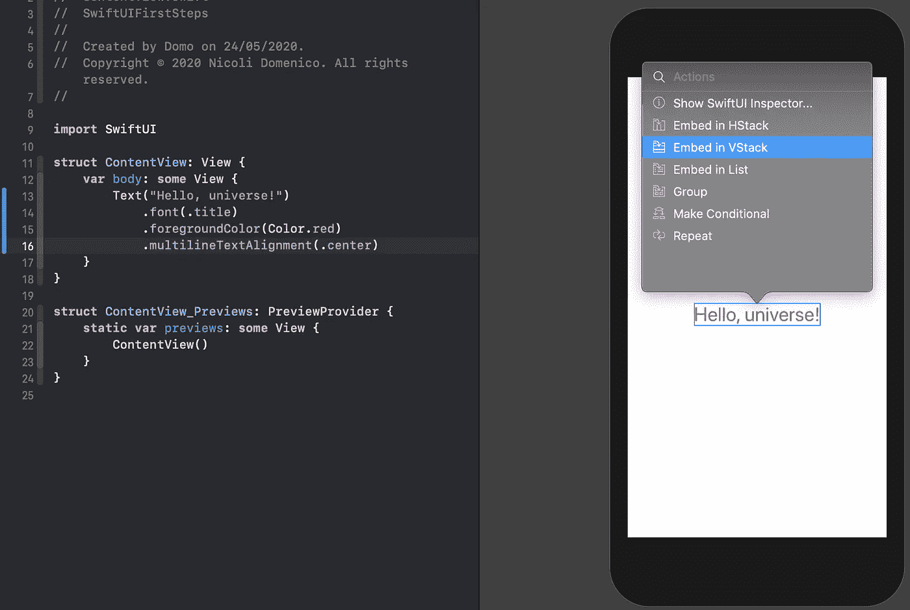
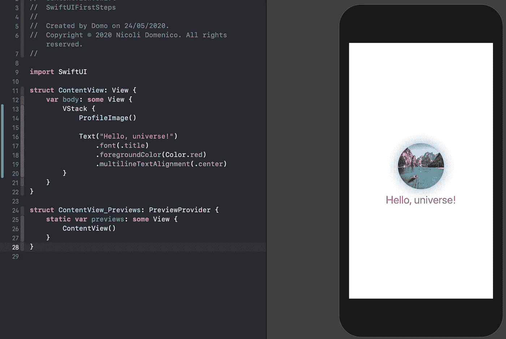

# 使用 SwiftUI 的第一步

> 原文：<https://blog.devgenius.io/your-first-steps-with-swiftui-236e90f30ea4?source=collection_archive---------16----------------------->

## 让我们从苹果新的声明式 UI 结构设计框架开始

照片由[韦斯·希克斯](https://unsplash.com/@sickhews?utm_source=medium&utm_medium=referral)在 [Unsplash](https://unsplash.com?utm_source=medium&utm_medium=referral) 拍摄

# 介绍

在 WWDC 2019 期间，苹果发布了 SwiftUI，这是在任何苹果平台上声明用户界面的新框架。使用它你可以用更少的代码更容易地创建 UI。您还可以在 [Xcode](https://developer.apple.com/xcode/) 中实时查看更改，而无需运行应用程序，您所要做的就是编写代码、构建，然后您就可以直接在新画布中测试您的应用程序界面了！

你还想要一个使用 SwiftUI 的理由吗？**不需要界面构建器和自动布局！**

# 开始

首先，打开 [Xcode](https://developer.apple.com/xcode/) 并创建一个新项目。选择单视图应用程序。

现在，在项目导航器中，选择`ContentView.swift`文件。在这个文件中，您可以找到两种结构。第一个是`View`，它描述了页面的视图内容。相反，第二个结构为这个视图声明了一个*预览*。

# 履行

现在点击画布顶部的 *Resume* 按钮，查看 Xcode 中的实时视图。别担心，第一次可能需要一些时间来表现出来。

如果您修改 hello world 消息，您将看到预览会立即更新以反映您的更改。

漂亮吧？

如果您按住 command 键点按文本，您会发现允许您更改控制的不同选项。例如，如果您选择“ *Show SwifUI Inspector* ”，您可以直接在画布上更改文本，更改将反映在您的代码上。

在检查器中修改像字体、颜色和对齐这样的属性也会帮助你理解这些东西是如何从代码中产生的。

记住。`textAlignment, .textColor and .font?`

# 添加图像

创建一个名为 *ProfileImage* 的新视图，它将包含我们的图像。

从 [Unsplash](https://unsplash.com) 下载一张免费图片，添加到你的 *Assets.xcassets* 文件中。

现在在你的新视图中放入下面的代码来调整你的图片到特定的尺寸，并把它剪成一个圆形。你也可以用一行代码添加一个漂亮的阴影效果。

这是只有几行简单易读的代码的最终结果:

# 合并两个视图

现在我们有了一个包含文本的视图和一个包含图像的视图。但是我们如何在一个视图中合并两者呢？

首先回到 *ContentView.swift* 文件，将文本嵌入到 *VStack 中。*

现在在文本控件前添加你的 *ProfileImage* 视图，你就完成了！

简单对吗？

# 结论

SwiftUI 的第一课到此结束！

甚至你可能会爱上这个新框架的简单性，记住它仍然有一些大的缺点。例如，它只支持 iOS 13 和 Xcode 11，所以如果你想在 SwiftUI 中创建一个新的应用程序，你将会放弃很多使用旧设备的潜在用户。它也仍然是新的，所以你可以找到一些奇怪的错误**、**不支持的控制**和一些 Xcode 执行上的**小故障**，这可能需要几个小时才能理解发生了什么。**

我希望苹果在接下来的更新中解决这些问题。

# 完整代码

你可以在 [GitHub](https://github.com/domeniconicoli/SwiftUIFirstSteps) 上找到完整代码。感谢您的阅读。