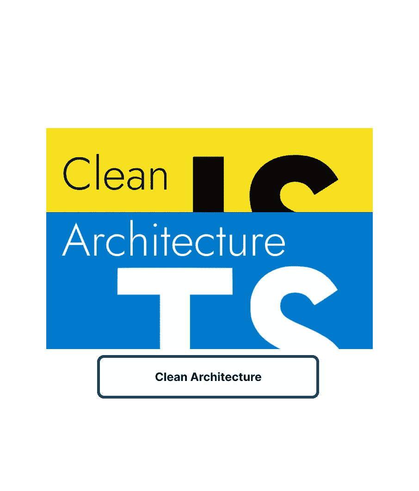
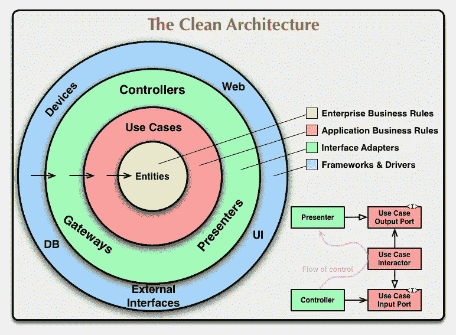
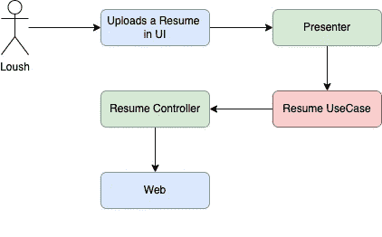
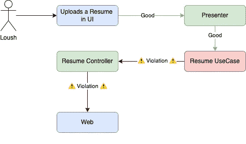
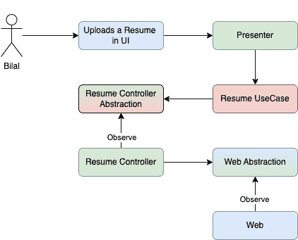

# 你的清洁建筑指南

> 原文：<https://blog.devgenius.io/your-guide-to-clean-architecture-42d8d62e8012?source=collection_archive---------0----------------------->

在这篇文章中，我们将了解更多关于清洁建筑和可爱的分层建筑❤

> 抓住你最喜欢的饮料☕️，因为这将是一个旅程！

# 📒介绍

obert C. Martin 在他的书中定义了“干净的架构:软件结构和设计的工匠指南”。这种架构建立在软件系统应该围绕业务规则而不是完成它们所需的基础设施或技术来构建的前提之上。这意味着系统的底层业务逻辑应该与它对用户的显示方式或配置方式相区别。在干净的设计中，您不必在项目开始时选择数据库或框架，因为这些只是不影响策略的元素，并且可以根据需要进行更改。
为了保持众多事物的独特性，干净的建筑采用了一系列的层次，每个层次都有特定的功能。业务规则位于最深层，独立于系统的其他部分。基础设施和表现细节在外层，但是它们依赖于内层。
总的来说，干净的架构强调关注点的分离和依赖倒置的概念，以创建易于维护、可扩展和易于理解的软件系统。

## 为什么要建筑师？🤔

> “软件架构的目标是最小化构建和维护所需系统所需的人力资源。”*――罗伯特·c·马丁，清洁建筑*

软件架构之所以重要，有几个原因:

1.  改进的可维护性:设计良好的软件架构可以使理解和修改代码库变得更容易，这可以在需要更改或更新时节省时间和资源。
2.  更好的可伸缩性:一个好的软件架构应该能够处理流量或数据量的增加，而不需要对代码库进行重大修改。
3.  增强的安全性:通过遵循已建立的架构模式和最佳实践，有可能构建更安全的软件系统，更不容易受到攻击。
4.  增强的性能:设计良好的软件架构可以提高系统的性能，使其更快、更高效。

总的来说，软件架构是至关重要的，因为它确保最终的软件系统设计良好，易于维护，可伸缩，从长远来看节省时间和金钱。

# ⚠️:首先让我们弄清楚一些术语:

## 关注点分离到底是什么？

关注点分离是一个软件设计原则。这意味着一个软件系统应该被分成几个部分，每个部分处理一个特定的问题。关注点分离的目的是通过使软件系统更加模块化、可维护和可测试来改进软件系统。
模块化设计和封装经常被用于软件开发，以保持程序的不同组件的不同。一个系统被分成更小的、独立的部分，称为模块，在模块化设计中可以单独构建和测试。将对象的数据和行为组合成一个单元的过程称为封装。这有助于对系统的其他部分隐藏事物的内部运作。
当不同的关注点被分离到不同的模块或对象中时，修改和管理系统变得更加容易，因为对系统的一个区域的改变不会影响其他部分。这也可以使系统测试更容易，因为单个元素可以独立评估。

总的来说，关注点的分离有助于通过使软件系统更加模块化、易于维护和可测试来改进软件系统的设计和结构。

## 什么是依赖倒置？

依赖倒置概念是一种程序设计原则，它指出高级模块不应该依赖于低级模块。两者都应该依赖抽象。依赖倒置原则寻求通过减少系统组件之间的连接来改进软件系统的架构和结构。为了掌握依赖性反转原则，考虑软件系统中的高级和低级模块传统上是如何交互的。在典型的设计中，高级模块依赖低级模块来执行特定的活动，例如数据库访问或与用户界面交互。因为高级和低级组件是如此紧密地集成在一起，所以改变和维护系统是很困难的。
依赖倒置原则试图通过在高层和低层组件之间引入一个抽象层来颠覆这种传统的连接。高层模块依赖于这个抽象层，而不是直接依赖于低层模块。抽象层由底层模块实现。
这种逆向关系将高层和低层模块分开，更便于系统的更新和维护。它还使得系统测试更加容易，因为高级模块可以独立于低级模块进行评估。

总的来说，依赖倒置原则是一个有用的软件设计原则，它可以通过减少软件系统的连接和模块化来帮助改进软件系统的设计和结构。

# 👨🏻‍💻干净的架构层

他的同心层概念建立了一个有组织的单向执行流程，允许我们将所有依赖指向同一个方向。内层不了解外层。这种分隔保护内层免受最外层可能发生的变化。假设我们引入了一个新的呈现框架。这对我们的业务层没有影响，业务层是由“实体”组成的我们可以用这种方式保护应用程序最重要的方面:业务规则。

> *“如果你觉得好的建筑很贵，那就去试试差的建筑。”—布莱恩·富特*

如我们所见，该图有四层。蓝色、绿色、红色和黄色是层。
每个圆圈代表软件的一个独立方面。最外层是软件的最低级别，随着我们越深入，级别越来越高。一般来说，随着我们越深入，该层变得越不容易改变。

## 实体

领域模型将在这一层实现。因为它处理系统的“心脏”，我们可以说这是我们应用程序最重要的一层。这一层是业务实体的行为(方法)和属性(特性)生效的地方。我们应该尽一切可能阻止那些没有什么发言权或没有改变动机的实体。一个贫血的实体揭示了它的所有属性，却无法控制谁或什么改变了。此外，通过只显示只读属性并允许构造函数和方法改变它们的内部状态，我们可以确定我们总是在使用模型的真实实例。

## 用例

这一层包含了系统用例的实现。通常，抽象被提供给这一层(通过依赖注入),以便它可以连接到外部系统，如数据库、电子邮件服务等。这一层将协调运行特定用例所需的所有服务和领域模型。由于隔离和依赖流，这一层的变化对实体层没有影响。

## 接口适配器

这一层的目的是在来自外部系统的数据和来自用例的数据之间提供链接。这一层的主要作用是从外部系统(数据库、Rest API、GRPC、队列等)收集数据。)并将其传递给用例，反之亦然。在这一层使用中介模式可能是个好主意，这将进一步放松这一层与用例层的交互。我们可以通过 DTO(数据传输对象)提交命令并接收结果。

## 框架和驱动因素

这一层包含所有的外部工具，比如数据库访问、rest APIs、用户界面等等。一般来说，这一层不会包含太多代码。我们可以添加将被该层中所有其他层使用的依赖关系。

# 📜依赖性规则

干净架构的主要标准是依赖规则，它规定源代码的依赖只能指向内部，也就是说，指向最高级别的策略。也就是说，最深层的元素无法了解最外层的元素。在外层中声明的类、函数、变量、数据格式和任何其他实体不能在内层的代码中使用。

最底层是实体层。它包含应用程序的业务目标以及最广泛和最高级的规则。只要一个实体可以被各种应用程序利用，它就可以是数据结构和函数的集合，或者是具有方法的对象。该层不得受到最外层变化的影响。换句话说，任何应用程序操作方式的改变都不会对这一层产生影响。

用例层包含特定于应用程序的业务规则，将系统的所有用例分组并付诸实施。用例管理实体之间的数据流，同时还指导实体应用重要的业务规则来满足用例目标。最外层不应该影响这一层，您的更改不应该影响实体层。如果用例的细节发生变化，该层中的一些代码将会受到影响。

接口适配器层有一个适配器集合，用于转换数据格式，以便其他层可以使用它。换句话说，它从数据库中获取数据，并将其更改为最适合实体层和用例的格式。从最内层的数据到最外层的数据的转换也是可能的。这一层包含演示者、视图和控制器。

框架和数据库通常位于图表的最外层。这一层包括与接口适配器层通信的代码。这一层包含所有的细节；网络是一个细节，数据库也是。所有这些组件都在最外层，因此它们不会相互干扰。

但是如果这些层是自治的，它们是如何通信的呢？依赖倒置的概念解决了这个矛盾。按照 Robert 的说法，你可以安排接口和继承连接，以便源代码依赖在适当的时候与控制流相对。

如果一个用例需要与提交者通信，它不能直接调用提交者，因为这将违反依赖规则。相反，用例从内层调用一个接口，然后由外层的演示者实现。这种技术可以应用于所有的架构层。不同级别之间的数据可以是基本结构或简单的数据传输对象，作为函数调用的参数。如果发送数据库中的实体或记录，将会破坏依赖规则。

> 依赖规则声明源代码依赖只能指向内部。

这意味着内圈的任何东西都不可能了解外圈的任何东西。也就是说，内圈不应该依赖于外圈的任何东西。图中的黑色箭头显示了依赖规则。

这是使这个架构工作的重要规则。还有，这个很难理解。所以我打算先打破这个规则让你明白它带来了什么问题再来解释，看看如何跟上这个规则。所以请原谅我。

首先，这种循环表示可能会让许多人感到困惑。所以我们试着垂直表示。

这里的颜色与干净的架构图中显示的颜色相同。

请记住，箭头应理解为“依赖于”具体来说，框架和驱动程序应该依赖于接口适配器，而接口适配器依赖于应用程序业务规则，应用程序业务规则依赖于企业业务规则。

## 框架和驱动因素

位于这一层的软件领域有

*   用户界面
*   数据库ˌ资料库
*   外部接口(例如:本地平台 API)
*   Web(例如:网络请求)
*   设备(例如:打印机和扫描仪)

## 接口适配器

这一层适用

*   演示者(用户界面逻辑，状态)
*   控制器(保存由网络、设备或外部接口实现的应用程序所需方法的接口)
*   抽象(包含应用程序执行的每个操作的接口，由 DB 实现，类似 ORM 操作)

## 应用程序业务规则

此类别包括不是核心业务规则，但对于此特定应用程序是必需的规则。这一层包含用例。顾名思义，它应该涵盖每个应用程序用例。也就是说，它包含了应用程序的所有功能。

该层还定义了特定用例调用哪些控制器/接口。我们偶尔需要各种模块的控制器。

## 企业业务规则

这一层包含核心业务规则以及特定于领域的业务规则。该层对蚀变也最不敏感。任何其他外层的变化对该层没有影响。因为业务规则不会频繁更改，所以这一层的更改非常少。该层包含实体。
实体可以是业务规则所必需的核心数据结构，也可以是包含业务逻辑的方法的对象。

让我们看一个简单的例子来更好地理解这一点。
这个例子演示了一个只有一个网络请求的简单应用程序。
我们如何设计一个应用程序，用简历上传器给用户送汉堡🍔API？让我们试着设计。

每一层都有不同的目的。不好看吗？让我们看看前面提到的设计的依赖流，看看是否有什么不正确的地方。你还记得依赖规则吗？"根据依赖规则，源代码依赖只能指向内部."

UI 从演示者那里请求数据，演示者又从用例那里请求数据，演示者又从控制器那里请求数据，控制器又从 Web 上请求数据。

毕竟，如果控制器不依赖于数据，我们怎么能指望将一些数据扔给控制器呢？同样，如果用例不依赖于控制器，我们怎么能期望用例从控制器获得必要的数据呢？

但是依赖规则严格地说依赖只能指向内部。当你说这是使架构工作的规则时，这一切都加在一起了。

为了满足这个标准，我们必须将箭头反向。这可能吗？多态性已经存在。当我们在这里引入一些多态性时，神奇的事情发生了。我们可以简单地通过在这两层之间建立一个接口来颠倒这种依赖性。依赖性反转原则控制了这一点。当依赖性规则被打破时，让我们应用依赖性反转概念。

因此，流程变为:

> *那么为什么外层要依赖于内层而不是相反呢？*

应用程序订购它想要的数据，它不关心数据库或 API 如何准备数据。这样，应用程序不依赖于数据库或 API。如果我们将来需要或想要更改 DB 或 API 模式，我们可以简单地更改它。至于它给出了应用程序所要求的，应用程序甚至不知道 DB 或 API 中的变化。

此外，单向依赖关系规则将应用程序从死锁状态中拯救出来。即，想象在两层架构中，第一层依赖于第二层，第二层依赖于第一层。在这种情况下，如果我们需要更改第一层中的任何内容，就会破坏第二层。如果我们需要改变第二层中的任何东西，就会破坏第一层。这可以通过跟踪死锁状态来拒绝。

## 🌪️:我们应该在哪里抛出业务异常？

一次只验证一个实体的业务异常应该在实体的行为(方法)中抛出。当我们需要验证更多来自系统外部的实体或信息时，用例层是一个放置它们的好地方。

## 🛞任何项目都可以使用清洁建筑吗？

使用干净的架构可能会无意中增加项目的复杂性。干净的架构模式可能会延长构建某些东西所花费的时间，而不会给“粗制滥造”的项目带来任何实际的好处，这些项目是通向数据库的桥梁，或者是具有定义的生命周期的项目。一个清晰的设计可以为应该成长的小项目创建一个强大的、可扩展的架构。这可能会在项目开始时花费更多的精力，但从长远来看，这将使添加附加功能变得更加容易。

## 适当建筑的✅优势

*   可试验的
*   可维持的
*   易变的
*   易于开发
*   易于部署
*   自主的

*最重要的是*

*   **数据库无关**:您的核心业务逻辑并不关心您是否使用 Postgres、MongoDB 或 Neo4J。
*   与客户端接口无关:核心业务逻辑不关心您是否使用 CLI、REST API 甚至 gRPC。
*   **框架不可知:**使用 vanilla nodeJS，express，fastify？您的核心业务逻辑也不关心这个。

# 🤓结论

结果是，在项目的早期实现清洁设计可能会在以后获得巨大的收益。尽管如此，彻底理解它如何帮助您的团队开发一个健壮的、可伸缩的、符合业务原则的架构是至关重要的。请记住，每一个无意的复杂性都必须以某种方式为业务提供价值；否则，没有必要雇用它。
没有能够解决所有困难的“银弹”架构。这不是清洁建筑的错。
一旦建立了应用程序基础，干净的架构有助于以较低的成本(物理成本或时间成本)维护和发展应用程序。这种帮助是由它的层是自治的这一事实以及设计模式的频繁使用提供的。因此，对系统中一个元素的修改很少会中断程序其余部分的运行。
另一方面，一个更有经验的开发团队需要在系统上工作。为了能够管理和构建程序，需要理解设计模式。它也需要比基本 MVP 应用程序更长的时间来看到第一个结果，因此需要强大的客户一致性来使未来的好处显而易见。
最后，清洁的架构方法是一个很好的选择，可以用于那些倾向于发展和存在很多年的应用程序。然而，对于基本的和非进化的系统，这样的架构可能不值得努力；相反，应该遵循更简单的架构模式。

> 希望你觉得这篇文章有趣和好玩❤️