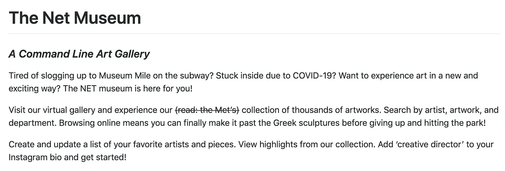
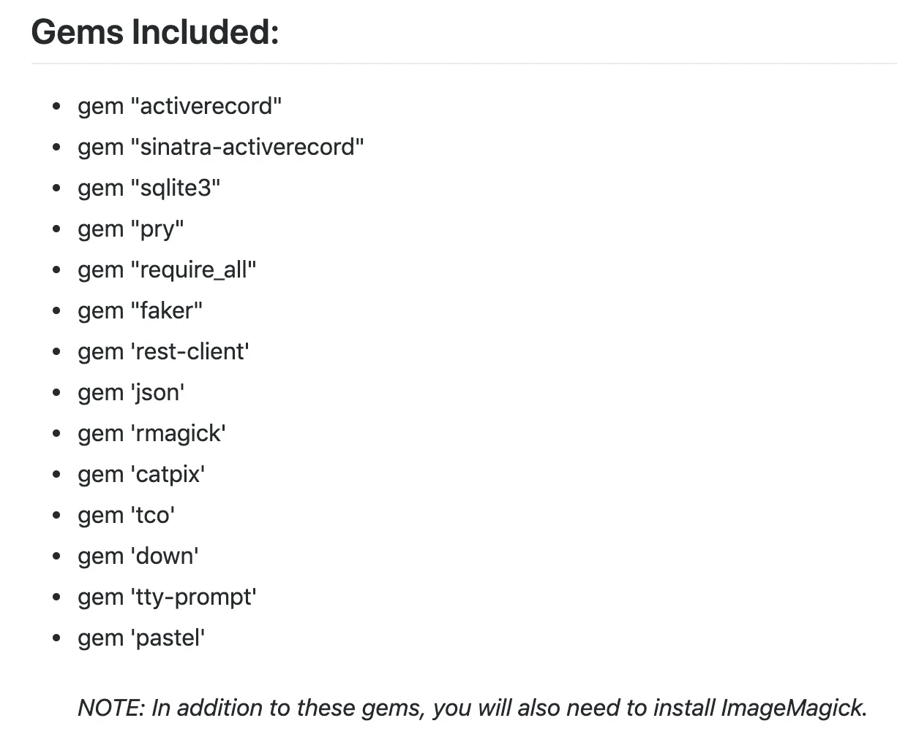
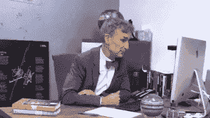
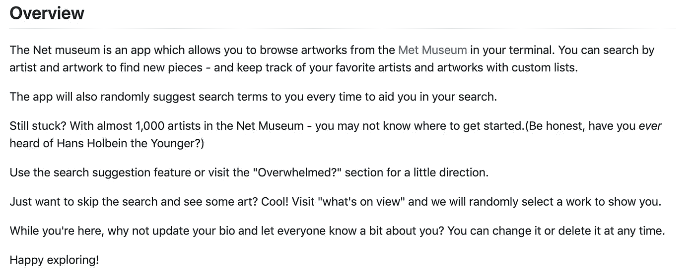
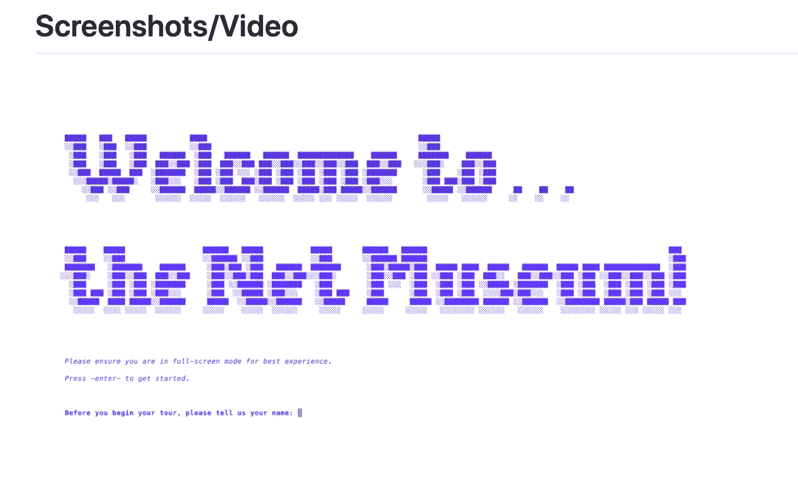
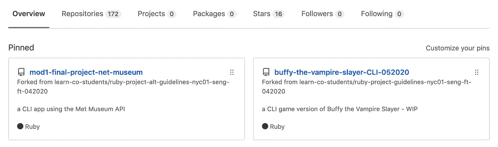

# 没有自述文件，您的项目还没有完成。下面就来写一个。

> 原文：<https://blog.devgenius.io/your-project-isnt-finished-without-a-readme-997ca096a7ca?source=collection_archive---------8----------------------->

没有自述，哈？我明白了...

我绝对喜欢看别人的编码项目。无论是大公司还是小公司，无论是有经验的还是初学者，在编程的世界里，我相信我们都有可以互相学习的东西。作为一个初学者，我有很多次被困在一个问题上，或者努力从不同的角度看问题，于是我去搜索 Google/GitHub/等等。看看别人想出了什么。

作为这些项目的创建者，我们也希望得到同行和网络的支持。也许我们需要反馈、鼓励，或者一只愿意测试我们所有错误的小白鼠。我们不知疲倦地工作几个小时，创造一些我们引以为豪的东西，并希望与世界分享。然后…我们完全忽略了包括自述文件。

蒂芙尼刚刚去了你的回购，并没有自述文件。这就是她的感受。

为什么我们要这样对待自己？！尽管我是一个初学者，有点不好意思分享我的作品和想法，但我仍然不那么秘密地希望其他人看到它并参与其中。但是我们需要先把他们吸引过来。

一些初学编程的人没有意识到的一件事是，重要的不再仅仅是你顶尖的编码技能。潜在的雇主希望看到整个包装:编码能力，个性，沟通，等等。问题是，他们非常忙，有成百上千的申请要处理。除了你的简历和个人网站，你的项目(大部分)应该反映你是谁，你对什么感兴趣。如果我是 Judy Recruiter，我碰巧看到了你的 GitHub，你的项目标题听起来很有趣，但没有关于如何访问它或它做什么的信息，我会看到它吗？不要！我太忙了！

不仅如此，如果你为社区构建了一个真正有用的工具，却没有 README，那么就没有文档可以依赖于更新，如果出错了该怎么办，等等。我尝试过(但失败了)使用一些 Ruby gems，除了一行描述之外，它们没有任何关于它们如何工作的真实文档，这让我很难过，因为我真的很想尝试一下他们努力构建的东西。

让我们用几个简单的步骤来改变这一切，好吗？

***注:*** *我怀疑有些人不包括 README 的是因为写作不是他们的强项。这完全没问题——README 没有获得普利策奖。我们只需要你的项目和它是如何工作的概述。此外，因为这些软技能在工作场所很受重视，所以每当你写一个软技能时，就把它当作练习。他们会越来越好的，我保证！*

# 第 1 步—标题和描述:这里有什么？

你所有的项目都应该有某种与项目内容相关的标题，并包括对项目内容的简要描述。这也是我可能强调某个项目仍在进行中的地方，因此我可以为用户设定期望，这是一个我仍在构建的项目。

接下来，包括应用程序的高层次描述。这是你可以让自己的个性大放异彩的地方。正如我之前提到的，我们很多人都忘记了雇主想从多个层面看你是否适合他们的公司或项目。但是不要忘记你的项目也是一个吸引你想要的工作的机会。你是一个愚蠢的人吗？在描述中展示一些！更直白更中肯？你知道该怎么做。

对于我的第一个项目，我试图在自述文件的描述中加入一些友好的幽默(见下文)。如果这对一些雇主来说太多了，我想我们可能不会太喜欢一起工作。没关系！

我的项目简介。

# 第二步——说明:我如何操作这个东西？

请记住，没有人知道如何以您想要的方式运行和使用您的项目，除非您告诉他们。给出入门所需的概述(例如，我的 Ruby README 将包括任何相关的 gem——也是出于信用目的),以及关于克隆和运行什么命令的几个简单步骤。见下面我的。如果用户需要任何额外的库，也可以在这里调用。

我的应用程序中使用的红宝石。

# 第三步——概述和照片/视频:哦，照片！

哇，你的自述文件真的越来越完整了！

你的概述应该比你的介绍更简单明了。这是您深入谈论您的项目的机会，并描述它有什么特性，它是如何构建的，以及您使用了什么语言和技术。见下面我的。我特别指出并赞扬了我对 API 的使用，并描述了我的应用程序的大约 7 个特性。我仍然保持了一点轻松和幽默，但这只是我的风格。

我的应用概述。

现在是我最喜欢的部分——这个应用程序看起来像什么？！我不想打破它给你，但你可以通过所有的麻烦，有人可能仍然不想花时间克隆你的工作(除非你是在一个网站上托管它，并包括链接…提示提示。)因此，添加照片和/或视频是一种简单且经济高效的方式，让他们可以看到实际情况。他们还可以看到你的审美品味，如果你包括一个短视频，他们将再次看到应用程序的流程，并看到你令人印象深刻的造型能力。

*旁注:如果你像我一样是一名训练营的学生，并且无论如何都要为了展示的目的而创作一些这样的材料，那么尽可能多的利用它们吧！*

我的应用程序的截图之一。

# 额外收获:修正你的个人资料亮点！

在您的 Github 个人资料页面上添加和组织您的项目，这样就没有人需要挖掘来找到您的最佳作品。Github 允许你的个人资料页面上有 6 个图钉，你可以按照你想要的任何顺序拖放。只需在您的个人资料页面上单击“自定义您的 pin”即可开始。

把它想象成你的 Myspace 前 8 名——展示你的最爱，并得到安慰，因为与 Myspace 不同，你的其他项目不会因为你没有把它们放在这里而生气。

我的 Github Top 6 一瞥。

# 恭喜——你是一个自述大师！

一个潜在的雇主在读了你华丽的自述后。

就是这样！既然你已经了解了基础知识，那么从现在开始，挑战自己，将自述文件作为应用清单的一部分。如果您没有自述文件，请不要通过 go。你的项目还没有完成！我自己(以及你的应用程序的崇拜者)会感谢你的！