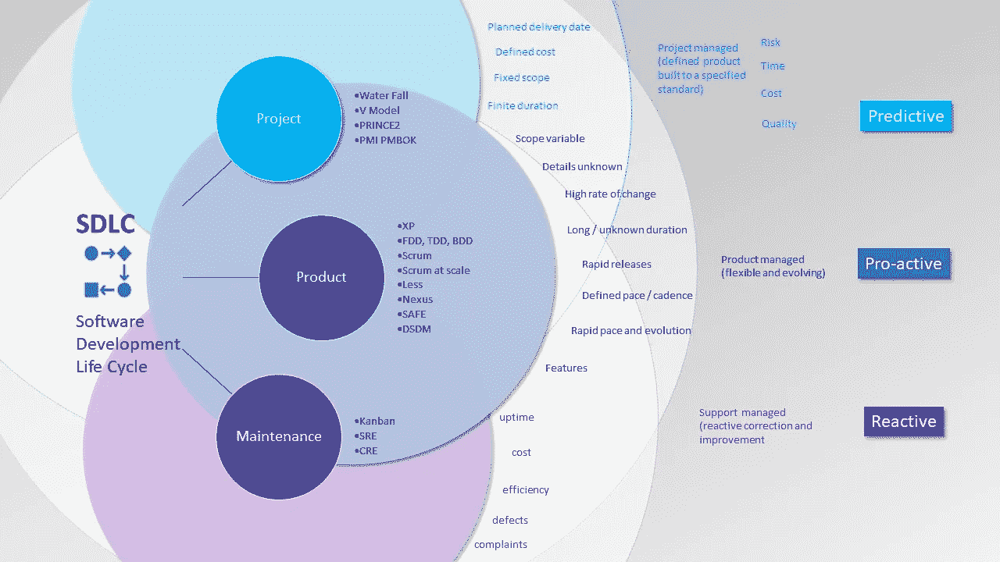

# 你的 SDLC 烂透了！

> 原文：<https://blog.devgenius.io/your-sdlc-sucks-b0ac06b09911?source=collection_archive---------5----------------------->

## 选择适合您的规模、文化和要求的 SDLC

## 如果你只有一把锤子，不要以为所有东西都是钉子

照片由在 [Unsplash](https://unsplash.com?utm_source=medium&utm_medium=referral) 上拍摄

有这么多的开发方法，重要的是要明白一个尺寸**并不**适合所有人。随着业务的增长，他们也在变化，一个适合一个团队的开发人员在一个物理办公室的桌子上的过程可能无法扩展到三个更大的团队，这三个团队是远程的，但是是本地的，或者甚至进一步扩展到十个地理上远程的团队。公司的工作类型和产品也应该是决定的一个关键因素。

是不是一家为客户进行固定价格开发的软件商店，所以交付日期是关键，估计是盈利的必要条件？

或者是在没有竞争的发展中行业制造新产品的业务，随着客户了解到好处，快速发展的特性和功能也是如此？

或者它是一个成熟的产品，在阳光照射它之前的最后阶段被作为一棵摇钱树来运营，其重点是**稳定性、低支持成本、客户满意度、减少投诉、**和优化效率？

最困难的领域是快速增长的小型企业，因为流程可能需要随着增长而改变。这种情况可能需要对员工进行再培训，并考虑过程演变或变革？

文章作者图片(格雷格比灵顿)

一个组织也可能决定它足够大或足够灵活，以支持其目的的各个领域中的几种方法，例如固定价格交易的 PRINCE2，内部资助的产品开发的大规模 Scrum，以及支持团队中的看板。

另一种方法是所有团队都必须有一个默认的过程，但是可以灵活地为一个项目或团队定制一个过程，只要决策是经过考虑和证明的。

布雷特·乔丹在 [Unsplash](https://unsplash.com?utm_source=medium&utm_medium=referral) 上拍摄的照片

另一种状态是类似或可能类似于**混沌**的状态。团队内部缺乏过程的连续性，如果一个团队确实可以被明显地识别，或者跨团队。就像混沌说你在做过程 X，但事实上，你只做了一半，或者根本不做，或者实际上在做过程 Y，但用了另一个名字。这是每个人都想避免的状态，也就是说，如果他们有意识地无能，并能认识到这种情况。当然，那些无意识无能的人继续生活在幸福中，没有意识到混乱和问题。

> 乱能好吗？甚至有用吗？

是的，在一个停滞不前的组织中，在一个没有差异化或受外部因素制约的市场中。也许在招募一致的团队成员方面如此成功，一致性减少了冲突和建设性的挑战。拥有一个技术团队/创新小组/纯研究/满是没有束缚和约束的研究员的密室，以真正伪随机和混乱的方式前进，更有可能找到独特和原创的解决方案。

> 每一个过程都是有目的有地点的，不要对某些不屑一顾，只考虑在你这个时间点的具体情况下，哪一个适合你。

# 关于作者的更多信息

Greg 是一名经验丰富的软件专业人士，也是[**outsource . dev**](https://outsource.dev/)**，**的首席技术官。他曾在多家公司工作过，现在热衷于帮助他人在软件开发、管理和外包方面取得成功。

如果你喜欢这篇文章，那么请**鼓掌**和**跟随**我。