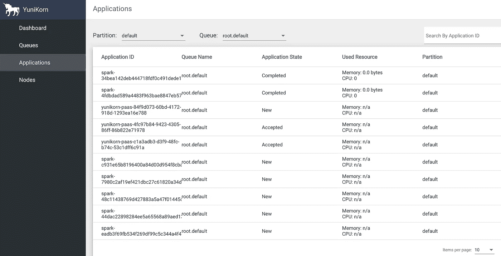
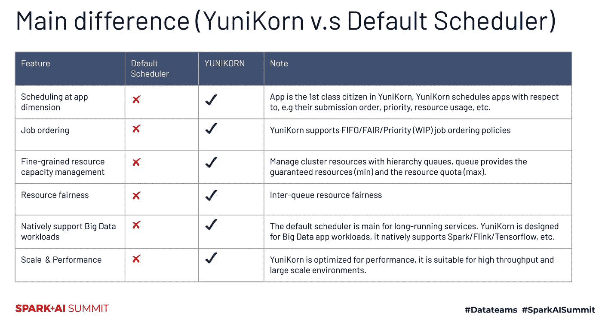
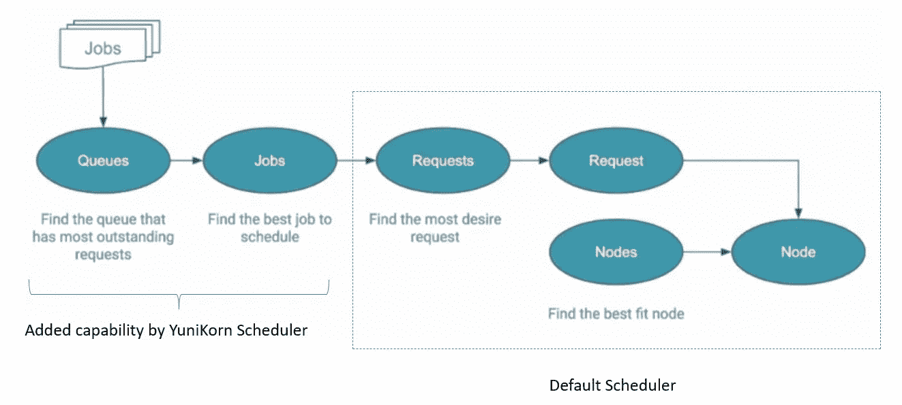
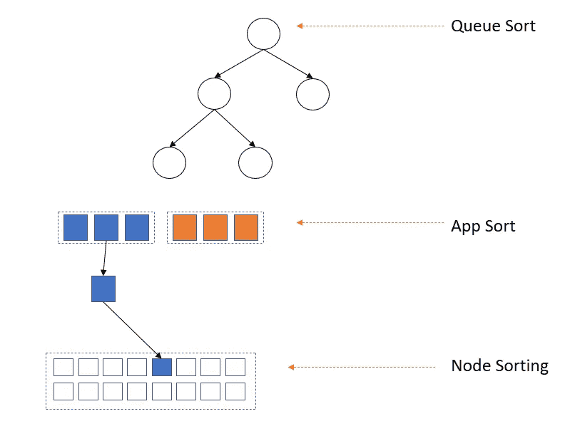
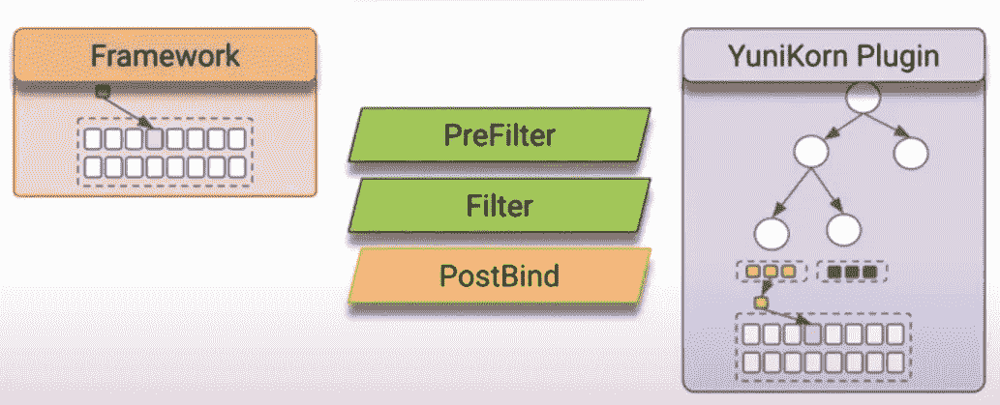
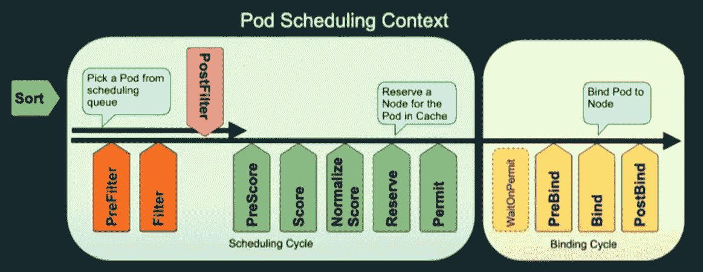
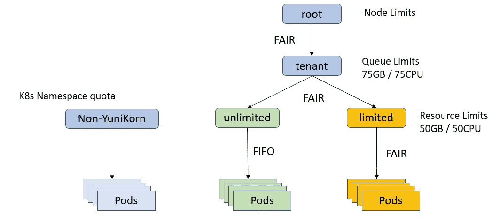
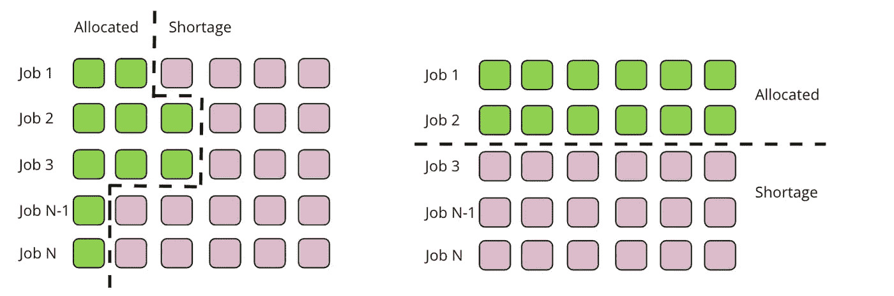
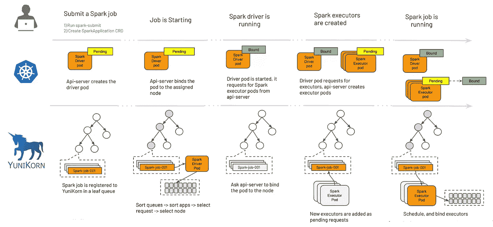
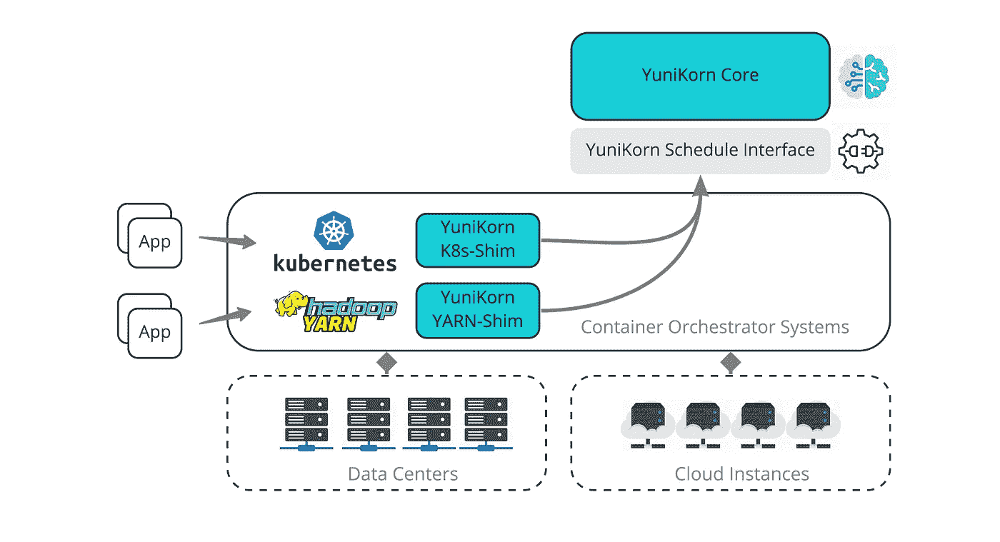

# YuniKorn —大数据工作负载的批处理调度程序

> 原文：<https://blog.devgenius.io/yunikorn-the-batch-scheduler-for-big-data-workloads-44a129d90e7b?source=collection_archive---------3----------------------->



Kubernetes 上的快速大数据作业

K8s 是为服务型工作负载而设计的。随着时间的推移，它为有状态应用程序提供了更好的支持。但它的调度程序并没有随着时间的推移而改善大数据批量工作负载，这需要更快的大规模 pod 供应。此外，作业运行时间更长，需要租户隔离。默认计划程序有以下缺陷。

*   **缺乏一流的应用程序概念** —默认调度程序执行 pod 级调度，它不理解 pod 之间的排序，如先驱动程序后执行器。
*   **缺乏精细的容量管理** —命名空间配额是固定的，并在准入阶段进行验证。如果资源不可用，则没有排队机制。此外，命名空间资源配额是平面的，它不支持分层资源配额管理。
*   应用/任务障碍
*   **由于“AM”问题引发作业死锁**——存在多个作业的驱动程序占用槽位并持续等待执行者出现的可能性。
*   **租户之间没有资源公平性** —错误配置的作业可以独占一个名称空间中的所有资源，并使同一名称空间中的其他作业资源匮乏。
*   吞吐量和调度延迟(100 秒以上)

> 由于所需的计算并行性的性质，批处理工作负载通常需要一起调度，而且频率要高得多。

为了填补这一空白，Cloudera 以及后来的开源软件 yuni Korn**。**

# YuniKorn 是什么？

*   独立资源调度程序
*   在部署/pod 中运行的无状态服务
*   适合大数据工作负载(无状态批处理工作负载和长期运行的有状态服务)
*   支持纱线和 Kubernetes。
*   遵循解耦设计模式
*   目前原生支持 Spark，Flink & Tensorflow。

> 在 YuniKorn 中，“Y”代表纱线，“K”代表 K8s，“Uni”代表通用



图片来自 Databricks AI 峰会

# YuniKorn 的优势

*   应用感知调度



作者图片

*   多承租——yuni Korn 提供了一种无缝的方式来管理使用队列的 Kubernetes 集群的资源配额，它可以替代名称空间资源配额。
*   分层资源池/队列



*   基于 K8s 调度框架的插件系统



图片来自 Apache YuniKorn meetup



图片来自 CNCF 在 YuniKorn 上的演讲

*   弹性队列配额
*   调度公平性——用户、应用、交叉队列的公平性



作者图片

*   队列中的可插拔作业排序— FIFO、公平、优先级顺序、状态感知
*   可插拔节点排序—公平& [装箱](https://www.youtube.com/watch?v=qbuMPi44bVQ)
*   团伙调度



K8s 排班与帮派排班

*   每秒 600 多个吊舱

启用 YuniKorn 调度程序时集群中发生的情况的总体视图。



> 主动 B 树分类
> 群组调度依靠非群组调度
> 占位符容器
> 内置日志&可观察性

# 部署 YuniKorn

```
helm repo add yunikorn https://apache.github.io/yunikorn-release
helm repo update
kubectl create namespace yunikorn
helm install yunikorn yunikorn/yunikorn --namespace yunikorn --set enableSchedulerPlugin=true

# To Access web UI
kubectl port-forward svc/yunikorn-service 9889:9889 -n yunikorn

# To restart the scheduler 
kubectl scale deployment yunikorn-scheduler -n yunikorn --replicas=0
kubectl scale deployment yunikorn-scheduler -n yunikorn --replicas=1

# Get scheduler logs
kubectl get pod -l component=yunikorn-scheduler -n yunikorn
kubectl logs yunikorn-scheduler-<id> yunikorn-scheduler-k8s -n yunikorn
```

注意:要将 YuniKorn 与默认调度程序一起使用，我们可以设置`embedAdmissionController=true`。这将启动一个准入控制器，它将使用调度程序信息使 pod 变异为指向 YuniKorn。

queues.yaml 内容

```
partitions:
  - name: default
    nodesortpolicy:
        type: binpacking
    placementrules:
      - name: User
        create: true
        parent:
          name: Provided
          create: false
        filter:
          type: allow
          groups:
            - sandbox
      - name: Provided
        create: true
    limits:
      - limit: "resource limit for user"
        users:
        - user1
        maxresources: {memory: 10G, vcore: 10}
      - limit: "application limit for group"
        groups:
          - sandbox
        maxapplications: 10
    queues:
      - name: root
        queues:
          - name: advertisement
            resources:
              guaranteed:
                {memory: 500G, vcore: 50}
              max:
                {memory: 800G, vcore: 80}
          - name: search
            resources:
              guaranteed:
                memory: 400G
                vcore: 40
              max:
                memory: 600G
                vcore: 60
          - name: sandbox
            parent: true
            submitacl: " sandbox"
            resources:
              guaranteed:
                memory: 100G
                vcore: 10
              max:
                memory: 100G
                vcore: 10
```

当我们向集群提交 spark 作业时，Spark driver pod 将首先在给定的名称空间下创建。由于该集群启用了 YuniKorn 准入控制器，因此当创建驱动程序 pod 时，准入控制器会改变 pod 的规范并注入`schedulerName=yunikorn`，这样一来，默认的 K8s 调度程序将跳过该 pod，而是由 YuniKorn 进行调度。

[AWS EKS 上带有 YuniKorn 的 spark 应用示例。](https://awslabs.github.io/data-on-eks/docs/spark-on-eks/spark-operator-yunikorn)

# YuniKorn 组件



*   [**调度器接口**](https://github.com/apache/yunikorn-scheduler-interface) —资源管理平台(如 YARN/K8s)通过 gRPC 与该接口通信
*   [**核心**](https://github.com/apache/yunikorn-core) —包含所有调度算法，满足容器分配请求
*   [**k8 shim**](https://github.com/apache/yunikorn-k8shim)**—**与 K8s 通信&将 pod 绑定到特定节点
*   [**Web/UI**](https://github.com/apache/yunikorn-web)**—yuni Korn UI 提供集群资源容量、利用率和所有应用程序信息的集中视图。**

## **项目回购布局**

```
├───core # Core functionality (Go)
├───k8shim # Placement strategy (Go)
├───kubernetes # (optional) uses helm chart to deploy to different env using Kustomization (YAML)
├───release # generates helm chart (YAML/Jinja)
├───scheduler-interface # Intermediate between Yunikorn & Resource manager
└───web # code for Web UI (Node)
```

## **本地构建**

**如果我们希望在本地建设项目，那么我们需要一些先决条件:**

*   **Go 版本 1.16 以上**
*   **结节**
*   **某些基础映像作为构建一部分被提取— node、nginx、alpine(基础)。**
*   **构建项目时，将 go.mod 中的引用更改为本地包名(默认情况下，它将从开源 github 中选择)**
*   **注意系统的架构。在 Makefile 中将 HOST_ARCH 设置为右目标。**
*   **如果在公司网络中运行，请设置正确的代理。**

# **云科恩天体**

*   ****分区** —分区是调度程序配置的顶层。**
*   ****队列** — YuniKorn 通过利用资源队列来管理资源。YuniKorn 队列可以是静态配置，也可以是动态管理的。用户可以设置放置规则来委托队列管理。**
*   ****应用** —执行单位**

**对于运行多个作业的大型集群，使用 YuniKorn 需要考虑以下事项**

*   **将 YuniKorn CPU 设置为 1 核，内存设置为 1 GB+，以避免运行 1k+作业时的内存压力。**
*   **部署 Spark 操作符的多个实例(3–5)。因为当单个操作符必须处理多个任务时，它就开始全力以赴了(单个操作符实例可以处理大约 3k 个任务)。**
*   **整体性能实际上取决于 K8s 主服务，如 api-server、控制器-管理器、etcd 和 coreDns。需要时缩放这些。**

# **未来的增强**

*   **每个队列的 MaxApplication**
*   **用户和组配额**
*   **先占**
*   **插件模式部署为默认模式**
*   **垫片、核心和网络的标准化配置**
*   **REST 和 Web UI: authn、authz 和加密**

# **生产中的 YuniKorn**

*   **Cloudera，苹果，Lyft，阿里巴巴**
*   **Pinterest，Visa，Zillow，Informatica**