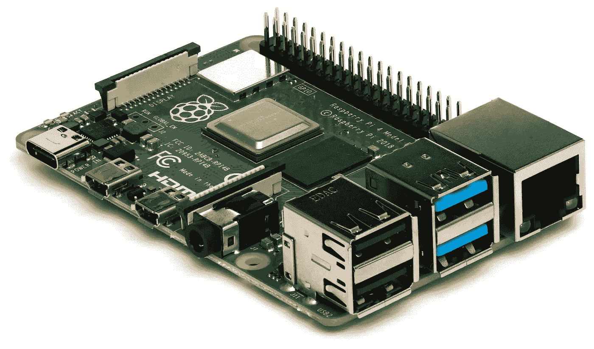
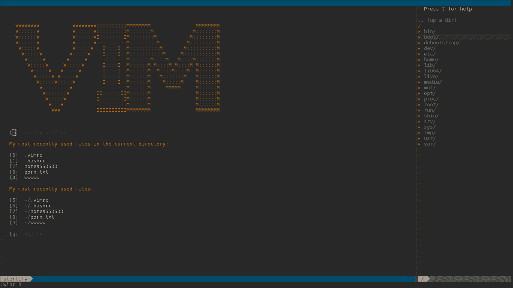

# 零学士:学习编程

> 原文：<https://blog.devgenius.io/zero-bs-learning-to-program-32dacfbbbe75?source=collection_archive---------38----------------------->

花点时间在 Quora 上，你会读到很多关于如何学习计算机编程的建议。对于新来的人来说，很多都是错误的、有害的、令人沮丧的。在这篇文章中，我将消除一些误解。

神话 1:你需要擅长数学。

完全错了，大多数编程只需要高中数学，你几乎不需要会加法。

**神话 2:你需要一台伟大的现代电脑。**

一点也不。给计算机编程通常是比浏览网页更轻量级的任务，当然也比玩任何现代游戏更轻量级。你需要一台 100 美元的易贝电脑，或者一个树莓派。你有什么都可以。不过，不要用你的智能手机，这并不是说它不够强大，而是你真的需要一个合适的键盘。

这个覆盆子酱在易贝要花 10 美元，绰绰有余。

**谣言 3:你需要安装 Linux**

我不知道这是哪来的。Linux 是从 90 年代才出现的，它进入计算世界相对较晚，大多数人用别的东西编程。

谣言 4:你需要一台笔记本电脑

同样，不知道人们从哪里得到这些东西。不需要笔记本电脑，什么电脑都可以。

**误区#4a:你不仅仅需要一台笔记本电脑，还需要一台 MacBook！**

说真的。这是我在 Quora 上读到的真实内容。MAC 电脑在软件开发中是一个非常小的角色。大部分人都不用。你不需要。如果你有一个，很好，使用它，但是你同样可以使用任何你喜欢的东西。

**误区五:你需要学习 C、C++、C#、Java、Python、JavaScript。**

不你不知道。选择*一种*语言，不管是哪一种，学习它，坚持下去，直到你能用它编写软件。

误解 6:你必须打字速度快。

不，大多数程序员打字都没有真正的打字员快。你不需要像一个作者那样打字很快。大多数编程发生在你的头脑中。

误解 7:你需要早点开始。

不，我知道一些伟大的程序员在将近 40 岁的时候开始工作。

神话 8:编程是你天生擅长的事情。

除了缺乏努力，我从未见过任何人因为其他原因而编程失败。大多数人在早期阶段放弃是因为缺乏奉献精神，而不是因为缺乏任何天赋。

误解 9:学习如何使用 Vim 或 Emacs。

完全扯淡。如果你想要一种复古的体验，它们是不错的编辑器，但是大多数开发人员不会使用它们，而且当你刚刚开始学习时，它们是一种有害的干扰。用更简单的，用老编辑器不会得 l33t 分。

你不需要这个。

误解 10:你必须学习 git。

不，这是达到目的的手段。当你第一次开始的时候不要担心，当你开始的时候，只需要使用桌面 GUI。你不需要学习每一个最后的命令，只需要在你需要的时候查找。

神话 11:买一个机械键盘。

没关系。你的键盘不重要。*真的*。