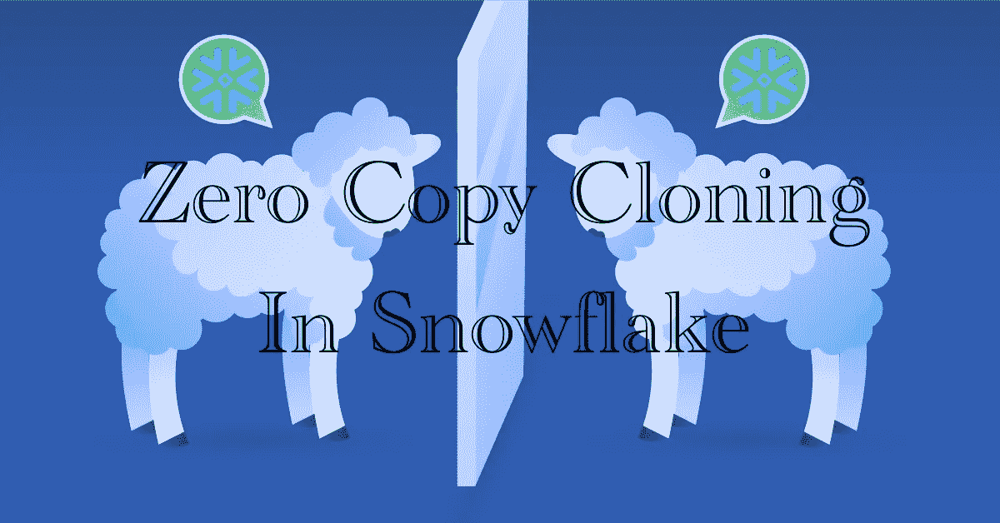

# 雪花中的零拷贝克隆。

> 原文：<https://blog.devgenius.io/zero-copy-cloning-in-snowflake-46b90a7e9d7a?source=collection_archive---------4----------------------->

Snowflake 的另一个很酷的特性使它不同于市场上的其他数据库。如果您计划在您的组织中建立雪花，那么考虑零拷贝克隆可以帮助您优化数据存储，也有助于节省一些资金。



在本文中，我们将看到零拷贝克隆，以及如何以及在哪里使用雪花的这一古老特性。

## 什么是数据克隆？

雪花数据克隆类似于一般的克隆词，即创建一个对象副本。

> 根据 snowflake 的文档:-
> Snowflake 的零拷贝克隆特性提供了一种便捷的方法，可以快速获取任何表、模式或数据库的“快照”，并创建该对象的派生副本，该副本最初共享底层存储。这对于创建不产生任何额外成本的即时备份非常有用(直到对克隆对象进行更改)

这意味着我们可以在一个表、方案和数据库上创建任意数量的副本，而无需在雪花中花费额外的存储成本，直到可以对原始对象或克隆对象进行更改。

更改由 CDP(连续数据保护)处理。克隆对象和原始对象之间的共享公共数据指向相同的微分区，但是更改的数据存储在进行更改的各个表的专有微分区中。

这意味着我们将只为在进行更改的各个表的新分区中存储更改的存储额外付费。

## 零拷贝克隆雪花可以克隆哪些对象？

因为克隆完全是关于数据存储的，所以存放数据的东西也有助于数据克隆。以下是在编写本文时所有可克隆对象的列表。最新列表可以在雪花的克隆文档中找到:

*   **数据存储对象如**:
*   数据库
*   计划
*   桌子
*   流
*   **数据配置对象**:
*   阶段
*   文件格式
*   顺序

## 如何在零拷贝克隆雪花中克隆一个对象？

在零拷贝克隆雪花中克隆对象只需一条 SQL 语句:

```
CREATE <object_type> <object_name>
CLONE <source_object_name>
```

该语句将克隆一个现有对象以生成一个新对象。以上是声明的浓缩版；完整的语法如下所示:

```
CREATE [ OR REPLACE ] { DATABASE | SCHEMA | TABLE | STREAM | STAGE | FILE FORMAT | SEQUENCE | TASK } [ IF NOT EXISTS ] <object_name>
CLONE <source_object_name>
```

不要担心上面的语法；我们将很快看到一个克隆表的例子，以帮助您更好地理解这个概念。

## 用一个例子理解克隆。

在雪花图中创建一个包含 100000 行的数据库、模式和表，如下所示

```
CREATE OR REPLACE DATABASE PROD_DB;
CREATE OR REPLACE SCHEMA PROD_DB.RAW;
CREATE OR REPLACE TABLE PROD_DB.RAW.TEST
(NAME VARCHAR,
 ID1 NUMBER,
 ID2 NUMBER,
 ID3 NUMBER
);

INSERT INTO PROD_DB.RAW.TEST
SELECT 
'Khush' AS NAME,
seq4()  AS ID1,
uniform(1, 10, random(12)) AS ID2,
uniform(1, 40, random(12)) AS ID3
FROM 
table(generator(rowcount => 100000))
ORDER BY seq4();

SELECT COUNT(*) FROM PROD_DB.RAW.TEST;
```

创建`PROD_DB.RAW.TEST`的克隆作为`PROD_DB.RAW.TEST_CLONE`。

```
CREATE TABLE PROD_DB.RAW.TEST_CLONE 
CLONE PROD_DB.RAW.TEST;

SELECT COUNT(*) FROM PROD_DB.RAW.TEST_CLONE;
```

我们可以看到,`PROD_DB.RAW.TEST_CLONE`的计数也是 100000，这意味着我们已经成功地创建了`PROD_DB.RAW.TEST`表的副本，但是在后台，这两个表正在访问相同的存储，因为原始表和克隆表中的数据是相同的。

关于表级存储的详细信息，我们可以查询名为`[TABLE_STORAGE_METRICS](https://docs.snowflake.com/en/sql-reference/info-schema/table_storage_metrics.html)`的信息模式视图。
要查询该视图，您必须使用帐户管理员角色。该视图对其他角色可见，并且可以被查询，但是查询不会返回任何行。

```
USE ROLE ACCOUNTADMIN;
SELECT TABLE_NAME,
       ID,
       CLONE_GROUP_ID,
       ACTIVE_BYTES,
       TIME_TRAVEL_BYTES,
       FAILSAFE_BYTES,
       RETAINED_FOR_CLONE_BYTES
FROM PROD_DB.INFORMATION_SCHEMA.TABLE_STORAGE_METRICS
WHERE TABLE_CATALOG = 'PROD_DB'
AND TABLE_SCHEMA = 'RAW'
AND TABLE_DROPPED IS NULL
AND CATALOG_DROPPED IS NULL
AND TABLE_NAME IN ('TEST', 'TEST_CLONE');
```


从结果中可以看出，`TEST_CLONE`表是通过克隆`TEST`表创建的，这就是为什么两个表的 `CLONE_GROUP_ID`与`TEST`表的表 id 相同。

因为 Snowflake 的克隆在克隆后执行 DML 语句之前不会占用额外的存储空间，所以值`ACTIVE_BYTES`表示数据的实际存储空间只对`TEST`表可用。

## 零拷贝克隆的使用案例

1.  在组织中创造各种各样的环境。开发人员经常抱怨没有一个与生产相似的开发数据库。零拷贝克隆可以在不增加额外成本的情况下解决这个问题。
2.  快速备份表、模式和数据库。
3.  在不建立新环境和不将源对象置于风险中的情况下，测试预期的修改/开发。
4.  完成使用其源项目的一次性任务。

***总结:*** 在本文中，我们已经看到了零拷贝是如何工作的，以及它的用例。因为克隆整个数据库进行测试非常简单，所以您可以轻松地积累数百 TB 的冗余存储。

如果你认为这篇文章信息丰富，对你正在寻找的东西有所帮助，那么请鼓掌并关注我的媒体账户(
[datageeks.medium.com](https://datageeks.medium.com/))。如果有任何关于这个话题的问题，欢迎在 datageeks.connect@gmail.com 写评论或发邮件给我。注册成为会员(【https://datageeks.medium.com/membership】)后，你可以阅读每一篇故事，并在媒体上帮助作者。