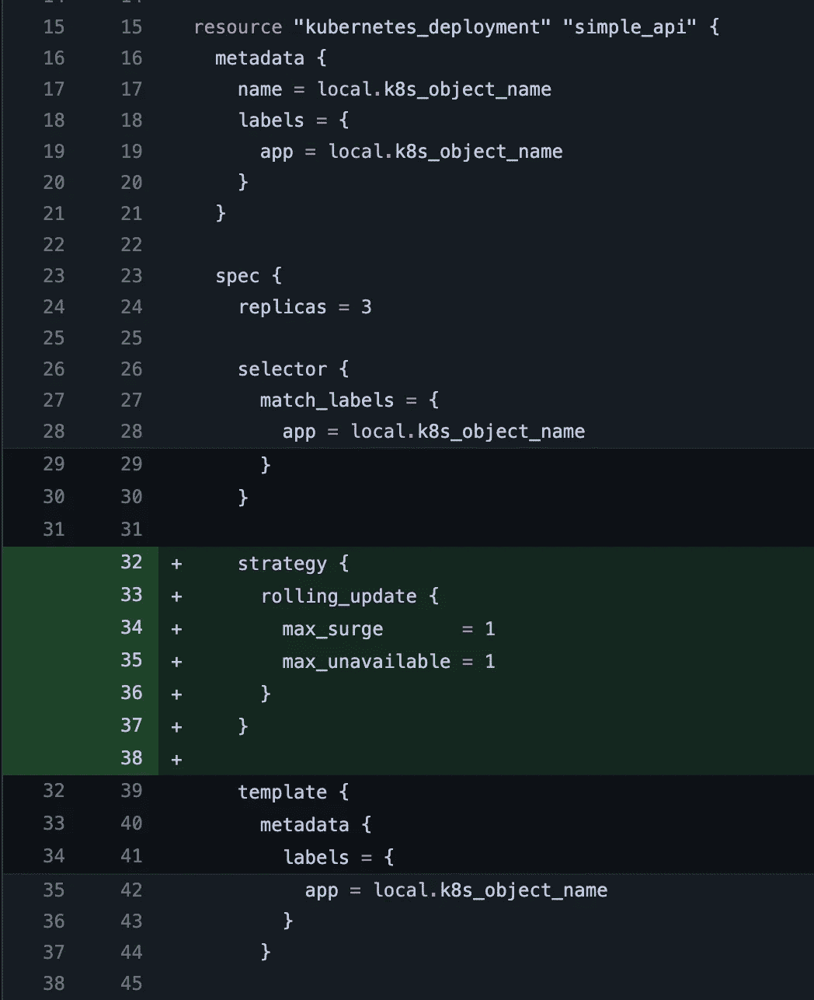
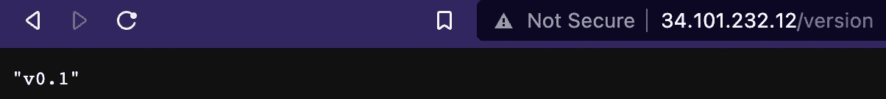
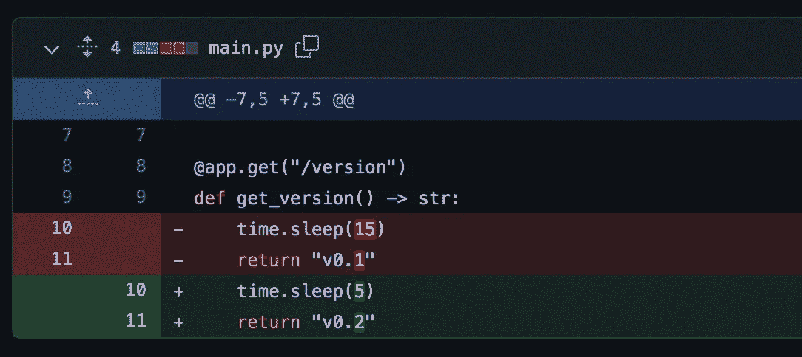
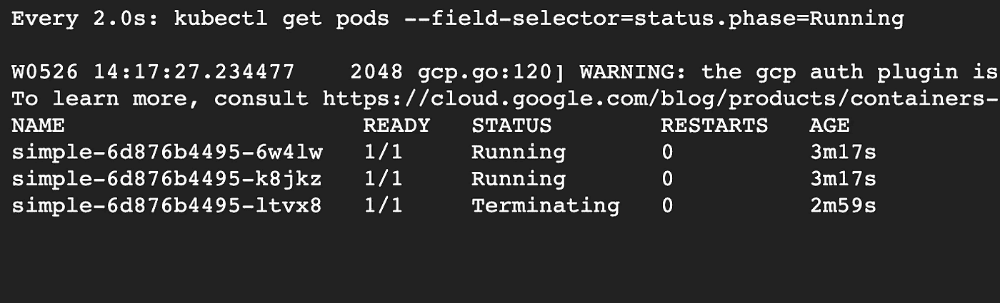
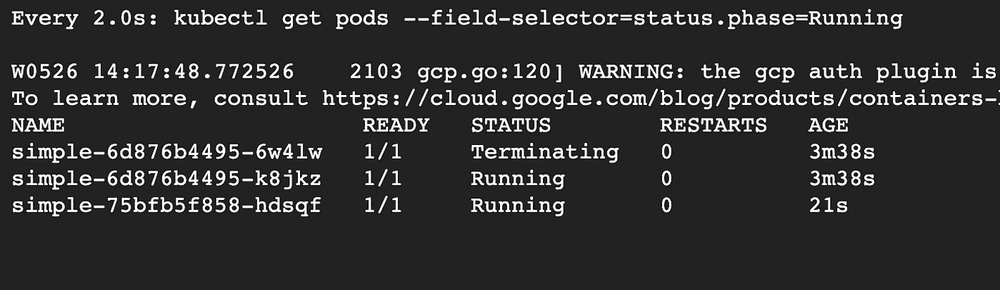
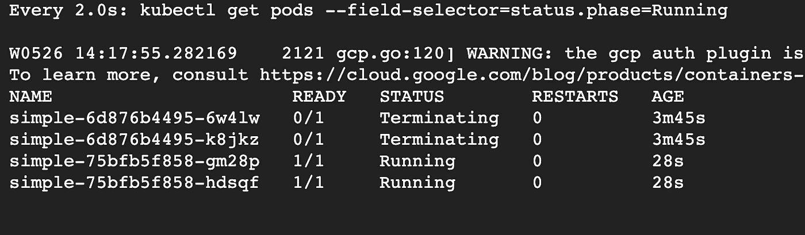
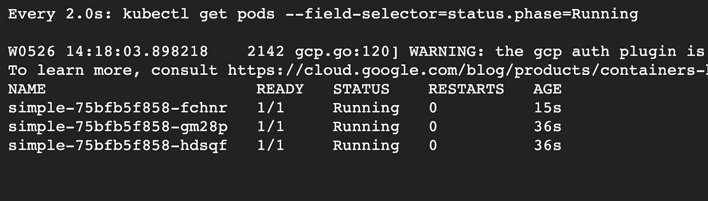
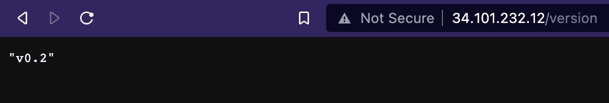

# Kubernetes 的零停机部署

> 原文：<https://blog.devgenius.io/zero-downtime-deployment-in-kubernetes-fe7470210b6a?source=collection_archive---------1----------------------->

## KUBERNETES 操作指南

## 如何轻松实现滚动部署

[SpaceX](https://unsplash.com/@spacex?utm_source=medium&utm_medium=referral) 在 [Unsplash](https://unsplash.com?utm_source=medium&utm_medium=referral) 上的展开图

> 在大多数地方，以零停机时间迁移为目标应该是常态，而不是例外。
> 
> 格尔吉利·奥罗兹

零停机部署是许多工程团队的梦想。在这个高速增长的时代，无需通知用户“维护期”就能交付价值的“魔法”是一个致命的弱点。

尽管如此，实现零停机部署并不总是容易的。然而，不要害怕，因为 Kubernetes 来救援。在本文中，我将指导您使用滚动方法在 Kubernetes 集群中创建零停机部署。

*注意:虽然我们将使用滚动方法，但这不是唯一的方法。你可以在这里* *阅读更多关于部署策略* [*。*](https://harness.io/blog/continuous-verification/blue-green-canary-deployment-strategies/)

*注意:我不打算在这篇文章中解释 Kubernetes。你可以在这里* *阅读关于 Kubernetes 对象* [*的基本解释，或者你也可以在 YouTube 上查看 Kubernetes 教程。*](/deploy-socket-io-to-kubernetes-part-2-infrastructure-7764fec252d0)

# 创建应用程序和图像

端点将非常简单，只返回当前版本。

*注意:如果我们想要测试滚动部署，我们需要在构建第二个映像之前替换响应。*

至于 15 秒睡眠，我想在 Kubernetes 中模拟启动一个新 pod 时的延迟。15 秒钟模拟实际服务器连接到数据库和其他外部依赖项的时间。滚动应该有效，即使没有睡眠时间。

对于 Docker 图片，我只是用了 FastAPI 网站的`Dockerfile` [。这是我的图像文件:](https://fastapi.tiangolo.com/deployment/docker/)

现在我们有了一个简单的应用程序和`Dockerfile`，接下来我想做的是测试滚动策略。

# 设置集群

虽然我使用的是谷歌云提供商(GCP)，但也可以使用任何具有 Kubernetes 功能的云提供商。我选择 GCP，因为我仍然有一个免费的计划。

如果你想使用美国地区，你可以阅读关于如何使用 Google Kubernetes 引擎提供 Kubernetes 集群的指南。然而，如果你想在其他地区使用，我不知道它是否有效。根据我的经验，在雅加达(而不是美国地区)有一个与服务帐户相关的错误。因此，我们必须自己调配 GKE 群集，而不使用上面指南中的模块。

## 网络配置

为了自己调配 Kubernetes 集群，我们需要首先创建 VPC 和子网。这是我使用的配置:

*注:原始代码可以在* [*这里*](https://github.com/iamdejan/k8s-rollout-demo/blob/main/03-network.tf) *找到。*

## GKE 集群配置

对于 GKE 集群配置，我们使用标准的`google_container_cluster`资源。然而，根据来自 [HashiCorp Learn](https://learn.hashicorp.com/tutorials/terraform/gke) 的提示，我们需要在调配我们自己的节点池后“放弃”默认节点池。事实上，下面的代码是对那篇文章中提到的 GitHub repo 的修改。

现在你明白了(在上面的代码中)为什么我们需要“手动”创建我们自己的子网。这些子网将由 GKE 群集使用。

*注:HashiCorp Learn 的文章和我的代码的一个重要区别是，我在* `*google_container_cluster*` *资源中添加了* `*ip_allocation_policy*` *。如果我们不添加该配置，每次应用 Terraform 配置时，我们都“被迫”重新创建集群，这不是我们想要的。*

# 创建部署和服务

为了测试我们的应用程序，我们需要创建`Deployment`和`Service`，这样我们就可以通过互联网访问端点。

这是我用来创建部署和服务的 Kubernetes 对象文件:

注意:我还没有添加滚动配置。这将在下一小节中完成。

如您所见，我创建了一个`Deployment`，然后用一个`LoadBalancer`服务公开它。这允许我们从互联网访问容器。

在我的配置文件中，我为我的 pod 添加了健康检查配置。原因是我想让 Kubernetes 知道什么是健康指标，所以如果有任何 pod 不“健康”，Kubernetes 将自动删除 pod 并重新创建一个新的。

另外，如果你注意到了，我用地形创造了这些 Kubernetes 物体，而不是 YAML。原因是滚动部署可以从`terraform apply`命令自动触发。

我没有使用 Google Container Registry (GCR)来配置 Kubernetes 对象的一个原因是，Kubernetes 需要额外的工作来从 GCR 获取图像。你可以在这里看到关于在 Kubernetes 中使用 GCR 图片的指南。

## 配置滚动

现在，谈谈滚动策略。

默认情况下，Kubernetes 在 Terraform 中的部署已经包括滚动。但是，如果您不确定或者想要自定义行为，您可以自定义滚动模式。

添加滚动更新配置。

*注:最终的源代码可以在这里* [*找到*](https://github.com/iamdejan/k8s-rollout-demo/blob/main/05-kubernetes.tf) *。*

现在你可能想知道，`max_surge`和`max_unavailable`是什么意思。让我试着简单解释一下。滚动部署意味着在部署期间将会有一个或多个额外的单元，并且在新单元被认为是健康的之后，旧单元将被删除。`max_surge`表示在轧制开始前应该提供多少个新的 pod，而`max_unavailable`表示在 pod 终止部分有多少个 pod 不可用。

## 如何触发滚动部署

前面我说过之所以用 Terraform 写 Kubernetes 配置文件是为了实用(用`terraform apply`触发滚动部署)。但是，它是如何工作的呢？

根据 [Kubernetes 模式书](https://www.goodreads.com/book/show/44144501-kubernetes-patterns)，为了触发对`Deployment`对象的更新，有三个选项:

1.  用带有`kubectl replace`的新版本替换整个`Deployment`。
2.  使用`kubectl patch`为部署打补丁。
3.  用`kubectl set image`改变 pod 的图像。

我的猜测是，Terraform 使用第二或第三选项。

# 配置配置项/光盘

GitHub Actions 是 GitHub 为开源库提供的免费使用的 CI/CD 管道。在这篇文章中，我使用 GitHub 动作来执行`terraform apply`命令。

*注意:我不会在这篇文章中深入讨论 GitHub 动作。可以从 GitHub 网站* [*这里*](https://docs.github.com/en/actions/learn-github-actions/understanding-github-actions) *了解。*

*注:源代码可以在* [*这里找到*](https://github.com/iamdejan/k8s-rollout-demo/blob/main/.github/workflows/default.yaml) *。*

逻辑很简单。我们克隆存储库(虽然我不明白为什么这个动作使用了`checkout`术语)，然后我们用`mypy`和`pycodestyle`验证代码。之后，我们设置了 Terraform 访问和修改 GCP 资源所需的`gcloud`命令。之后，我们运行`terraform apply`命令，这将触发滚动部署。

# 秀场

在提供了集群和 Kubernetes 对象之后，现在是测试应用程序的时候了。让我们首先通过浏览器、终端(`cURL`或其他 CLI 应用程序)或用于 HTTP 端点测试的 GUI 应用程序(如 Postman)访问端点来测试现有应用程序。

为了访问端点，请按照下列步骤操作:

1.  运行`kubectl get services`。您将在`EXTERNAL-IP`栏获得 IP 地址。
2.  使用以下格式的 URL 访问端点:`${external ip}/version`。您将等待 15 秒钟，然后您将得到如下图所示的响应。

现在，让我们更新代码并推入 GitHub，看看滚动部署是否有效。这是我的变化:

更改端点中返回的版本。

如果你使用`watch “kubectl get pods — field-selector=status.phase=Running”`观看豆荚，你会看到类似这些截图的东西:

(1)第一个旧 pod 正在终止。

(2)一个新的 pod 已经在运行，而第二个 pod 正在终止。

(3)第二个和第三个旧 pod 正在终止，而第二个新 pod 正在运行。

(4)旧的荚被终止并用新的荚代替。

现在，要测试部署是否成功，请访问同一个端点。你会得到不同的输出。这是我更新后的输出:

端点已更新！

嗯，有效！很棒，对吧？这里可以看到完整的代码[。](https://github.com/iamdejan/k8s-rollout-demo)

*注意:我意识到我应该在滚动过程中测试端点，因为这是滚动更新的好处。不过，我认为通过监控豆荚将足以证明滚动更新是成功的。此外，在实践中，我很难做到这一点，因为我需要在测试端点时截屏滚动过程，所以我选择截屏。*

# 一个制作技巧

当您想在生产中这样做时，我的一个建议是，您需要将 Kubernetes 集群供应的 Terraform 代码与 Kubernetes 对象配置文件(包含`Deployment`和`Service`)分开。原因是出于安全目的，我们希望限制对 Kubernetes 集群配置的访问。开发者将直接与 K8s 对象交互。

我希望您通过本指南了解如何在 Kubernetes 中设置滚动部署。回头见！