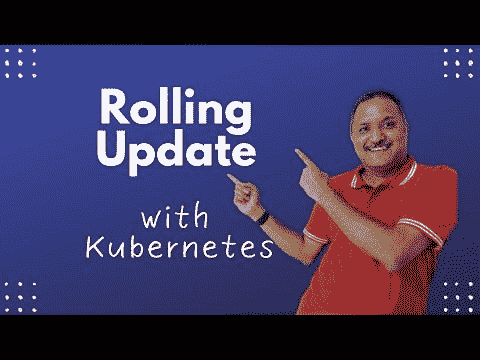

# 使用滚动更新策略的 Kubernetes 零停机部署

> 原文：<https://blog.devgenius.io/zero-downtime-deployment-with-kubernetes-using-rolling-update-strategy-bff45de8c3c3?source=collection_archive---------8----------------------->

# 背景

如今，现代云原生应用的开发和部署速度非常快。用于升级应用程序和服务的传统技术不再适用。我们希望给最终用户最好的用户体验。其中一个越来越受欢迎并且已经成为主流技术的是**渐进式递送**。这使得我们可以通过减小爆炸半径来逐步升级应用程序版本。在本帖中，我们将看看如何使用**滚动更新策略**和 **Kubernetes** 实现**零停机部署**。

# 滚动更新策略的快速概述

滚动更新策略允许具有多个实例或副本的应用程序以受控的方式从一个版本升级到另一个版本。这种策略不是一起升级所有副本，而是成批应用更改并用新版本替换旧版本。因此，在升级过程中，应用程序可以在实例数量减少的情况下继续运行。

实现滚动更新策略的先决条件之一是应用程序需要运行多个副本或实例。如果应用程序只有一个实例，那么会有一点停机时间。Kubernetes 本机支持滚动更新策略。我们不需要任何额外的东西来实现它与 Kubernetes。当我们使用 Kubernetes 部署来部署我们的 pod 时，滚动更新是默认策略。

如果您一直在使用 Kubernetes 部署，那么在升级应用程序版本时，您可能会不知不觉地使用滚动更新策略。

# 使用滚动更新策略实现零停机部署

如果我们不覆盖任何与滚动更新相关的设置，默认情况下，Kubernetes 将应用 25% **MaxSurge** 和 25% **MaxUnavailable** 设置。这意味着在升级时，最多将添加 25%的副本。同样，当旧版本的副本被新版本替换时，一次最多替换 25%。

这样做可以确保在升级过程中有 80%的副本处于工作状态，并且最终用户不会受到影响。如果我们已经使用服务公开了 Kubernetes 集群之外的部署，那么**负载平衡器**将相应地在新版本和旧版本之间路由流量。

# YouTube 视频演示

请参考 YouTube 视频，了解这一过程。

# 滚动更新策略的其他替代方案

滚动更新策略还有其他替代方法。现代云原生应用程序支持高级部署策略或技术，如[蓝绿色部署](https://youtu.be/bm6RYgVuAzo)或[金丝雀部署](https://youtu.be/_-_KnmAbKIo)，这些部署策略和技术还支持渐进交付的零停机部署。请参考在我的频道上观看 YouTube 视频的链接，了解如何将这些视频应用到您的 Kubernetes 应用程序中。

# 结论

拆除服务器和应用程序来升级它们的日子已经一去不复返了。借助云，我们可以轻松升级应用和服务，而对最终用户的影响极小。使用滚动更新、蓝绿色部署或金丝雀部署等现代技术来实现应用程序的 100%可用性。

下次再见， ***激情码*** 。

*原载于 2022 年 10 月 12 日 https://www.handsonarchitect.com**的* [*。*](https://www.handsonarchitect.com/2022/10/zero-downtime-deployment-with.html)