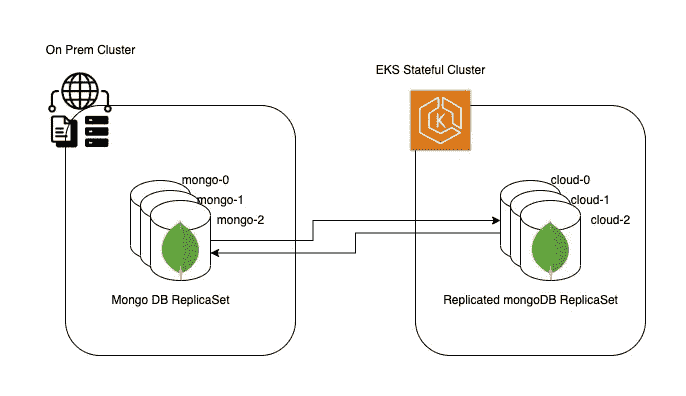

# 零停机 Mongo 数据库迁移

> 原文：<https://blog.devgenius.io/zero-downtime-mongo-db-migration-96c736cb0db?source=collection_archive---------9----------------------->

**TL；DR:** 如果您想将您的数据从基于本地 k8s 的 mongo DB 迁移到云管理的 kubernetes 集群(EKS)上的 Mongo DB，这里有一个分步指南。

**背景:**

其中一个客户希望将其整个平台从本地基础设施迁移到 AWS 云，包括微服务架构中涉及的有状态和无状态组件。这种迁移的主要瓶颈是 MongoDB 迁移，因为客户机不能承受其数字平台上的任何停机时间。

为了实现零宕机的 mongoDB 迁移，我们使用了 mongoDB 的 MongoDB 复制机制，然后将它们重新配置为新迁移的 MongoDB 复制集。

**设置连接:**

在这个设置中，我们有 3 个属于 mongo replicaSet rs0 的 pod。其中一个 pod 是主 pod，另外两个辅助 pod 与主 pod 同步。

让我们从 on-prem 调用现有的 pod**mongo-0、mongo-1、mongo-2** ，我们需要迁移的云上的数据的 mongoDB pods 是 **cloud-0、cloud-1、cloud-2。**确保您能够解析本地和云环境中的所有主机名。

现在，为了执行迁移，我们首先必须验证 mongoDB 成员之间的连通性。这里我们需要 4 种类型的连接:

1.  在数据将要迁移到的新 mongoDB 成员之间( **cloud-0，cloud-1，cloud-2 在端口 27017**
2.  在数据将要迁移的旧 mongoDB 成员之间( **mongo-0、mongo-1、mongo-2 在端口 27017 上**)
3.  新旧 mongoDB 吊舱之间(在端口 **27017 上的 **cloud-0** 、 **cloud-1、cloud-2** 与端口 **27017 上的 mongo-0、mongo-1、mongo-2** 之间，反之亦然**)
4.  从有状态集群 mongoDB 到无状态集群(应用平面)



从本地到 AWS EKS 集群的 MongoDB 连接

**同步所有数据:** 一旦连接测试成功，开始使用以下命令逐个添加新成员…

```
rs.add("mongo0:27017");
cfg = rs.conf();
cfg.members[3].votes = 0;
cfg.members[3].priority = 0;
rs.reconfig(cfg);
#Once it transitions to secondary proceed furtherrs.add("mongo1:27017");
cfg = rs.conf();
cfg.members[4].votes = 0;
cfg.members[4].priority = 0;
rs.reconfig(cfg);#Once it transitions to secondary proceed furtherrs.add("mongo2:27017");
cfg = rs.conf();
cfg.members[5].votes = 0;
cfg.members[5].priority = 0;
rs.reconfig(cfg);#Once it transitions to secondary proceed further
```

**更改投票和优先级:**

现在，作为副本集 rs0 的一部分，我们有了 1 个主要成员和 5 个次要成员。

现在，我们确保在同步过程中，没有云成员有资格投票成为主要成员。现在，我们将更改成员的投票和优先级，以便其中一个云成员成为主要成员。

**选举初选:**

要从 3 个云辅助实例中选择一个主实例，请在主 mongo 实例上运行以下命令:

```
cfg = rs.conf();
cfg.members[0].votes = 0.5;
cfg.members[0].priority = 0.5;
cfg.members[1].votes = 0.5;
cfg.members[1].priority = 0.5;
cfg.members[2].votes = 0.5;
cfg.members[2].priority = 0.5;cfg.members[3].votes = 1;
cfg.members[3].priority = 1;
cfg.members[4].votes = 1;
cfg.members[4].priority = 1;
cfg.members[5].votes = 1;
cfg.members[5].priority = 1;rs.reconfig(cfg);
# after running above command, primary on-prem member will become secondary and one of the cloud member will be elected as Primary member.
```

**恭喜:**

太好了！我们成功地将主要 mongoDB 成员从本地切换到云。现在，您可以安全地删除旧的 mongo-0、mongo-1 和 mongo-2 成员，并更改 mongoDB 的连接字符串，该字符串被所有支持的应用程序使用。

删除辅助内部成员的命令有:

```
rs.remove(mongo-0);
rs.remove(mongo-1);
rs.remove(mongo-2);
```

如果您的后端应用程序能够解析(本地和云)mongo 成员主机名，上述步骤不会导致任何停机。确保在连接字符串更改后重新启动所有服务。

如果这有帮助，或者如果你有问题，请留下评论。

感谢您的阅读。