# Zigbee 集线器—权威指南

> 原文：<https://blog.devgenius.io/zigbee-hub-7ab382633767?source=collection_archive---------1----------------------->

在过去的几年里，智能家居技术出现了爆炸式增长。家庭自动化、物联网是对我们日常生活非常友好的东西。每周都会出现新的智能家居设备，我们有摄像头、暖气、传感器和更多设备来将您的家拖入互联的未来。让我们深入了解 Zigbee hub。

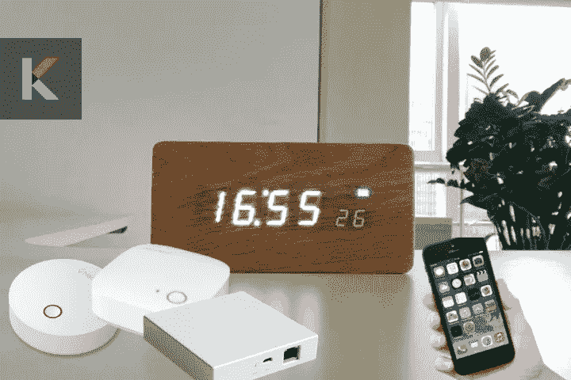

***在这篇文章中，你会学到，***

*   Zigbee 是什么？
*   Zigbee 的规格
*   什么是 ZigBee Hub？
*   为什么你的家需要一个 Zigbee 集线器？
*   最好的 Zigbee 集线器有哪些？
*   Zigbee 集线器的特性比较
*   如何选择最适合自己的智能家居 hub？
*   ZigBee 是如何工作的？
*   最佳 ZigBee 产品
*   ZigBee 和 Wi-Fi 的区别
*   价格比较

# Zigbee 是什么？

好的，让我们从尝试了解什么是 ZigBee 协议开始。Zigbee 基于个人局域网(IEEE 的 802.154 标准)。许多主要品牌都开发了基于 Zigbee 的产品，包括 Philips Hue、GE 和 Nest。它是由 ZigBee 联盟组织设计的一种无线通信协议。这个群体包括三星、亚马逊、华为、高通、东芝和许多其他家电公司。

[Zigbee 技术](https://original.newsbreak.com/@ishara-fernando-1590158/2456204237530-zigbee-hub-a-definitive-guide?s=influencer)已经成为智能设备领域的标准。借助这种集线器，您可以将家中的所有 Zigbee 设备连接到中央单元。它可以控制您所有连接的设备，并将它们连接到互联网。例如，Zigbee 集线器对于像 [Philips Hue](https://kodmy.com/about-philips-hue/) 这样的智能照明来说是必不可少的，因此你可以同时控制许多灯。

**想给 HomeKit 添加 Zigbee 设备？**

如果你想了解 Zigbee HomeKit，请参见[如何将 Zigbee 设备添加到 HomeKit](https://kodmy.com/zigbee-hub/#zigbee-homekit) ？

**为您的家寻找更多 Zigbee 产品和其他智能家居产品**

如果你想用谷歌助手检查智能家居设备的兼容性。不仅仅是为了谷歌助手的兼容性，你也可以检查设备与 Alexa 和 Siri 的兼容性。你可以通过下面的按钮下载 Canda-Siri 兼容性检查器。

[从 Play Store 下载](https://play.google.com/store/apps/details?id=com.knovik.kodmy&fbclid=IwAR1nVBOUdSB4oxZky8tiRpKOO_ZhNOptXs25U6bs8P43Qonu0legjbWSS_o)

[从应用商店下载](https://apps.apple.com/us/app/canda-compatibility-checker/id1630339464)

# Zigbee 的规格

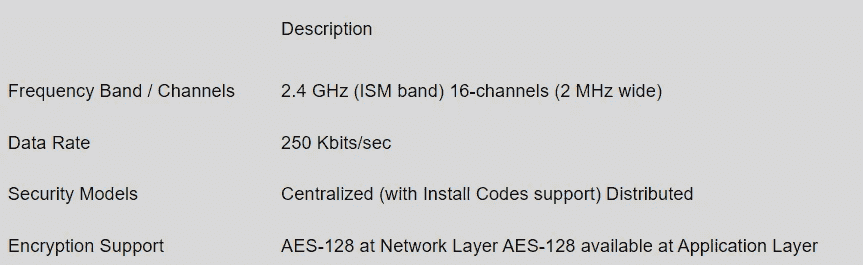

# 什么是 ZigBee Hub？

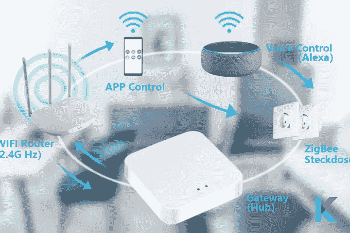

[Zigbee hub](https://kodmy.com/zigbee-hub/) 被其他智能家居设备厂商冠以不同的称呼。这个控制中心也被称为“网关”。而且，Zigbee 集线器不需要直接的互联网连接。因此，由于 Zigbee 桥，如果互联网连接中断，智能设备可以被控制。此外，不同的自动化可以保存在 Zigbee hub 上，以便您可以在特定时间或特定事件中控制您的灯具、灯光和门锁，而无需您的智能手机或其他设备。

此外，当检测到运动时，需要 Zigbee 集线器。它可以与语音助手交流，如[亚马逊 Alexa](https://kodmy.com/alexa-smart-home-devices/) 和谷歌助手。因此，您可以在外出时通过语音命令控制智能设备。

你知道它提供了一个特殊的功能，即每个连接的设备都会放大信号。因此，信号通过更长的距离到达最后一盏灯，从而形成网状网络。此外，Zigbee 是一种无线网络，被广泛认为是蓝牙和 Wi-Fi 的替代品。这对于智能家居技术来说很棒，因此它可以在网状网络中运行。

它还可以作为一个集中点，从这里您可以一起控制所有不同的智能设备。当你锁门时，智能家庭集线器可以告诉你开灯或关灯。它在您的智能家居设备中使用通用语言和低能耗。因此，智能设备可以在没有 Wi-Fi 和蓝牙等标准通信的情况下相互通信。

# 为什么你的家需要一个 Zigbee 集线器？

Zigbee 为您的其他 Zigbee 设备之间的通信创建一个网状网络。它同时支持许多设备，以保持许多其他设备之间的通信顺畅，并能够在任何给定的移动中支持数千个设备。此外，您可以在图雅应用程序上添加您的[图雅智能设备](https://kodmy.com/tuya-smart/)，并设置自动场景。

# 最好的 Zigbee 集线器

如果你想启动你的 Zigbee 智能家居，试试以下最好的 ZigBee 集线器。

*   **TEEKAR 图雅 ZigBee Hub**

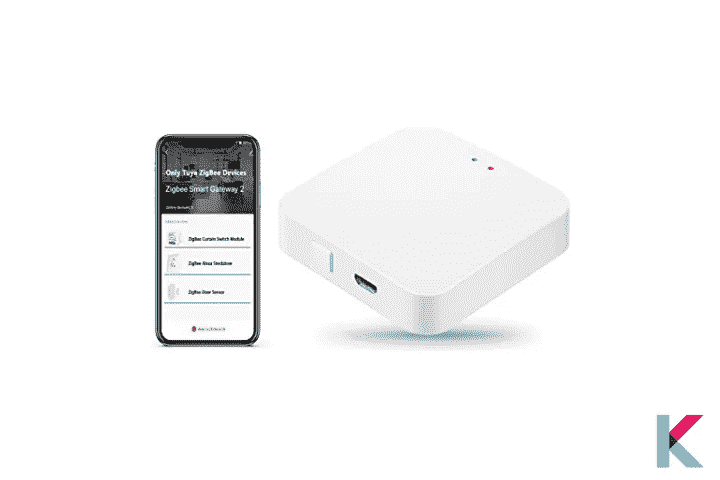

TEEKAR 图雅 ZigBee Hub 是 Zigbee 3.0 网关的升级版，已经从连接 50 个设备升级而来。它与所有图雅 ZigBee 设备兼容，并为图雅 ZigBee 设备提供稳定的连接和自动化控制。此外，您可以使用智能生活应用程序控制您的[家庭自动化系统](https://kodmy.com/best-home-automation-systems/)。设置过程很容易，因为不需要连接到网络电缆。你只需要打开这个智能网关集线器，并将其与智能生活应用程序连接。

你可以从亚马逊上花 26.99 美元买到缇卡图雅 ZigBee 中心。

*   **莫埃斯图雅 Zigbee 3.0 集线器网关**

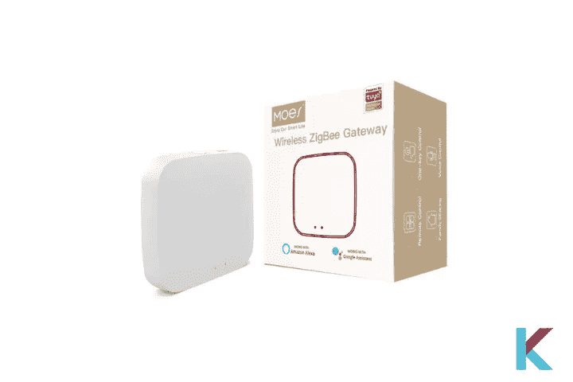

莫埃斯图雅 Zigbee 集线器连接许多设备(多达 50 台设备)。支持 2.4 GHz Wi-Fi。这个 Zigbee 网关是 Zigbee 设备使用 Google Assistant 或 Alexa 实现语音控制所必需的。如果你是图雅智能家居系统的所有者，这个中枢可以让你通过智能生活应用程序控制你所有的图雅产品。可以通过 Zigbee hub 打造一套完整的家居生态链。比 Wi-Fi 系统更安全稳定。它设计用于快速简单的设置，不需要布线和技术技能。

你可以[从亚马逊花 27.99 美元](https://amzn.to/31BbZ0A)购买莫埃斯图雅 Zigbee 中心。

*   **莱奥莫卡图雅 Zigbee 3.0 集线器网关**

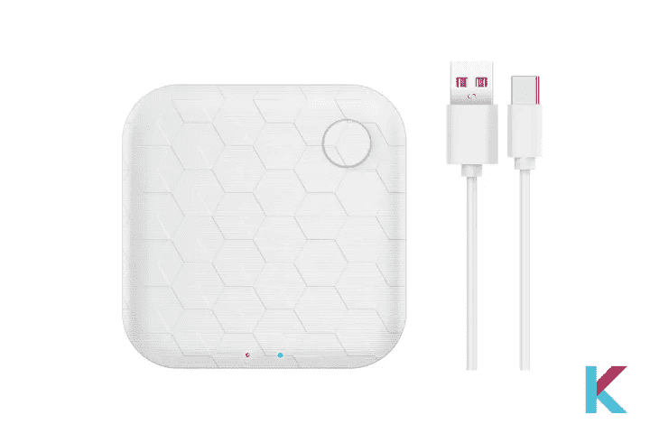

LEOMOCA 图雅 Zigbee 3.0 集线器网关是一款智能无线网关，可与 2.4G Wi-Fi 和 ZigBee HA 3.0 配合使用。这款图雅 Zigbee 智能无线网关集成了 ZigBee 模块和 Wi-Fi 模块。因此，图雅 Zigbee 子设备可以通过 ZigBee 网络或通过应用程序上的 Wi-Fi 远程控制。你不需要担心薄弱的网络。与 Wi-Fi 协议相比，您可以通过 ZigBee 轻松控制更多连接的智能设备。您可以将它放在不同的地方，并与您的家庭成员共享设备。

你可以从亚马逊以 26.98 美元的价格购买利奥莫卡图雅 Zigbee 3.0 集线器网关。

*   **eMylo ZigBee Hub**

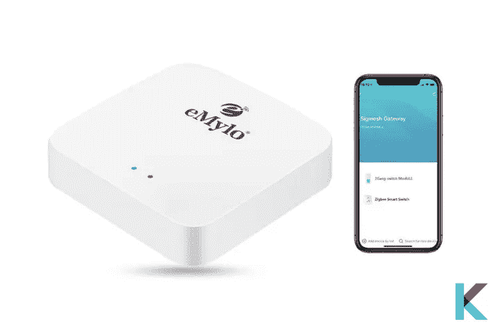

eMylo ZigBee Hub 是一款集亚马逊 Alexa 和谷歌助手于一体的智能网关。它支持 ZigBee 3.0 和 ble 多协议通信。它拥有超小的外观和简单的设计。此外，这个智能中枢可以通过图雅智能应用程序在任何地方控制您的设备。它与其他 ZigBee 集线器一样，不需要连接到网络电缆。以便于设置。你只需要打开这个智能网关，然后连接到应用程序。此外，它支持多达 128 个智能设备。

你可以从亚马逊花 26.99 美元购买 eMylo ZigBee Hub。

相反，请查看 KNX 智能家居的[完整指南和评论。](https://kodmy.com/knx-smart-home/)

# Zigbee 集线器的特性比较

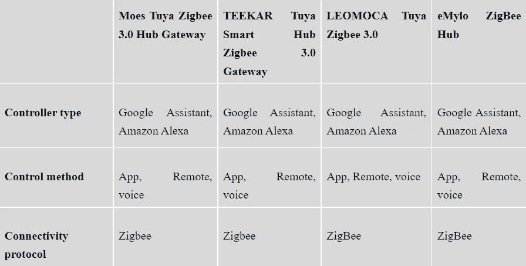

# 如何选择最适合自己的智能家居 hub？

当选择最符合您需求的智能集线器时，首先您必须考虑您想要控制什么，以及您想要用它来做什么。每个智能设备都使用一些无线技术，如 Wi-Fi、蓝牙、Zigbee 或 Z-Wave。你要记住 Zigbee 集线器是由各种制造商出售的。此外，他们提供不同的价格范围。如果你正在考虑一个新的智能家居，你想仔细看看 Zigbee 集线器的功能。您可以找到提供 Zigbee hub 的选项、您想要的功能以及您使用的助理。这些东西在买 Zigbee hub 之前都要考虑。

***Zigbee 智能家居枢纽的决策因素***

*   语音助手支持
*   移动应用程序
*   没有互联网也能工作
*   内置备用电池
*   内置扬声器

# ZigBee 是如何工作的？

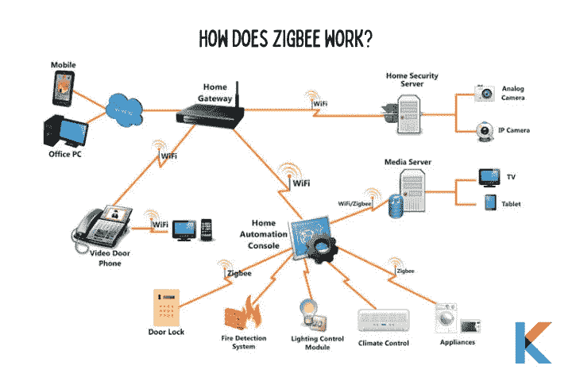

所有智能家居设备都希望其中一种无线通信能够接收来自 ZigBee 网关集线器和应用程序的命令。Wi-Fi 很耗电。因此，对于电池供电的设备以及像智能灯泡这样希望低功耗的智能家居设备来说，这是一件坏事。

如果你是一个更大的智能家庭的主人，在一个家庭网络上有太多的设备不是一个好主意。还有呢？它有许多优点，例如比 Wi-Fi 耗电更少，它是专门设计来支持网络上的数百个智能设备。最重要的是，你可以把 ZigBee 设备散布在房子的各处，甚至在你的花园里。

# 最佳 ZigBee 产品

现在，你知道所有关于 Zigbee 集线器和有许多 Zigbee 产品可用于你的家。这里有一些设备和品牌值得留意。

*   亚马逊回声
*   砖坯黏土
*   贝尔金·韦莫
*   博世安全系统
*   储备
*   霍尼韦尔恒温器
*   Aeotech
*   Senic 户外开关
*   飞利浦色调
*   三星智能手机
*   耶尔锁
*   Innr
*   奥罗拉

# ZigBee 和 Wi-Fi 的区别

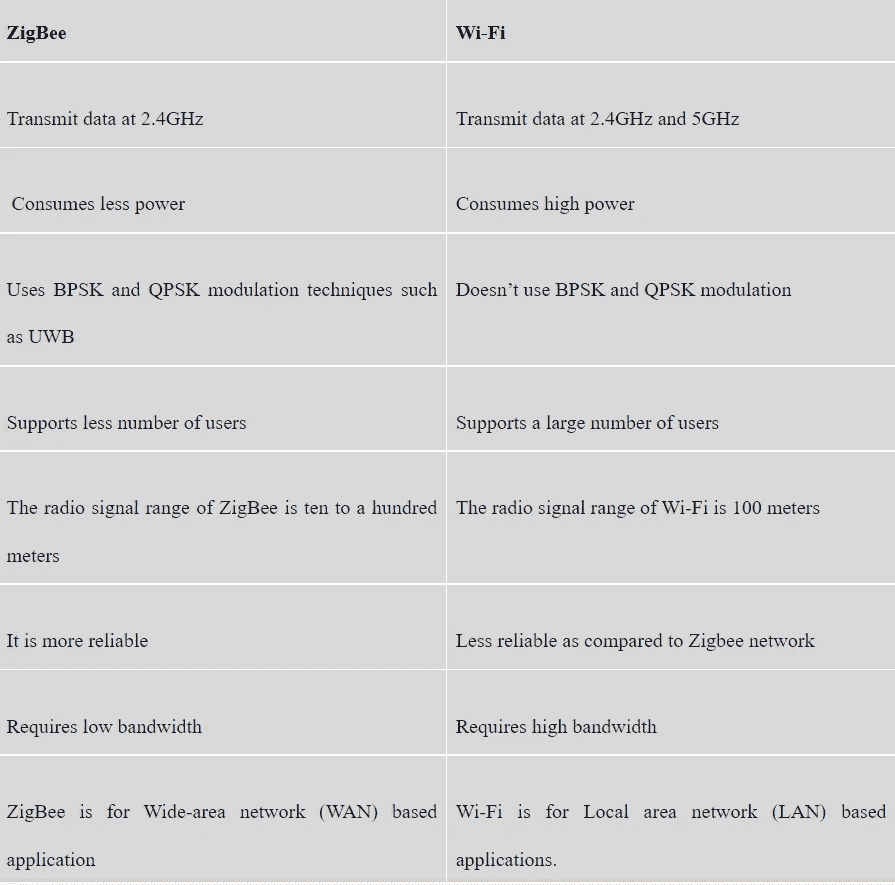

# 价格比较

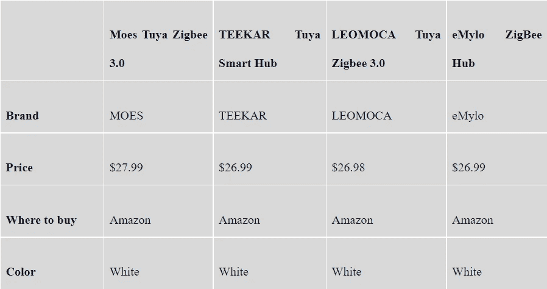

***雄霸天下***

如果您计划使用多个 ZigBee 设备实现家庭自动化，集线器是必不可少的。ZigBee hub Google & Alexa 是你的 ZigBee 设备的中央交换站。此外，我们可以使用智能中枢将你所有的智能设备联系在一起，以及图雅、苹果 HomeKit 和三星 SmartThing 等平台。

如果你对 [Brilliant 智能家居自动化系统](https://kodmy.com/brilliant-smart-home/)感兴趣，可以在这里找到。

*更多内容尽在*[*blog . dev genius . io*](http://blog.devgenius.io)*。*